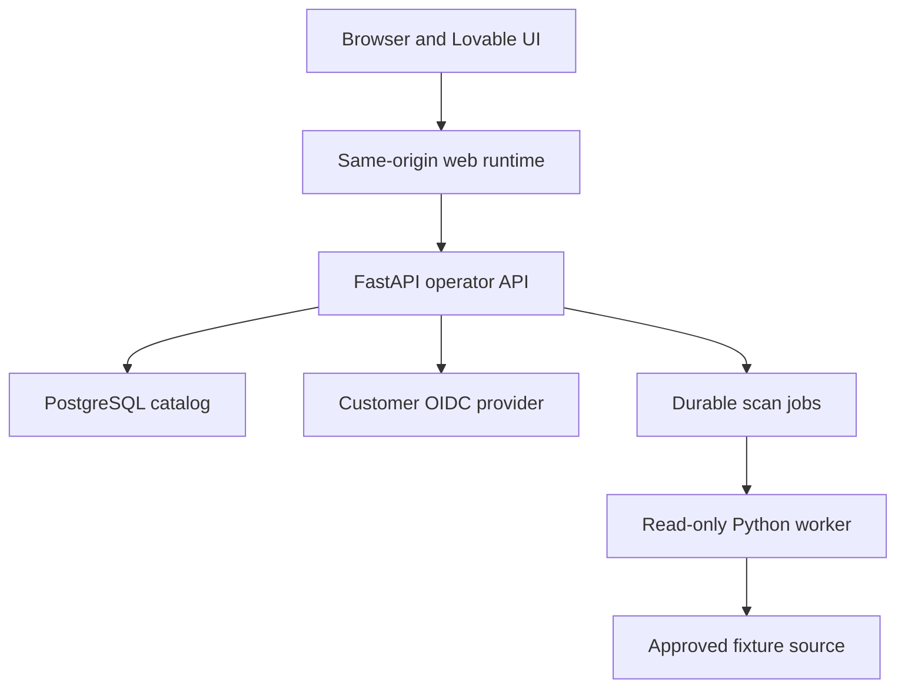

# ZeroShield operator API and schemas — implementation guide

**Contract version:** draft `0.1.0`; OpenAPI 3.1.1 in [`openapi.yaml`](openapi.yaml).  
**Code status:** specification only. The previous G0 scaffold implements only `/livez`, `/readyz`, and `/api/v1/system`, with a different FastAPI default error shape. The remaining routes, new error handler, sessions and tenant model must be coded and tested.  
**First product gate:** G1 read-only local-fixture posture MVP (T01–T18). G2 permission-aware RAG (T19–T26) is specified conceptually below and must receive a separate reviewed OpenAPI revision before implementation.

## 1. Deployment and trust path



The web runtime may forward `/api/v1` to FastAPI, but authorization decisions are made by the backend. A hosted Lovable preview cannot reach a customer's private or air-gapped API. Use the current Git-synced frontend code for integration; do not merge against the prior local snapshot without confirming its revision.

The operator API is for authenticated humans. Future workload authorization and ingest use a **separate** workload-authenticated interface, not the browser's cookie, a static workspace connector secret, or a tenant ID supplied in JSON. The scanner's source identity is read-only. Remediation will use a different identity and approval flow.

## 2. Route catalog and release gates

| Route | Gate | Permissions | Meaning |
| --- | --- | --- | --- |
| `GET /livez`, `/readyz`, `/api/v1/system` | G0 | Public, no tenant/customer details | Actual process/database state and installation ID |
| `GET /api/v1/session` | T06 | Signed-in member | Trusted selected tenant, roles, UI permissions |
| `GET/POST /api/v1/sources`, `GET /sources/{id}` | T09–T10 | Viewer list; admin create | Registered local fixture and connector capability |
| `POST /sources/{id}/scans`, `GET /scans/{id}`, `POST /scans/{id}/cancel`, `GET /scans/{id}/outcomes` | T14–T15 | Analyst/admin mutate; viewer read | Durable scan state and per-item failures |
| `GET /assets`, `GET /assets/{id}` | T15 | Viewer+ | Masked asset/version/classification summaries |
| `GET /findings`, `GET /findings/{id}`, `PATCH /findings/{id}/workflow` | T16 | Viewer read; analyst/admin workflow | Stable finding with evidence; workflow is not security enforcement |
| `GET/POST /ai-resources` | T17 | Viewer list; analyst/admin declare | **Declared** AI inventory, not proof of activity |
| `GET /access-paths` | T17 | Analyst/admin | Bounded evidence graph; G1 decisions are `unknown` |
| Internal authorize/retrieval, runtime, policy, remediation | G2+ | Separate workload/approver roles | See Section 12; deliberately omitted from first OpenAPI file |

No route should appear as healthy in the UI before its backend gate passes. Existing mock findings remain labeled demonstration data until replaced by real G1 records.

## 3. API-wide rules

### 3.1 Identity, tenant and roles

Use OIDC authorization code with PKCE and backend-managed sessions. Validate issuer, audience, signature, expiry and state. Store an opaque random cookie (`zs_session`, `HttpOnly`, `Secure` under HTTPS, `SameSite=Lax` or a justified stricter value); store only a keyed digest server-side. Rotate on login/privilege change and invalidate on logout. Protect every state-changing cookie request with a server-bound CSRF token in `X-CSRF-Token` and Origin/Referer checks appropriate to deployment. Login/callback/logout URLs are implementation-specific BFF/auth routes and are intentionally outside the operator OpenAPI.

The selected tenant comes from an active, server-validated membership attached to the session. A tenant switch is a **separate authenticated operation** that revalidates membership, rotates session/CSRF state and clears UI caches. Do not accept `X-Tenant-ID`, `tenant_id`, group IDs or a user ID in a product request as authorization authority. `GET /session` may return the verified selected tenant ID for display; the server still derives it internally on every request.

| Operation | Viewer | Analyst | Admin | Remediation approver |
| --- | :---: | :---: | :---: | :---: |
| Read masked sources/assets/findings | Yes | Yes | Yes | Yes |
| Read detailed declared access paths | No | Yes | Yes | Yes |
| Register declared AI resources | No | Yes | Yes | No |
| Start/cancel scan | No | Yes | Yes | No |
| Triage or suppress finding | No | Yes | Yes | No |
| Register/disable source | No | No | Yes | No |
| Approve later source remediation | No | No | No | Yes, separate scope |

This table is a minimum backend policy. A user with multiple roles gets the union **within the selected tenant**. An approver cannot also execute an approved action merely because a frontend button is visible. Direct API tests are mandatory.

### 3.2 Versioning, IDs and time

Use `/api/v1`, UUID product IDs, `schema_version: 1` on returned domain records, and UTC RFC 3339 timestamps. Store source-native identifiers separately from product UUIDs; namespace them by connector/account/container. Do not derive identity from a filename alone. `X-Request-ID` is a new server-generated UUID per request, returned even on errors and recorded in sanitized audit metadata. User-supplied correlation IDs can be separate, bounded metadata, never authorization context.

Do not silently change a field's meaning. Add optional fields compatibly; changing states, required fields or denial semantics requires a versioned contract and a typed-client compatibility test. Generate TypeScript types from the **served** OpenAPI and compare with this design file in CI.

### 3.3 Errors and validation

All errors use the same body; add a FastAPI exception handler so default validation errors do not leak framework-specific shapes:

```json
{
  "error": {
    "code": "DEPENDENCY_UNAVAILABLE",
    "message": "The catalog is temporarily unavailable.",
    "request_id": "d90ee57d-0870-4918-8391-76020903d20d",
    "details": {}
  }
}
```

| Status | Use | Specific negative case |
| --- | --- | --- |
| 400 / 422 | Malformed scope/filter or schema validation | Reject a raw filesystem path instead of `fixture:...` |
| 401 | No usable session | Expired/revoked session |
| 403 | Valid member but forbidden role/action | Viewer POSTs a scan directly |
| 404 | Object absent **or in another tenant** | Same indistinguishable response for guessed UUID |
| 409 | Changed `If-Match`, duplicate active scan rule or reused idempotency key with different body | Two analysts edit the same finding |
| 413 | Supported request/scan bounds exceeded | Oversized request rejected before parsing/storage |
| 428 | Required `If-Match` absent | Workflow PATCH without version |
| 429 | Authenticated caller exceeds scoped limit | Retry-After and no unbounded job creation |
| 503 | Required DB, auth, or source dependency unavailable | Readiness is false; protected action is not allowed |

Never return Python tracebacks, connector credentials, raw matched PII or names of cross-tenant objects. Record reason codes internally; bounded, sanitized details can aid users without disclosing restricted metadata.

### 3.4 Pagination, idempotency and concurrency

List endpoints use `limit` 1–100, default 50. Cursors are opaque, tamper-resistant and bound to the authenticated tenant, endpoint, filters, immutable ordering key and a bounded snapshot watermark. Use `(created_at DESC, id DESC)` for sources and AI resources, `(first_seen_at DESC, id DESC)` for assets/findings, and `(observed_at DESC, id DESC)` for outcomes. There is no unbounded `offset` or count query on every request. Invalid/foreign/expired cursor is a 400, never a tenant data leak. `next_cursor: null` means end of this snapshot, not proof of complete scanning.

`Idempotency-Key` (16–128 chars) is required on create source, start scan and register AI resource. Store a digest keyed by tenant, authenticated actor, method/path and key, along with a canonical request digest. Same key+body returns the original ID/status for at least 24 hours; same key+different body returns 409. Ensure the original effect and idempotency record commit atomically. Expiration is a documented bound, not forever deduplication. Job execution itself is at least once and must be independently idempotent.

Finding workflow changes require `If-Match: "<version>"`. The server increments `version` atomically; a stale version gets 409 with no state change. The client cannot PATCH to `resolved`: only a successful relevant rescan or verified deletion can perform that transition. Suppression requires a bounded scope, reason and future expiry; the current `FindingWorkflowChange` reserves expiry and reason, while detailed scope rules must be finalized by T16 before enabling suppression.

## 4. Exact G1 workflow and examples

### 4.1 Register a bounded local fixture

```http
POST /api/v1/sources HTTP/1.1
Cookie: zs_session=<opaque>
X-CSRF-Token: <session-bound-token>
Idempotency-Key: fixture-setup-20260929-01
Content-Type: application/json

{"display_name":"Synthetic payroll fixture","connector_type":"local_fixture","approved_scope_ref":"fixture:payroll_lab"}
```

The API resolves `fixture:payroll_lab` to a **server-side allowlist** of a mounted read-only directory. It never treats the input as a path, URL or command. Response 201 returns a UUID, declared capabilities, `coverage.state=not_scanned`, and `can_write=false`. A source with `can_read_acl=false` cannot produce a source-verified permission claim.

### 4.2 Queue, inspect and reconcile a scan

```http
POST /api/v1/sources/8a52dbbe-1a4d-4a16-a420-5a814acac187/scans HTTP/1.1
Idempotency-Key: payroll-scan-20260929-01
X-CSRF-Token: <session-bound-token>
Content-Type: application/json

{"reason":"Initial synthetic inventory"}
```

Return `202`, `Location: /api/v1/scans/{id}`, and `status=queued`. Only the worker can change it to running/terminal after persisting outcomes. A scan with a listing error is `partial` or `failed`, never `completed`. If enumeration is incomplete, `eligible=null`, and the reconciler must **not** tombstone any unseen existing assets. If a document cannot be parsed, record `unsupported`/`failed`, not “no sensitive data.” Cancellation is a request (`cancel_requested`) until the worker records terminal `cancelled` and the outcomes already produced.

Rescan example: `payroll.csv` was present at scan 1. Scan 2 ends after a listing timeout; it does not see `payroll.csv`. The asset remains active and coverage is partial. Scan 3 fully enumerates the approved scope and confirms its absence; only then may the asset transition to `deleted`, with a versioned change and audit event.

### 4.3 Inspect assets and findings

`GET /assets` returns stable product IDs, masked display names, version reference, classifications with detector versions and evidence references. A detector score is **not automatically a calibrated probability**. `GET /findings` returns a stable finding ID/key across rescans, first/last seen, a masked rationale, evidence freshness/limits, and workflow state. `resolved` requires a successful recheck tied to an actual scan; a failed scan cannot close a finding. Do not put raw matches into URLs, logs, traces, exports or ordinary API responses.

### 4.4 Declare an AI resource and view a bounded path

An analyst records `HR Bot`, kind `application`, owner and purpose with `POST /ai-resources`. That creates **declared** evidence. `GET /access-paths?from_ai_resource_id=...&max_depth=3` may show HR Bot → declared source → payroll asset with `decision=unknown` and a limitation “source ACL not evaluated.” G1 cannot assert that Bob can or cannot retrieve payroll. At G2, the protected-RAG gate provides a separate enforced authorization path.

## 5. Connector contract and source discovery

Each connector declares version, supported platform/API versions, approved scope, credential capabilities, content and ACL access separately, pagination, checkpoint semantics, deletion semantics, last successful enumeration, event latency, error codes and offline support. Connector methods should be bounded `capabilities()`, `enumerate_page(cursor)`, `read_metadata(native_ref)`, `read_content(native_ref)` where separately allowed, and `read_acl(native_ref)` where supported. All outputs carry source/account/container namespace and observed time. Raw source exception strings are not exposed to callers.

The first `local_fixture` connector has no network access and read-only filesystem access. Golden corpus: synthetic `payroll.csv` with known regulated fields, `public.txt`, an unsupported binary, unreadable item, an alias/symlink escape and two tenant roots containing the same filename. Record a fixed seed and independent expected results. No real customer credentials are needed for G1.

## 6. Coverage and evidence semantics

| Field | Exact meaning | Failure rule |
| --- | --- | --- |
| `enumeration_complete` | The approved source scope was fully listed for this snapshot | False on cursor/listing failure; deletion reconciliation prohibited |
| `inspection_complete` | Every eligible listed item was inspected | False on parser failures, unsupported formats and timeouts |
| `eligible` | Known total of eligible items | Null if enumeration incomplete; never a guessed denominator |
| `inspected/failed/unsupported` | Persisted per-item outcomes | Never silently count unsupported as inspected |
| `declared` | Operator/configuration claim | Does not establish execution or effective permission |
| `observed` | A witnessed event at a recorded time | Does not establish every possible path |
| `source_verified` | Supported source authorization check or controlled request | Record principal, action, version, conditions and expiry |
| `unknown` | Missing, stale, opaque or contradictory input | Protected retrieval fails closed; posture displays limitation |

Even `coverage.state=complete` is complete only **within the connector's declared scope, formats and snapshot time**. The UI must show connector exclusions and stale timestamps. Classification of an embedding alone cannot reconstruct sensitive source content or source ACL.

## 7. UI contract for the present Lovable console

Keep one API client with types generated from the served OpenAPI. Use the same-origin `/api/v1` route. Bind query caches to verified session tenant/user and clear them on logout/switch. Start with System, then Sources/Scans, Assets, Findings, declared AI resources and access paths in that order. For each route show loading, empty, partial, stale, forbidden, expired-session and dependency-unavailable states. Never fall back from an API failure to the old `src/data/*` fixture arrays under a “real” heading.

The public landing walkthrough may continue to use explicitly labeled demo data. It must not say “immutable audit”, “automatic remediation”, “all AI discovered”, “air-gapped” or compliance certified based solely on G1 UI records.

## 8. What to implement next: named checkpoints

| Step | Files to create in your Git repository | API/DB acceptance | Browser and negative acceptance |
| --- | --- | --- | --- |
| 0. Sync | Latest Lovable Git sync commit, backend under `apps/api` or a separate repo | Record source revision; no force push | Existing UI still builds |
| 1. G0 | FastAPI/Compose/Alembic from previous scaffold, adjusted to repo | Installation ID survives restart; readiness 503 on DB loss | System screen shows real ready/unavailable states |
| 2. T05 | Tenant/role migrations, repository layer | Two tenants with colliding native IDs; actual app role RLS; pooled context reset | No cross-tenant object visible by UUID or pagination |
| 3. T06 | OIDC and session service, role guard | Wrong audience, inactive membership, forged headers rejected | Admin/analyst/viewer flows; expired session/logout |
| 4. T07–T10 | Fixture generator and local connector | No write permission; pagination/restart/escape checks | Source screen shows supported and excluded scope |
| 5. T11–T15 | Extraction, classification, worker, reconciliation | Retry after worker crash, idempotent effects, partial listing no tombstone | Scan progress, partial and unsupported states |
| 6. T16–T18 | Finding service and evidence API | Stable finding keys and verified resolution | Full G1 flow without API mocks |
| 7. T19–T26 | Separate source DB, ACL/chunk provenance, authorize/retrieve | Alice allowed, Bob denied, revocation, stale/unknown denied | Protected RAG explanation and no forbidden model input |

For each step, preserve code revision, pinned dependencies/images, fixture seed, run ID, actual tests, sanitized logs, browser evidence, and clear pass/fail. Do not mark a task verified when a required live service was unavailable or a required test collected zero cases.

## 9. G2 contract sketch: source-aware authorization (not in G1 OpenAPI)

The internal RAG boundary first authenticates a **workload**, resolves the delegated human through a trusted signed session/token, validates purpose and provider destination, then authorizes retrieval **before** returning usable chunks. The request may identify a resource/version/action; it must not assert its own groups or tenant as trusted facts. Proposed decision record:

```json
{
  "decision": "unknown",
  "enforcement": "deny",
  "reason_code": "ACL_EVIDENCE_STALE",
  "resource_version_id": "1a61631e-d49a-4054-9b1a-e8e7f40a2195",
  "policy_revision": "p-27",
  "source_acl_revision": "acl-103",
  "evaluated_at": "2026-09-29T04:00:00Z",
  "valid_until": "2026-09-29T04:00:15Z"
}
```

The caller sees `allowed/denied/unknown`; an `unknown` protected retrieval is **enforced as deny**. No forbidden candidate is returned to the app/model. Cache keys include tenant, delegated user, workload, source version, ACL epoch and policy revision. Test Bob's forbidden chunk against the actual model fixture input, response, citations, logs and cache. Changing source ACL must invalidate or age out a previously allowed result within the declared freshness window. A separate disclosure decision governs sending otherwise readable content to an external model.

## 10. Later interfaces: reserve concepts, do not implement prematurely

| Gate | API family to version separately | Required invariant |
| --- | --- | --- |
| D04–D18 | Code/repo/CI/cloud/IdP/endpoint ingest and provenance | Every code-to-cloud edge has source, time, strength and limitation; unknown links stay unknown |
| T27–T42 | Policy simulate/activate, prompt/output, agent/MCP/tool boundaries | Trusted application path; unsupported shapes explicit; bypass/fallback/streaming tests |
| T51–T56 | Remediation preview/approve/apply/verify/rollback | Scoped diff, separate write identity, approval tied to exact revision, read-back and forbidden-path retest |
| L26–L32 | Retirement, backups, offline bundles, restore | Residual copies and model effects recorded; egress-deny/offline reproducibility verified |

## 11. Useful standards and exact source references

- [OpenAPI Specification 3.1.1](https://spec.openapis.org/oas/v3.1.1.html) — HTTP API description and JSON Schema dialect.
- [PostgreSQL row security](https://www.postgresql.org/docs/current/ddl-rowsecurity.html) — roles, owner bypass and `FORCE ROW LEVEL SECURITY`.
- [PostgreSQL SELECT locking](https://www.postgresql.org/docs/current/sql-select.html) — `FOR UPDATE SKIP LOCKED` is appropriate for queue-like consumers, not consistent general queries.
- [FastAPI generated clients](https://fastapi.tiangolo.com/advanced/generate-clients/) — served OpenAPI as frontend type source.

The three earlier ZeroShield plans remain the authoritative full-scope task catalogue. This document defines the **first implementation contract** and a compatible extension path, not a claim that the full lifecycle is already covered by endpoints.
