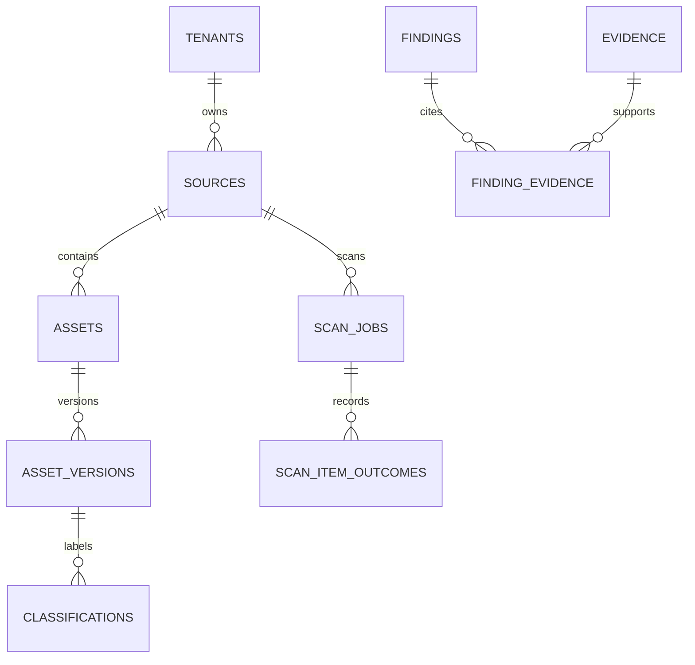
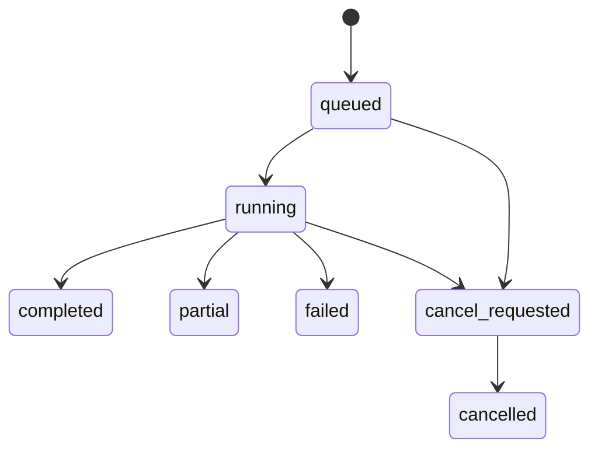

# PostgreSQL catalog: schema, invariants and migration guide

**Reference DDL:** [`schema.postgres.sql`](schema.postgres.sql). This is a reviewable G1 schema proposal. Implement it as ordered Alembic migrations against a disposable PostgreSQL instance, then test forward migration, rerun, backup restore and upgrade. It has **not** been executed against a live PostgreSQL server here. The existing G0 `installations` table remains a global installation record.

## 1. Entity relationships



The graph is stored in `graph_nodes` and `graph_edges`; each edge points to an evidence record. AI resources are declared separately. All tenant-scoped keys are composite `(tenant_id, id)`; every cross-record foreign key includes the tenant. A source's native ID is kept as a **tenant-keyed, namespaced digest**, while product records have separate UUIDs. This prevents two tenants or two accounts with `payroll.csv` from colliding.

## 2. Table dictionary and ownership

| Table | Keys and important fields | Writer | Invariant / API use |
| --- | --- | --- | --- |
| `tenants` | `id`, name | Provisioner only | Tenant root; not selected by request header |
| `auth_subjects` | `(issuer,subject,kind)` unique | Auth/provisioner | Global validated OIDC subject or workload; no email-as-primary-key |
| `tenant_memberships` | `(tenant_id,auth_subject_id,role)` | Auth/provisioner | Active membership verified at login, switch and privileged action |
| `browser_sessions` | `(tenant_id,id)`, `token_digest`, expiry/revocation | Auth service | Opaque cookie digest; no raw session or OIDC tokens |
| `sources` | `(tenant_id,id)`, connector/scope unique | Admin API | Approved fixture scope and capability snapshot; no plaintext secret |
| `scan_jobs` | `(tenant_id,id)`, source FK, lease, status and coverage | API enqueue + worker | Durable at-least-once job; `completed` only after complete/clean inspection |
| `scan_item_outcomes` | `(tenant_id,scan_id,native_key_digest)` unique | Worker | Every enumerated item gets inspected/failed/unsupported/skipped result |
| `assets` | source FK + unique namespaced native digest | Worker | Stable identity, first/last seen, deletion only after full listing |
| `asset_versions` | asset/scan FKs, source revision, fingerprints | Worker | Immutable observed snapshot; ACL-only changes also make a new version/evidence event |
| `evidence` | origin, kind, producer version, collected/expiry, limitations | Connector/worker | Masked metadata only; declared ≠ observed ≠ source verified |
| `classifications` | version/label/detector unique, evidence FK | Classifier worker | Detector score bounded 0–1, not necessarily calibrated probability |
| `ai_resources` | kind, owner, purpose, approval, lifecycle | Analyst/admin | G1 declarations only; later observed state needs separately sourced evidence |
| `graph_nodes` | kind+object unique | Correlator | One tenant-local node per typed object; app must check underlying object exists |
| `graph_edges` | node/evidence FKs, relation, decision, expiry | Correlator | Evidence-backed claim; G1 declared access decision remains `unknown` |
| `findings` | stable key digest unique, severity, status, optimistic version | Finding evaluator/analyst | Rescan updates same finding; resolved requires verified scan |
| `finding_evidence` | composite finding/evidence FKs | Finding evaluator | Many-to-many evidence; no cross-tenant linkage |
| `idempotency_records` | actor+route+key digest composite | API | Same body/key returns same effect; conflicting body returns 409 |
| `audit_events` | actor, action, result, request ID, masked details | API/worker | Append-only application operation; full cryptographic immutability is later work |

**Scope limit:** Source ACLs, chunk provenance, policy revisions, runtime decisions, model artifacts and remediation actions are **not** in G1 DDL. Add those through migrations at G2/P3 and never infer effective access from the current graph table alone.

## 3. Privileges, membership bootstrap and RLS

Use distinct service identities and roles:

| Identity | Allowed work | Explicit exclusion |
| --- | --- | --- |
| Migration owner | Apply reviewed schema migrations | Never serve browser/API requests |
| Auth bootstrap service | Look up validated issuer+subject, session digest and memberships | No source, asset, finding, evidence or export grants |
| Operator API role | Tenant-scoped CRUD allowed by service policy and DB grants | No owner/BYPASSRLS; no source scanning credentials |
| Scanner worker role | Tenant-scoped scan/asset/evidence writes and job leases | No remediation source write permission |
| Future remediation role | Only specifically approved source action | Not used by discovery or G1 API |

The reference DDL enables and forces RLS on each tenant-scoped table. [`roles.example.sql`](roles.example.sql) gives a concrete separate-role grant template for a disposable integration environment; review it before production. Before **each transaction**, the API authenticates the request, resolves an active tenant membership via the narrow auth path, and sets trusted transaction-local context:

```sql
BEGIN;
SELECT set_config('zs.tenant_id', :verified_tenant_uuid, true);
-- All tenant-scoped SELECT/INSERT/UPDATE/DELETE use the restricted application role.
COMMIT;
```

`true` makes `set_config` local to the transaction. Do not use session-persistent `SET` with a connection pool. Missing context yields no matching rows and fails WITH CHECK on writes. Always rollback on errors. The auth bootstrap role has a separate, explicit **SELECT policy** on `tenant_memberships`/`browser_sessions` in the example grants; tenant context cannot be established by reading these tables through ordinary tenant RLS before membership has been verified. That role can see all membership/session metadata, so isolate its credentials and API, restrict its query to validated issuer+subject or session digest, and test it separately. It has no grant to assets/evidence/findings.

RLS is defense in depth: a SQL injection that can run arbitrary SQL as a trusted application role could attempt to modify settings, so parameterized SQL, strict grants, separate service identities, request authorization and SQL injection tests remain mandatory. Table owners and `BYPASSRLS` roles can bypass ordinary policies; verify the **actual runtime roles**, not only a migration/superuser session. `FORCE ROW LEVEL SECURITY` affects owner behavior but does not replace role separation. See [PostgreSQL row security](https://www.postgresql.org/docs/current/ddl-rowsecurity.html).

The `graph_nodes.kind/object_id` pair is a polymorphic reference. The graph FKs guarantee that edges point to nodes of the **same tenant**, but they cannot guarantee that every `object_id` exists in the corresponding resource table. The correlation transaction must validate it, and a periodic integrity check must identify orphans. If this becomes a correctness bottleneck, migrate to typed edge tables rather than treating a generic node as source authority.

## 4. Data state rules that SQL constraints alone cannot prove

### Scan and reconciliation



`completed` requires a complete enumeration, successful inspection of every eligible item and a finish timestamp; the DDL checks this minimum. `partial` preserves usable results plus explicit omissions. `failed` has no reliable usable completion. `cancel_requested` is not terminal. A timeout, unsupported file or unreadable page must affect coverage. Only a **complete enumeration of the same approved scope** may tombstone unseen assets. A partial scan can update seen assets, but must leave unseen ones active with stale coverage. Never delete previous evidence simply because a scan failed.

`scan_jobs` has `lease_owner`, `lease_until` and `attempt`. Claim within a short transaction for a **trusted tenant context**, for example:

```sql
WITH candidate AS (
  SELECT tenant_id, id FROM scan_jobs
  WHERE tenant_id = :verified_tenant AND status IN ('queued', 'running')
    AND (lease_until IS NULL OR lease_until < now())
  ORDER BY queued_at, id
  FOR UPDATE SKIP LOCKED LIMIT 1
)
UPDATE scan_jobs AS j
SET status = 'running', lease_owner = :worker_id,
    lease_until = now() + interval '30 seconds', attempt = attempt + 1,
    started_at = coalesce(j.started_at, now())
FROM candidate AS c
WHERE j.tenant_id = c.tenant_id AND j.id = c.id
RETURNING j.tenant_id, j.id, j.source_id, j.attempt;
```

Set transaction-local tenant context **before** this query; a worker cannot derive authority merely from a job payload. Lease renewal, cancellation and completion use a compare-and-swap on current owner/attempt. Keep transactions short; perform extraction outside the lease-claim transaction; commit per-item effects idempotently under `(tenant_id,scan_id,native_key_digest)`. `SKIP LOCKED` is suited to queue-like consumers and gives an inconsistent general view, so do not reuse it for posture reports. See [PostgreSQL locking clauses](https://www.postgresql.org/docs/current/sql-select.html).

### Findings and versioning

Stable key: tenant + source + namespaced native asset + finding type + policy scope, canonicalized and tenant-keyed. Do not use a display title as identity. A repeated scan updates `last_seen_at` and supporting evidence, preserving `first_seen_at`. Workflow state (`triaged`, `accepted_risk`, `remediating`, `suppressed`) is operator intent, not a verified fix. Resolution requires a successful relevant scan or verified deletion with `verified_by_scan_id`; an operator cannot force it through the generic workflow endpoint. Use an atomic `UPDATE ... WHERE version = :if_match` and return 409 if zero rows match an existing finding. Audit actor, reason, before/after and request ID.

### Evidence and data minimization

Store origin, event/version references, masked summary, timestamps, limitations and tenant-keyed HMAC fingerprints where correlation is necessary. Ordinary unkeyed hashes of predictable PII permit guessing. Parser buffers containing customer text remain transient in the customer environment and have explicit size, time and lifetime limits. Avoid raw snippets in logs, traces, browser URLs, screenshots, exception messages, audit events and idempotency responses. `evidence` is logical provenance; cryptographic signing, chain anchoring and secure retention are later verification work, not a property of this table by itself.

## 5. Index, growth and retention decisions

The reference DDL indexes tenant-bound list ordering, scan status/lease, evidence freshness, graph traversal and finding workflow. Check `EXPLAIN (ANALYZE, BUFFERS)` against representative synthetic fixtures before adding an index. Do not add a graph database or queue broker until measured traversal/worker bottlenecks justify them. Cursor and graph queries must cap page size, traversal depth (≤4), fan-out and total paths (≤100), and return `truncated=true` when limits are hit.

Specify retention as an explicit customer policy before production. Proposed initial values to review: browser sessions until expiry plus short audit grace; idempotency records at least 24 hours; per-item scan outcomes and evidence per customer retention/hold policy; raw source content never routinely stored. Deleting a source from the catalog does not delete provider copies, RAG chunks, backups or trained-model effects. A retention job must preserve legal holds and audit its own actions.

## 6. Migrations and minimum live tests

1. **T05:** Create tenant/identity/catalog base tables and roles. Run schema migration with a dedicated owner, then API tests as the actual restricted role. A missing tenant context must deny data access. Test two tenants with identical native IDs and attempts to insert a cross-tenant FK.
2. **T06:** Add auth bootstrap path, sessions and membership role policy. Test invalid issuer/audience, expired/revoked session, removed membership, tenant switch and pooled connection reuse.
3. **T09–T10:** Add sources/capabilities and read-only fixture identities. Verify the scanner cannot write the mounted source and cannot follow a path outside the approved root.
4. **T14–T15:** Add leased jobs/outcomes/reconciliation. Two workers process the same queue without duplicate effects; kill one mid-item and recover; a partial enumeration cannot tombstone unseen assets.
5. **T16–T18:** Add findings, evidence, graph and bounded list queries. A failed scan cannot resolve a finding, an unknown edge cannot become `allowed`, and a cross-tenant UUID is indistinguishable from absent.
6. **G2 migrations:** Add source ACL versions, chunk provenance, authorized retrieval decisions and policy revisions in separate reviewed changes. Re-run every G1 isolation/coverage test.

On a clean disposable PostgreSQL volume, run migration twice (second run no-op), roll a failed migration back from a backup/rehearsal, and validate indexes and RLS using `pg_catalog` plus direct denied reads/writes. Do not assume Alembic's autogenerated diff correctly expresses composite tenant FKs, RLS policies, grants, trigger semantics or data backfills; review hand-written migration SQL. The reference DDL's single block is **not** the migration order to put into production unchanged.

## 7. Fields that require a later design decision

- Auth bootstrap's narrow membership lookup and deployment-specific OIDC issuer mapping.
- Exact legal-hold/retention policy and audit integrity mechanism.
- Connector-specific source-native ID normalization and HMAC key rotation.
- ACL semantics for each future source and consistency window for G2 revocation.
- The resource registry for code, build, cloud identities, MCP tools, model artifacts and supply-chain findings; those expand `graph_nodes` through dedicated typed records.
- Remediation approvals and separate write identities; never put a source write token in `sources.secret_ref` used by G1 scans.

These are explicit engineering decisions, not hidden assumptions. Resolve each before claiming the corresponding release gate.
