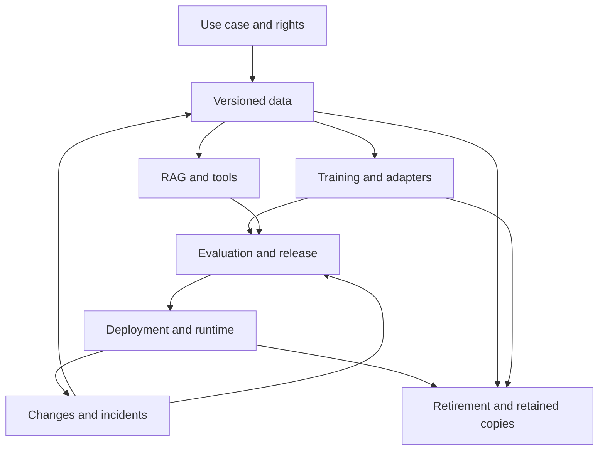

# AI-DSPM: End-to-End Master Scope and Lifecycle Tasks

**Version:** 2.0 — 24 September 2026  
**Product context:** ZeroShield AI Mesh Firewall and the proposed AI-DSPM platform  
**Status:** Implementation specification. Features, commands, tests, and acceptance targets below are requirements to build and verify, not claims that the product already implements or passes them.

## 1. Scope decision and relationship to existing plans

The product scope covers data security throughout an AI system's life: its purpose and acquisition decisions, source data, preparation, training or adaptation, evaluation, release, deployment, inference, monitoring, change, retirement, and disposal. The DSPM discovery-to-remediation cycle operates repeatedly within every applicable stage.

This is the master coverage contract. Keep the detailed engineering work already defined in `AI_DSPM_Implementation_Plan_and_Tasks.md` (T01–T64) and `AI_DSPM_Shadow_AI_Code_to_Cloud_Addendum.md` (D01–D22). This document adds L01–L32. It does not renumber or mark earlier work complete. Where a lifecycle requirement extends an existing task, implement the extension in that component; do not build a duplicate service.

**Meaning of complete coverage:** every declared lifecycle stage, supported asset type, risk family, connector capability, and trust boundary has an owner, evidence requirements, a control or documented limitation, and a test. No finite risk list guarantees detection of every future attack. Unsupported, unreachable, stale, and untested surfaces remain visible coverage gaps.

The platform supplies security and governance across MLOps. It integrates with training systems, registries, identity providers, key managers, DLP, and incident systems. It does not need to become a general-purpose model-training platform or replace those systems to govern their use.

### 1.1 Existing scope that remains mandatory

| Existing requirement | Preserved product obligation | Primary existing tasks |
|---|---|---|
| Coding assistants and coding agents | Discover installed/configured/observed use separately; correlate managed device, repository, identity, and runtime evidence | D04, D05, D08, D09, D13 |
| Desktop MCP connections | Inventory server/tool bindings, authorization, approved scope, and changes; inspect only permitted managed-device surfaces | D13, D14; T35–T42 |
| Direct and indirect LLM calls | Detect code/configuration and observe gateway/provider activity; framework import alone does not prove a live call | D04–D08 |
| Agentic applications | Identify principals, delegated users, tools, memory, data paths, side effects, and blast radius | D14, D18; T35–T42 |
| Cloud-managed AI | AWS, Azure/Foundry, and Google Cloud/Vertex/Gemini adapters with per-service evidence and permission limits | D10–D12 |
| AI embedded in SaaS | Combine identity, vendor declarations, admin settings, and available logs; inaccessible vendor internals remain unknown | D09, D15 |
| Three estate views | AI resources; supporting resources; supply-chain analysis of the same entities | D01, D03, D16, D17 |
| Code to cloud | Repository/commit → build → immutable artifact → deployment → identity → model/tool → data | D03, D06–D08, D18 |
| Source and AI data protection | Classification, effective-access evidence, authorized retrieval, prompt/output controls, agent/tool authorization, remediation | T09–T56 |
| Air-gapped operation | Local collection, classification, policy, inference where used, evidence, updates, and remediation within reachable enclave systems | D21; L30 |

### 1.2 Questions the product must answer

| Operator question | Required answer and evidence |
|---|---|
| What sensitive data can this agent access? | Time-scoped paths through agent identity, source authorization, tool capability, data classification, and observed use; label potential versus observed access |
| Which RAG/vector stores contain regulated or confidential data? | Index, namespace, chunk/source lineage, sensitivity, owner, residency, and scan coverage |
| Which employees send sensitive data to AI services? | Attributed managed-path events, identity confidence, policy decision, and coverage gaps; identity sign-in alone does not prove prompt content |
| Which agents have excessive permissions? | Granted capability versus approved purpose and observed need; unknown dependencies prevent automatic destructive privilege reduction |
| What enters prompts and leaves outputs? | Inspected boundary, direction, policy/rule version, transformations and decisions; minimized content evidence |
| Which MCP server/tool can access confidential data? | Tool schema/version, delegated principal, credential audience, source entitlement, and observed result path |
| Can an agent retrieve data its user cannot? | Effective intersection of user, workload, purpose, tenant, resource, and action permissions; unknown authorization does not become allow |
| Can we automatically redact, mask, or block? | Supported enforcement point, policy, measured detector limits, reversibility, and verified result |
| Which dataset versions trained or adapted this model? | Input manifests, training/adaptation run, base-model identity, adapters/checkpoints, signed or observed provenance, and unresolved inputs |
| Was that use of the data permitted? | Purpose-specific authorization, rights/consent record where applicable, region/provider restrictions, and policy at the time of use |
| Which release passed which tests? | Exact artifact/configuration/environment set, evaluation suite/data version, results, approval, expiration, and later invalidating changes |
| What remains after deletion or retirement? | Enumerated derivatives, caches, memory, replicas, backups, external copies, holds, and residual model risks; item-level disposal evidence |

## 2. Source alignment and the two lifecycles

IBM describes an iterative lifecycle spanning problem definition, data work, model selection, training, evaluation, deployment, and monitoring. We cover these areas and explicitly extend the product contract to acquisition, change control, retirement, and disposal. Retirement is our additional requirement, not a separate stage attributed to IBM's article. [IBM: What is the AI lifecycle?](https://www.ibm.com/think/topics/ai-lifecycle)

Palo Alto describes discovery, classification, data-flow mapping, risk assessment, control implementation, monitoring/auditing, and incident response/remediation. Its overview also calls out access monitoring and policy enforcement. Our product adds explicit verification before closure and repeats the cycle as data and permissions change. [Palo Alto Networks: What is DSPM?](https://www.paloaltonetworks.com/cyberpedia/what-is-dspm)

The controls, designs, examples, and tasks below are proposed requirements for this product. These references establish coverage anchors; they do not validate this implementation or certify compliance.

### 2.1 AI lifecycle coverage contract

The stage IDs are navigation and reporting labels, not a requirement to execute everything serially. A purchased model can skip customer-run training with a recorded reason. A RAG change can require retrieval evaluation without retraining. Every production change follows its affected dependencies back through relevant gates.

| Stage | Required security work | Concrete outputs | Gate / task |
|---|---|---|---|
| A01 — Purpose and ownership | Define use case, owner, users, permitted data/actions, acceptable risks, retention, evaluation criteria, and retirement responsibility | Versioned use-case record and policy scope | No unrestricted default purpose; L01, L02 |
| A02 — Acquire data and providers | Record origin, permissions for intended use, provider processing conditions, onward transfers, regions, and unknowns | Rights/processing records with reviewers and expiry | Unapproved use is blocked on managed paths; L02, L05 |
| A03 — Discover and collect | Inventory raw, structured/unstructured, cloud/on-prem/SaaS/endpoint, transient, and shadow data; classify and record permissions | Dataset versions, coverage receipts, ACL evidence | No scan success for skipped content; L03, L04 |
| A04 — Prepare and label | Trace cleaning, joins, OCR, chunking, labeling, features, synthetic data, de-identification, and outsourced annotation | Derivation manifests and inherited constraints | Transformation cannot silently lower sensitivity; L06, L07 |
| A05 — Select model and architecture | Assess local/provider model, base weights, licensing evidence, retention options, isolation, fallback routes, and supply chain | Model/provider decision and capability record | Opaque internals are declared unknown; L05, L09 |
| A06 — Train and adapt | Govern pretraining, fine-tuning, adapters, distillation, reward/preference data, experiment artifacts, and training identities | Run/input manifests; secured checkpoints and outputs | Preflight authorization plus output reconciliation; L08–L10 |
| A07 — Build RAG, agents, and tools | Bind source versions and ACLs to indexes; control memory, tools, identities, and data flows | Index/app/agent versions and access paths | Retrieval authorization before content reaches model; L11, L12 |
| A08 — Evaluate and approve | Test quality, privacy leakage, adversarial data paths, access controls, isolation, and use-case-specific harms | Version-bound evaluation evidence and decisions | Required missing/failed tests block relevant promotion; L13, L14 |
| A09 — Package, release, deploy | Bind code, dependencies, data/model/index versions, prompt/tool/policy versions, destination, and rollback candidate | Release manifest, approval, observed deployment | Deployed digest/config must match approved set; L15, L16 |
| A10 — Infer and act | Inspect supported inputs/outputs; authorize retrieval and tool actions; enforce tenant/purpose/egress controls | Correlated decisions and scoped boundary receipts | No forbidden bytes before a blocking decision; L17–L19 |
| A11 — Monitor and respond | Detect data, permission, behavior, supply-chain, and coverage drift; investigate incidents | Findings, risk explanations, evidence, response jobs | Blind intervals are visible; verified closure only; L20, L21, L24, L25 |
| A12 — Change and improve | Govern feedback, reindexing, retraining, model/provider swaps, prompt/tool changes, and rollback | Impact analysis and new gate decisions | Old approvals do not authorize materially changed artifacts; L22, L23 |
| A13 — Retire the AI system | Stop new activity; drain/cancel work; disable identities/routes/tools; inventory retained derivatives | Retirement plan and deactivation receipts | No new managed execution; unresolved copies remain open; L26 |
| A14 — Retain, dispose, and verify | Apply holds/expiry to data and evidence; remove authorized copies; handle backups and model residuals | Item-level deletion/retention ledger and restore tests | No blanket erasure claim from a delete API response; L27–L29 |

### 2.2 DSPM cycle required at every applicable stage

| Step | Product behavior | Example at training / example at runtime |
|---|---|---|
| C01 Discover | Enumerate assets and movement; record inventory denominator, scan status, inaccessible surfaces, and owner | Find an experiment export / discover a prompt log |
| C02 Classify | Label sensitive content and business context with detector, confidence, format support, and policy version | Identify restricted HR columns / detect customer identifiers in tool output |
| C03 Map lineage and access | Link sources, derivatives, identities, permissions, purpose, and destinations | Dataset → training run → checkpoint / document → chunk → model request |
| C04 Assess and prioritize | Explain impact, exposure, freshness, evidence quality, and control gaps | Unauthorized training purpose / overprivileged agent with observed sensitive reads |
| C05 Enforce and remediate | Apply supported local or source controls under scoped authority | Deny a training input / quarantine an index or block an external model route |
| C06 Verify | Read back source state and test the original forbidden path plus required legitimate paths | Job cannot read rejected dataset / Bob cannot retrieve a revoked chunk |
| C07 Monitor and audit | Watch changes and exceptions; retain protected evidence for a bounded period | New checkpoint copy / permission drift or uninspected fallback |
| C08 Respond and improve | Investigate incidents, preserve necessary evidence, contain, correct, retest, and feed lessons into gates | Contaminated model family / exposed session cache and affected users |

C08 returns to discovery and assessment. C06 is a release and closure requirement even when the underlying vendor API reports success. Monitoring is event driven where signals exist and scheduled otherwise; the UI displays measured delay instead of a universal real-time promise.

### 2.3 Dependency model



This diagram shows security dependencies. It is not a claim that every request traverses a training service or that every data object is deleted at retirement.

## 3. Asset, data, and evidence coverage

### 3.1 Data surfaces to inventory

| Surface | Items to track | Important limitation |
|---|---|---|
| Enterprise sources | Databases, rows/columns where supported, files, object versions, SaaS documents, shares, backups, snapshots | Listing a container is different from scanning every object |
| Data preparation | Extracts, staging tables, notebook outputs, temporary files, labels, features, OCR/transcripts, synthetic examples | Joins can create sensitivity absent in either input alone |
| Training | Training/validation/test splits, preference/reward sets, job inputs, gradients if exposed, checkpoints, weights, adapters, optimizer artifacts, experiment logs | A checkpoint can retain sensitive information without containing obvious plaintext |
| RAG | Source documents, chunks, vector payloads, embeddings, namespaces, retrieval caches, reranker inputs, search indexes | Embeddings are not an automatic anonymization boundary |
| Runtime | Prompts, attachments, images/audio where supported, outputs, streams, batch files, asynchronous jobs, provider uploads, traces, error logs | A text-only detector cannot certify image/audio protection |
| Agents and MCP | Plans, scratchpads when available, persistent memory, tool arguments/results, exported files, delegated credentials, inter-agent messages | Agent identity and human authority must be evaluated separately |
| Distribution | Container layers, model registries, artifact stores, edge/device copies, replicas, CDN/application caches, local downloads | Manifest evidence may be unavailable for unmanaged devices |
| Operations | Audit stores, telemetry, support bundles, crash dumps, replay queues, dead-letter queues, recovery snapshots | The security product's own evidence can become another sensitive dataset |
| External processing | Hosted models, AI SaaS, labeling vendors, subprocessors, customer-managed export destinations | Contractual statements and API receipts do not expose hidden provider internals |

Cover data at rest, in transit, and in use as separate control dimensions. For data in use, inspect available workload isolation, debugger/dump access, shared accelerator isolation, temporary storage, and confidential-computing attestations where supported. The posture scanner cannot prove the absence of plaintext in RAM/GPU memory or remote infrastructure. In federated/distributed training, inventory participant identities, local input policies, aggregation destinations, exchanged updates and supported privacy controls; do not infer privacy merely because raw datasets stay local. These extend R10/R17/R20 and L08/L10/L19.

Maintain `declared`, `observed`, and `verified` evidence levels. A report from a job is a declaration until corroborated with trusted run identity, storage observations, or provider evidence. Hashing identifies matching bytes; it does not prove lawful collection, authorization, or absence of poisoning.

### 3.2 Connector contract extensions

Each connector declares: inventory scope; supported asset/content types; permissions required; incremental cursor semantics; region/time coverage; classification capability; ACL/effective-access support; lineage support; runtime visibility; write actions; preconditions; verification method; retention/deletion visibility; offline behavior; and live-test status.

For each capability use one of `not_implemented`, `fixture_tested`, `live_verified`, `unsupported`, or `blocked`, alongside operational state such as `healthy`, `partial`, `stale`, or `unreachable`. A connector can be live verified for inventory and unsupported for deletion. Store these per capability, not as one green connector badge.

Start with local fixtures, PostgreSQL and existing object/file sources. Then add a customer-used training/registry stack and its cloud equivalents. Training/registry adapters should accept a generic signed manifest first; add product-specific adapters based on demand. Do not assume a Git repository, IdP, or cloud billing log exposes all prompts, training inputs, or backend SaaS models.

### 3.3 Coverage calculations

Report counts with scope and time: enumerated objects, successfully inspected objects, sampled objects, excluded objects, failed objects, and unknown/unreachable containers. Within an enumerated scope, `inspection_coverage = successfully_inspected / eligible_enumerated`; a sample count does not count as inspection of all content. If an entire container cannot be enumerated, its object denominator is unknown and must appear separately.

For lifecycle coverage, show each applicable stage and required control as supported, evidence current, failed, unknown, waived until a date, or not applicable with a reason. Never average critical missing controls into a reassuring percentage.

## 4. Shared graph, data contracts, and permission semantics

### 4.1 New records

| Record | Minimum fields and reason |
|---|---|
| `use_case_version` | Tenant, accountable owner, purpose, actors, data/actions allowed, environments, evaluation/retention requirements, review date; anchors decisions |
| `data_use_policy_version` | Use modes such as retrieval/training/evaluation/export, legal/contract review reference where applicable, regions/providers, expiry, reviewer; reading is not training permission |
| `dataset_version` | Source identity/version, partition or manifest digest, schema, classification version, ACL version, purpose policy, completeness; mutable names are insufficient |
| `derivation_event` | Input/output versions, transformation version, run identity, time, inherited restrictions, granularity and missing links; connects copies |
| `training_run` | Base-model identity, exact inputs/splits, code/image digest, parameters/seed/environment, job principal, destinations, timestamps, output manifest |
| `model_artifact_version` | Weights/checkpoint/adapter/base linkage, digest, registry location, source run, license evidence, eval references, retirement state |
| `index_version` | Embedding/chunking settings, source manifest, chunk mapping, namespace/tenant, ACL epoch, index status; binds retrieval to source security |
| `evaluation_run` | Suite, model/app/release binding, dataset version, environment, raw metric references, acceptance thresholds, failures and exclusions |
| `release_manifest` | Code/model/adapter/index/prompt/tool/policy versions, data-use decision, runtime controls, destination, approval and expiry |
| `runtime_event` | Trace/request ID, tenant, actor/delegation, release, operation, destination, policy decision, classified categories and timestamps; minimized by default |
| `retirement_plan` | System scope, dependencies, active jobs/identities, derivative inventory, holds, steps, rollback/containment constraints, owner |
| `disposition_item` | Object/version, action, authority, hold check, precondition, execution receipt, verification, residual risk, retry state |
| `evidence_record` | Producer, version, source event/time, collector time, scope, integrity metadata, freshness, access controls and retention |

Every relationship is tenant scoped, version aware, and time bounded. Examples: `derived_from`, `trained_on`, `adapted_from`, `evaluated_by`, `packaged_in`, `deployed_as`, `assumes_identity`, `retrieves_from`, `invokes_tool`, `exports_to`, `retained_in`, `supersedes`. Avoid unlimited graph traversals: paginate, cap depth/time, and display truncation.

Granularity must be honest. A dataset-level manifest cannot prove the presence or deletion of a particular person's row. Exact subject/record deletion needs a privacy-preserving subject locator or record mapping supported by that source. Such indexes themselves require strict access and retention controls.

### 4.2 Authorization contract

A managed operation is allowed only when all required authorities permit the same operation on the same resource/version: tenant boundary, human or approved service purpose, workload identity, source permissions, data-use policy, destination restrictions, and applicable lifecycle gate. An unattended batch job uses an explicitly approved service purpose; it does not invent a human delegation.

Use `allow`, `deny`, and `unknown` decisions with reasons and evidence expiry. For protected sensitive operations, `unknown` denies or routes to a predefined safe workflow. Lower-risk availability exceptions must be explicit, scoped, expiring, visible, and tested. An LLM may explain a policy result; it cannot grant access or override a deterministic denial.

Sensitive retrieval authorization happens before content is sent to the model. Output scanning is defense in depth and cannot undo upstream disclosure. The retriever must prevent unauthorized chunk text, titles, counts where sensitive, or cached results from leaking through auxiliary routes.

### 4.3 Example version-bound policy

```yaml
# Illustrative schema to implement; not a currently supported configuration.
policy_id: customer-support-data-v3
tenant_id: acme-test
dataset_version: tickets-redacted-v7
allowed_uses: [retrieval, evaluation]
denied_uses: [training, distillation, external_export]
allowed_destinations: [local-model-pool]
required_controls:
  source_acl: fresh
  retrieval_authz: enforced
  output_inspection: enforced
  audit_content: metadata_only
on_unknown_authorization: deny
retention_policy_ref: support-retention-v2
```

Changing this policy must invalidate affected cached decisions. A provider marketing label, encryption setting, or model name cannot substitute for the policy decision.

## 5. Hard constraints, remediation, and air-gapped execution

### 5.1 Non-negotiable implementation constraints

1. Tenant and source authorization are enforced in the backend and data access layer; frontend filters are not authorization.
2. Preserve raw-content minimization. Store categories, locations, digests where appropriate, and redacted evidence; raw samples require a specific retention and access policy.
3. No remote LLM, telemetry endpoint, package download, or license-server requirement in the fully disconnected operating path.
4. Model, prompt, agent, tool, and dataset content are untrusted input. Scanners and parsers use bounded resources, controlled network access, and isolation.
5. Never load an untrusted executable model serialization just to inspect it. Separate safe metadata inspection from sandboxed approved model evaluation.
6. Protect keys and source credentials through the deployment's secret/KMS system. Encryption at rest is necessary but does not prevent an authorized overprivileged agent from reading plaintext.
7. All source mutations have a capability declaration, authorization, preview, resource/version precondition, idempotency key, audit record, and independent verification.
8. Distributed remediation is a durable saga: individual steps can succeed or fail independently. Do not represent cross-system changes as a single atomic transaction.
9. Compensation must preserve current policy. Restoring old permissions after an incident can recreate exposure and requires a new decision.
10. Deleting documents, vectors, or a registry entry does not establish model unlearning or removal of every replica.
11. Legal holds, contract conditions, and rights decisions are customer-approved policy inputs. The product supports evidence and execution; it does not issue legal conclusions or automatic compliance certification.
12. Test only synthetic data and authorized disposable environments. Required unexecuted tests remain blocked/unverified.
13. An approval is bound to scope, artifact/configuration versions, destination, action, and expiration. It is not a permanent approval of a model name.
14. Missing evidence, sampling, unsupported formats, stale feeds, and unreachable resources are visible limitations at both asset and summary levels.

### 5.2 Remediation levels

| Level | Examples | Required execution rule |
|---|---|---|
| Observe | Find a public dataset export or excessive agent scope | No source mutation; create actionable evidence |
| Recommend | Propose removal of a public binding or reindexing of revoked content | Show exact target and expected impact |
| Approved execute | Remove a specific grant, rotate a scoped credential, retire an endpoint, rebuild an index | Obtain the tenant's configured approval and verify preconditions immediately before execution |
| Preauthorized automatic | Quarantine newly ingested disallowed data; invalidate platform-owned caches; block a forbidden gateway route; stop an unapproved managed training submission | Explicitly enrolled policy, bounded scope, tested adapter, concurrency control, audit and verification |
| Manual or deferred | Delete legally held data; change unmanaged SaaS internals; sanitize inaccessible media; unlearn an opaque third-party model | Track responsibility and residual risk; do not mark completed |

Suggested job states: `proposed → simulated → authorized → executing → verifying → completed`, with branches to `blocked`, `partial`, `failed`, or `compensation_required`. A successful API call moves a step into verification, not completion. A timeout after a source write requires read-back reconciliation before retry.

**Example:** A newly created index contains payroll chunks accessible to a support agent. Immediately deny that index on the enrolled retrieval gateway; enumerate affected source/chunk versions; propose or execute the authorized ACL/index correction; invalidate dependent caches; verify Bob is denied and the approved HR workflow still works. If the external ACL write fails, keep the local deny and show partial remediation. Information already returned to a user cannot be recalled.

### 5.3 Disconnected deployment

Run the catalog, workers, classification, policy decisions, identity integration, frontend assets, local evaluation services, audit, and remediation executors inside the enclave. Use local DNS/time/identity or documented offline substitutes. Import signed, versioned bundles containing images, dependencies, detector models, rules, schemas, scanner databases, and update manifests. Verify publisher trust, digests, compatibility, and anti-rollback policy before installation.

A connected collector outside the enclave may export an approved evidence package through a controlled transfer process. Inside the enclave it is a time-stamped imported snapshot, not a live cloud connection. A fully isolated deployment cannot inspect or repair unreachable public cloud/SaaS state. It can apply controls to reachable internal APIs and queue externally owned actions as pending.

Test air-gap operation with actual host/container egress controls and observations in a disposable environment. Blocking internet access only in a browser or setting a Docker network flag is insufficient. Include attempted update checks, telemetry, model downloads, fonts, OCSP/identity dependencies as applicable, and DNS traffic. Report permitted local traffic separately from forbidden external traffic.

## 6. Technology decisions for the lifecycle extension

Preserve the base plan's stack. Lock supported versions and image digests during implementation, record licenses and updates, and verify the chosen versions before release.

| Technology / approach | Use and reason | Why not expand it immediately? |
|---|---|---|
| Python/FastAPI and typed schemas | Reuse API/worker boundaries for manifests, policy inputs, scans, and lifecycle operations | Multiple new backend languages increase operational cost without a proven need |
| PostgreSQL with tenant-scoped records and edge tables | Transactions, versioned catalog, jobs, evidence references, and bounded lineage queries | A graph database is optional after measured query limits, not a prerequisite |
| Existing object storage / local artifact store | Large sanitized evidence and manifests with checksums, access control, retention | Do not put raw datasets or model weights into the posture catalog by default |
| PostgreSQL durable jobs and transactional outbox initially | Retryable remediation steps and event delivery consistent with catalog updates | Add a workflow engine/broker only when volume or workflow complexity demonstrates need |
| React/TypeScript/Vite and existing UI components | Lifecycle, evidence, release, and disposition workflows in the same console | Separate dashboards fragment investigations |
| Deterministic versioned policy evaluator | Permission and gate decisions with stable reasons and regression tests | LLM decisions are unsuitable as the sole authorization mechanism |
| Existing Keycloak/OIDC and customer IAM/KMS | Reuse authentication; integrate real workload/source authorization and keys | Do not build a new identity or cryptography product |
| Generic manifests, then registry/training adapters | Support existing customer MLOps systems without controlling training implementation | Do not require migration to a new training framework |
| OpenLineage-compatible ingestion | Import job/run/input/output metadata; add namespaced security facets and normalize internally | Lineage metadata is not an authorization engine or proof all producers reported honestly |
| Mesh runtime integration and retrieval/tool enforcement | Share policy IDs, trace IDs and evidence across data posture and runtime decisions | A gateway sees routed traffic only; repository/endpoint/cloud signals remain necessary |
| Docker Compose, pytest/Hypothesis, Playwright | Reproducible API/worker/source/browser validation, including denial and recovery | Pure mocks cannot qualify a live connector or a security boundary |
| Local tiny model plus deterministic boundary receiver | Exercise real inference separately from exact request/response-boundary assertions | A small fixture model does not establish production-model privacy or quality |
| OpenTelemetry and workload-specific load harness | Trace operation latency, queue age, policy staleness, and failure recovery | Do not import unrelated Mesh throughput numbers as DSPM guarantees |

OpenLineage defines metadata facets for jobs, runs, and input/output datasets. Use its versioned extension mechanism for security context, while keeping independent source authorization checks. [OpenLineage: Facets and extensibility](https://openlineage.io/docs/spec/facets/)

## 7. AI-DSPM risk register

This register is the initial threat-model baseline, not a claim of exhaustive detection. Each row must become a versioned control rule, scenario, or explicit integration/limitation. Risk IDs connect implementation, frontend findings, tests, exceptions, and release evidence. See L31 for adding risks as architectures change.

Evidence column abbreviations: **INV** inventory/scan receipts; **LIN** versioned lineage; **AUTH** source and delegated authorization; **RUN** observed runtime boundary; **CFG** observed configuration; **EVAL** scoped test evidence; **DISP** disposition ledger. A claim from a producer must retain its trust level.

### 7.1 Discovery, classification, purpose, and source posture

| ID | Risk and example | Required evidence / control | Verification and task |
|---|---|---|---|
| R01 | Unknown AI or owner: a developer's script sends production records to a model | INV + code/runtime correlation; ownership workflow | Undeclared fixture becomes an unapproved asset; D04–D15, L01 |
| R02 | Shadow copies: notebook export, abandoned bucket, snapshot, or test database | INV + LIN; storage discovery and derivative inventory | Seed an unregistered copy; discover or expose declared coverage gap; L04 |
| R03 | False clean scan: encrypted, unsupported, oversized, sampled, or failed content | INV receipts per outcome and format; bounded parsers | Unsupported archive remains unknown, never clean; L03 |
| R04 | Misclassification or lost business context | Detector/version/confidence plus owner override; custom categories | Measure per-category errors on held-out corpus; L03 |
| R05 | Orphaned data with no owner, purpose, or review date | Catalog completeness; scoped owner escalation | Unowned sensitive dataset cannot receive an unrestricted use approval; L01, L02 |
| R06 | Permitted reading but prohibited training/export | AUTH + purpose policy; operation-specific decision | RAG allow and training deny for the same dataset; L02, L08 |
| R07 | Unclear license, provenance, consent, or contract conditions | Reviewer-backed acquisition record; expiry and exceptions | Missing required approval blocks managed use; L02, L05 |
| R08 | Residency/onward transfer breach, including provider fallback | CFG + RUN + destination policy | Unapproved region/provider route denied; L05, L17 |
| R09 | Public exposure or excessive sharing on source/derived store | AUTH + CFG; explicit public/guest/grant evaluation | Broad grant produces finding; controlled removal verified; L19, L25 |
| R10 | Unencrypted storage/transport or excessive key access | CFG + trusted key/transport evidence; customer KMS controls | Encryption-off and wrong-principal fixtures remain findings; L19 |

### 7.2 Preparation, training, models, and supply chain

| ID | Risk and example | Required evidence / control | Verification and task |
|---|---|---|---|
| R11 | Sensitive temporary data, notebook cells, crash dumps, or experiment logs | INV + LIN; bounded retention and logging minimization | Synthetic marker absent from permitted metadata-only logs; L04, L10 |
| R12 | Derived data loses labels, ACLs, purpose, or deletion links | LIN; inherit constraints and reclassify transformations | Joined output retains stricter restrictions until reviewed; L06 |
| R13 | Masked/synthetic data mistaken for anonymous data | EVAL + transformation record; scoped reidentification checks | Reversible tokenization is labeled pseudonymized, not anonymous; L07 |
| R14 | Outsourced labeling leaks data or alters trusted labels | LIN + provider scope + quality/integrity checks | Wrong destination denied; modified label set triggers review; L05, L06 |
| R15 | Poisoned or backdoored dataset/model | Signed manifests, change review, anomaly/adversarial tests | Known poisoned fixture is flagged or blocked by declared control; L09, L14 |
| R16 | Training/evaluation contamination inflates assurance | Dataset split provenance and overlap checks | Duplicate holdout record fails evaluation-integrity gate; L13 |
| R17 | Training job reads excessive data or exports to unapproved destination | AUTH + job input/output manifests; least privilege and egress | Extra source read and external output write denied; L08, L10 |
| R18 | Model memorizes sensitive training examples | EVAL; minimization, permitted data, privacy testing and bounded claims | Canary/extraction suite records results and limits; L14 |
| R19 | Membership inference or inversion reveals private information | EVAL under defined attacker knowledge/access | Record attack setup and statistical result; no universal privacy pass; L14 |
| R20 | Exposed weights, checkpoints, adapters, gradients, or optimizer artifacts | INV + LIN + AUTH; artifact protection and lifecycle policy | Unauthorized download denied; all produced artifacts reconciled; L09, L10 |
| R21 | Malicious serialization, model code, dependency, or plugin | SCA/provenance plus isolated safe metadata inspection | Untrusted executable format is not loaded by ordinary scanner; D16, L09 |
| R22 | Swapped base model/adapter or mutable model alias | Digest and relationship checks; release binding | Same model name with changed bytes invalidates approval; L09, L15 |

### 7.3 Retrieval, runtime, agents, and data movement

| ID | Risk and example | Required evidence / control | Verification and task |
|---|---|---|---|
| R23 | RAG retrieves beyond human/source authority | AUTH + LIN; pre-model retrieval enforcement | Bob's payroll request yields no forbidden model input; T20–T26, L11 |
| R24 | Stale permissions survive in chunks, caches, memory, or pending jobs | ACL epoch/version and freshness; invalidation and recheck | Revoke access mid-session and deny subsequent protected operations; L11, L12 |
| R25 | Tenant/session crossover in vectors, semantic cache, memory, or batch output | Tenant-aware storage, query, cache and job ownership | Identical query in two tenants cannot share private results; L11, L12, L18 |
| R26 | Embedding inversion or sensitive vector payload exposure | INV + LIN + AUTH; restrict vector export and protect payloads | Unauthorized vector/payload export denied; scoped privacy tests; L11, L14 |
| R27 | Prompt injection causes data exfiltration or unsafe tool action | RUN + deterministic data/tool/egress policies | Malicious retrieved instructions cannot bypass source/tool restrictions; L14, L17 |
| R28 | Sensitive prompt, attachment, image, or audio leaves a managed boundary | Supported-format classification and destination enforcement | Positive/negative multimodal fixtures; unsupported type handled explicitly; L17 |
| R29 | Sensitive outputs leak through streaming before detection | Stream mode contract and boundary receipts | Forbidden test sequence emits zero user-visible bytes in strict mode; L17 |
| R30 | Logs, traces, caches, dead-letter queues, or support exports leak content | INV + data minimization + restricted debugging | End-to-end synthetic marker check across persistence and exports; L04, L18 |
| R31 | Retry, fallback, direct SDK, or alternate endpoint bypasses inspection | CFG + RUN; controlled routing and network enforcement | Direct and fallback calls fail or appear as explicit unmanaged gaps; T33, L16, L17 |
| R32 | Provider uploads, batch jobs, or asynchronous results escape policy | Job/file IDs, actor/purpose bindings, cancellation and reconciliation | Cross-user poll/download denied; orphaned job shown; L18 |
| R33 | Overprivileged agent/non-human identity or confused deputy | AUTH + user/workload/action intersection | Tool cannot use service privilege to bypass user's source restrictions; L19 |
| R34 | MCP/tool change, wrong token audience, or credential forwarding | Versioned tool schemas, server identity, audience/scope checks | Schema drift and wrong-audience token fail; T36–T42, D14, L19 |
| R35 | Multi-agent delegation, memory manipulation, or handoff widens authority | Traceable delegation chain, expiry and restrictive handoff policy | Child agent cannot gain parent's unrelated capabilities; L12, L19 |
| R36 | Model output executed as SQL, HTML, shell, or unapproved external action | Typed action schema, output handling and sink authorization | Untrusted output cannot trigger a side effect outside allowed action; L14, L19 |
| R37 | Joined/inferred attributes expose information despite literal redaction | Use-case evaluation, aggregation/purpose rules, query controls | Multi-query inference scenario records residual risk; L07, L14 |
| R38 | Unbounded queries, tool loops, scans, or inference degrade availability | Budgets, bounded retries/concurrency, tenant fairness | Controlled exhaustion preserves isolation and stated service envelope; L20, L32 |

### 7.4 Evaluation, release, drift, and third parties

| ID | Risk and example | Required evidence / control | Verification and task |
|---|---|---|---|
| R39 | Passing tests attached to a different artifact/configuration | EVAL + immutable release binding | Changed prompt/index/model cannot reuse stale release approval; L13, L15 |
| R40 | Unapproved deployment, environment drift, or stale rollback image | CFG + release attestation + current-policy rollback check | Live digest mismatch is detected; unsafe rollback blocked; L16, L23 |
| R41 | Missing telemetry falsely appears as no incidents | Connector heartbeat, lag, event scope and coverage | Stop a collector; dashboard shows blind interval and affected controls; L20 |
| R42 | Feedback/prompts silently become training data | Purpose-aware feedback intake and quarantine | User thumbs-up alone does not authorize training reuse; L22 |
| R43 | Provider/model/tool changes invalidate security assumptions | Versioned provider/configuration records and change triggers | Changed retention/route/tool record triggers reevaluation; L05, L23 |
| R44 | Opaque SaaS, subprocessor, or pretrained data chain treated as verified | Separate declaration, observation, verification; vendor review | Missing vendor internals remain unknown despite successful SSO; D15, L05 |
| R45 | False compliance claim or expired exception | Control/evidence mapping, exception owner/expiry | Expired waiver cannot keep a control green; L21, L31 |
| R46 | Poor evaluation conceals harmful quality/bias/hallucination behavior | Imported/use-case evaluation gates and responsible owner | Required quality/governance report missing means not assessed; L13, L31 |

### 7.5 Incidents, retirement, disposal, and recovery

| ID | Risk and example | Required evidence / control | Verification and task |
|---|---|---|---|
| R47 | Incident response lacks affected data/version/user scope | Time-aware LIN + RUN; preserve scoped evidence | Trace incident to known releases/data and show unknown paths; L24 |
| R48 | Automatic remediation deletes valid data or causes an outage | Plan/diff, preconditions, scope limit, safe compensation, verification | Concurrent source change and mid-job failure do not cause unbounded writes; L25 |
| R49 | Retired AI continues running via jobs, replicas, routes, or credentials | INV + CFG + runtime reconciliation | New managed execution denied; active work drained/cancelled and accounted; L26 |
| R50 | Source deletion leaves indexes, caches, memory, exports, or provider files | LIN + DISP; item-level deletion plan and tombstones | Known derivatives removed or explicitly retained/blocked; L27 |
| R51 | Backup restore resurrects deleted data or revoked permissions | Restore reconciliation against deletion/ACL ledger | Restore old snapshot into quarantine; forbidden content stays inaccessible; L28 |
| R52 | Legal hold/retention conflict mishandled | Approved policy and protected hold checks | Held object is restricted and retained, not silently deleted or reused; L27 |
| R53 | Document deletion incorrectly reported as model unlearning | Training LIN + residual-risk decision; retire/retrain/reassess options | Evidence distinguishes source removal from model residual state; L29 |
| R54 | Logical delete incorrectly reported as physical/media sanitization | Source-specific deletion and sanitization evidence | Unsupported physical-erasure assurance remains unavailable; L28 |

### 7.6 Risks in the security platform itself

| ID | Risk and example | Required evidence / control | Verification and task |
|---|---|---|---|
| R55 | Scanner, evidence store, or connector becomes a privileged data exfiltration path | Minimal credentials, sandboxing, restricted egress, retention | Malicious document and cross-tenant evidence access fail safely; L03, L31 |
| R56 | Falsified/replayed lineage or cross-tenant asset merging | Authenticated producers, tenant keys, event IDs, time/version rules | Replay is idempotent; forged producer and tenant collision rejected; L06 |
| R57 | Offline update is malicious, incompatible, or dangerously stale | Signed bundle, trusted keys, database age, version compatibility | Tamper/rollback tests fail; stale threat feed is visibly stale; L30 |
| R58 | Policy outage, clock skew, stale grants, or delayed revocation weakens decisions | Freshness limits, monotonic durations, trusted time bounds, safe defaults | Partition/skew test preserves required denial and reports degraded state; L20, L30 |
| R59 | Race, retry, upgrade, or scale breaks isolation or remediation correctness | Transactional state, leases, idempotency, version preconditions | Fault injection and load preserve tenant/security invariants; L25, L32 |
| R60 | Report export or support access exposes sensitive metadata | Field/row authorization, export policy, redaction and audit | Low-privilege user cannot export forbidden data or topology; L21, L31 |

### 7.7 Framework mapping and scope boundaries

Use the OWASP LLM Top 10 as one review lens: injection → R27; disclosure → R18/R28–R30; supply chain → R15/R21/R22/R44; poisoning → R15; unsafe output handling → R36; excessive agency → R33–R35; system-prompt exposure → R28/R30; vector weaknesses → R23–R26; misinformation → R46; resource exhaustion → R38. Keep system prompts free of credentials and avoid treating hidden instructions as authorization. [OWASP: 2025 Top 10 for LLMs and GenAI applications](https://genai.owasp.org/llm-top-10/)

NIST's GenAI profile provides a broader lifecycle risk-management lens. Use it to structure ownership, assessment, measurement, and ongoing treatment; it is not a product certification. The system should ingest and gate on relevant safety/quality reports, while distinguishing data-security controls it enforces from broader AI evaluations performed by other tools or people. [NIST AI 600-1: Generative AI Profile](https://nvlpubs.nist.gov/nistpubs/ai/NIST.AI.600-1.pdf)

## 8. All ten unique practices in the supplied image

The image contains eleven displayed entries because shadow-data monitoring is repeated. All ten unique practices are included below.

| Practice | Product implementation | Required evidence / gate |
|---|---|---|
| Continuous discovery and classification | Incremental scans, event triggers, rescans after transformations; content/type coverage | New and changed sensitive fixture discovered; unsupported content explicit; L03, L04 |
| Identity-centric security | Human, service, agent, workload, and delegated access linked to data and purpose | Wrong-tenant/user/service negative tests; L19 |
| Shadow-data protection | Discover temporary, abandoned, replicated and derived copies across lifecycle | Known hidden copy located or gap declared; L04, L06 |
| Risk-based access control | Deterministic policy based on approved sensitivity, action, identity, purpose, and evidence freshness | Risk score alone cannot grant/revoke arbitrary access; L02, L19, L25 |
| Continuous compliance monitoring | Versioned control mappings, evidence freshness, exceptions, owner review | Missing/expired evidence stays unknown/failed; L21, L31 |
| DSPM and DLP integration | Publish supported classification/policy context to runtime, endpoint, and egress controls | Inspect actual blocked boundary; L17, L19 |
| Encryption and data masking | Read configuration/key posture; integrate customer cryptography; mask/tokenize with semantics | Encryption and source access tested independently; L07, L19 |
| Third-party risk assessment | Model/provider/SaaS/labeling records, processing restrictions, expiry, opaque internals | Change or missing assurance triggers review; L05 |
| Automated detection and response | Correlate signals, contain on enrolled paths, execute bounded verified plans | Failure and retry tests; L20, L24, L25 |
| Risk scoring for prioritization | Explain sensitivity, exposure, blast radius, observed use, and control confidence separately | Known fixture priority ordering; no false precision; L21 |

## 9. Frontend scope additions

Extend the existing console. These are requirements for a future implementation, not a claim that the published design already contains them.

| Screen / route | Core components | Required interaction and failure state |
|---|---|---|
| `/lifecycle` | AI use-case inventory; stage/control matrix; owner; last evidence; exposure and coverage | Filter by stage/model/dataset/environment; unknown and N/A visually distinct |
| `/datasets/:id` | Versions, classifications, purposes, access, derivatives, training/RAG uses, retention | Explain why retrieval is allowed but training denied; show partial lineage |
| `/models/:id` | Base/adapter/checkpoint relationships, training manifests, registry copies, deployments, evaluations | Select exact version; distinguish imported declaration from verified provenance |
| `/releases/:id` | Manifest diff, gate results, required approvals, environment and expiration | Changed dependency invalidates relevant gate; promotion refused server-side |
| `/lineage` | Bounded data/code/deployment graph and time selector; path evidence | Select dataset to see known downstream artifacts; display truncated/unknown paths |
| `/findings/:id` | Risk rationale, affected data/actors/releases, evidence freshness and mitigations | Separate potential access from observed disclosure; restrict evidence previews |
| `/remediation/:id` | Plan, before/after diff, scope, approval, step receipts, verification | Partial execution and failed compensation remain actionable |
| `/retirement/:id` | Deactivate plan; active jobs/credentials; copy inventory; holds; disposition ledger | Retired compute may coexist with retained data; no misleading single green checkbox |
| `/coverage` | Capability matrix, scan denominator, lag, unsupported formats, offline snapshot age | Offline/unreachable connector does not appear healthy because no alerts arrived |
| `/audit` | Signed/versioned evidence references, control mappings, scoped exports | Backend authorization; redacted exports; evidence-expiry visibility |

Common UX rules: keyboard operation and readable labels; accessible status text in addition to color; time zone and observation timestamp; stable links to evidence; no raw secret exposure; no optimistic success before server verification; loading/empty/error/partial/stale states. For consequential actions, show exact resources, current authority, impact, and verification outcome.

## 10. Incremental delivery order

Lifecycle records and coverage states begin with the MVP; automated execution expands only after the relevant controls work. Phase names below are delivery slices over the existing P0–P7 plan, not a second independent roadmap.

| Slice | Existing work to retain | New lifecycle work | Exit gate |
|---|---|---|---|
| S0 — Contract and foundations | T01–T08; D01–D03 | L01 and schema/interface portions of L02/L03/L06; verification harness extensions | Real authenticated stack; tenant isolation; versioned policy/data contracts; honest unknowns |
| S1 — Read-only posture MVP | T09–T18; local D04/D08 signals | Complete foundational L02/L03/L06 checks; L04, L05, L21, first read-only L31 screens | Source → data → AI use case → finding visible with reproducible evidence |
| S2 — Protected RAG MVP | T19–T26 | L07, L11, L12 and applicable L13/L14 tests | Authorized retrieval works; denied content never reaches instrumented model boundary |
| S3 — Runtime and agents | T27–T42; D06–D09, D14, D18 | L17–L20, L24 | Prompt/output/tool/batch controls and meaningful incident investigation |
| S4 — Training-to-deployment governance | D16, D17 plus selected training/registry connectors | L08–L10, complete L13/L14, L15, L16, L22, L23 | One actual local training/adaptation-to-release workflow and one purchased-model path validated |
| S5 — Remediation and retirement | T51–T56; D20, D21 | L25–L30 | Verified response, retirement, disposal/hold handling, restore reconciliation, disconnected operation |
| S6 — Broader integrations and assurance | T43–T50; D05, D10–D15, D19 | Complete L31 and connector-specific qualification | Required customer connector capabilities have authorized live evidence |
| S7 — Scale after correctness | T57–T64; D22 | L32 | Security invariants, bounded latency/lag and recovery maintained under declared load |

Dependencies override slice placement. For example, the minimal lifecycle UI is delivered alongside each backend task; L31 adds the integrated workflow and release review. D05/D06 can be pulled earlier when a pilot requires code provenance. Do not defer basic retention/credential hygiene until retirement automation; the MVP already needs safe storage defaults.

**First practical engineering sequence:** review T01/D01 alongside L01; establish T02–T08; extend task registry for L tests; build L02/L03/L06 schemas; run one synthetic source scan; show the lifecycle/coverage view through the real API; finish the read-only gate before adding source writes. Estimate calendar dates after team capacity and pilot connectors are known.

## 11. Reproducible live verification contract

### 11.1 Required environment and fixtures

Extend the base repository and `tests/task_registry.yaml` with L01–L32, prerequisites, profiles, selectors, required browser paths, artifacts, and live-external gates. Use the same `make verify TASK=...` interface. Missing command, zero collected tests, required skip, or missing required credentials returns nonzero and leaves the gate unverified.

The local stack contains the real API, workers, catalog database, IdP, frontend, source database/object/file service, isolated RAG store, model boundary receiver, and applicable local inference/training fixtures. Add a fake external-provider service only to test protocol/fault behavior, and label its results fixture validation. A real cloud/SaaS capability requires a separate authorized live test.

Use synthetic tenants `acme-test` and `beta-test`; HR user Alice, support user Bob, a service principal, and an unrelated tenant administrator. Corpus examples include public support material, restricted payroll, source code with fake secrets, permitted training examples, forbidden training examples, labeled poisoned data, a retained-on-hold record, and a deleted subject. Use readable non-production markers such as `SYNTHETIC_PAYROLL_CANARY_7`.

All fixture versions, expected decisions, data splits, model/adapter files, images, dependencies, rules, policies, browser versions, seeds, and hardware/environment metadata are pinned. Expected results are defined independently of the production implementation; do not generate an authorization oracle by calling the same policy function under test.

### 11.2 Proposed commands to implement

```bash
make doctor
make build
make up PROFILE=lifecycle
make seed DATASET=lifecycle-golden-v1
make verify TASK=L11
make gate PHASE=lifecycle-rag
make reproduce PHASE=lifecycle-rag RUNS=2
make evidence TASK=L11
make airgap-verify PHASE=lifecycle
make down
```

These commands are planned interfaces, not commands executed to validate this document. `make down` preserves ordinary development volumes. Any reset command must refuse non-test projects, external resources, or missing disposable-environment markers. Never use broad Docker pruning as a test reset.

### 11.3 What counts as evidence

For every task capture commit, run ID, timestamps, fixture and image digests, applied migration/policy versions, test collection and outcomes, sanitized service logs, source observations, actual boundary receipts, screenshots/browser trace, and known limitations. Store in `artifacts/lifecycle/Lxx/<run-id>/` with a manifest and checksums. Restrict these artifacts as security evidence; a hash alone does not authenticate the producer.

Playwright must use real sign-in and live API responses. Component tests and mocked API responses are useful earlier but do not satisfy the integration gate. A browser screenshot alone cannot prove no data reached a model: inspect the instrumented receiver and all declared alternate routes in the controlled test. Scope the result to that instrumented environment and test window.

Two clean runs must agree on semantic decisions, entity relationships, and declared metrics within documented tolerances. Ignore only explicitly normalized volatile fields. GPU training is not universally bit reproducible across hardware; record environment and acceptable statistical variance. Security authorization decisions must remain deterministic for identical trusted inputs.

### 11.4 Acceptance targets and limits

| Measurement | Proposed initial gate | Interpretation |
|---|---|---|
| Tenant/authz negative scenarios | Zero unauthorized reads, exports, side effects, or model-boundary disclosure in the mandatory suite | Test-suite result, not proof against all attacks |
| Mandatory seeded assets and derivatives | 100% enumerated within the declared fixture scope, or explicit expected unsupported status | Does not claim enterprise-wide discovery completeness |
| Classification | Report precision/recall per category and format; select policy thresholds before release using held-out data | Never a single universal accuracy number |
| Revocation | Local high-sensitivity path rejects within a declared maximum, initially target 5 seconds after receipt of authoritative revocation; new admissions deny when required freshness cannot be established | Provider event delay is measured separately; no global 5-second guarantee |
| Lifecycle gates | All mandatory missing/stale/failed evidence scenarios block promotion | Optional gates and waivers clearly scoped |
| Remediation | No false completion; all step outcomes accounted; retries cannot broaden effects | Partial execution remains partial |
| Retirement | No new managed work admitted after deactivation is committed; in-flight work accounted with explicit handling | Cannot retract already transmitted bytes |
| Air-gap | No successful forbidden external connection; attempted connections observed and investigated; functions exercised offline | Proves tested deployment envelope only |
| Performance | Establish baseline by workload, hardware, concurrency, payload size, and scan depth, then set budgets | No borrowed throughput/latency claims |

## 12. Detailed lifecycle implementation tasks

All tasks inherit Section 11 and the hard constraints in Section 5. The Docker and frontend steps below are required additions, not substitutes for common isolation, retry, and evidence checks. A failed or unexecuted required test keeps the task open.

### L01 — Register lifecycle scope, ownership, and applicability

**Start / dependencies:** T01, T05, T06 and D01–D03 contracts. Start with one use case, one owner, two tenants, and the stage/control enums.

**Implementation:** (1) Add versioned use-case and lifecycle-applicability records. (2) Require owner, purpose, environment, data classes and retirement owner. (3) Link existing discovered resources without merging tenants. (4) Separate product implementation state from control status. (5) Record N/A reasons and expiring exceptions. (6) Add backend-authorized CRUD and audit events.

**Why / why not:** Ownership and applicability make lifecycle coverage measurable. A mandatory training stage for a hosted-model application would create meaningless checks; a justified N/A is different from an unknown upstream training history.

**Example:** A support RAG application uses a purchased model. Customer training is N/A; provider/model assurance remains applicable.

**Live Docker test:** Create both tenants through the API; attach discovered resources; attempt a foreign-tenant link; restart the API and verify version history.

**Frontend test:** Create the use case, select stage applicability, inspect missing-owner state and changed-record history.

**Success:** Correct scoped records persist; unknown and N/A are distinct. **Failure:** Cross-tenant association succeeds or missing evidence displays a pass.

**Hard constraint:** Only trusted authenticated identities can assign ownership or approve exceptions.

**Evidence:** API results, schema migration, rejected-link receipt, UI trace and coverage snapshot.

### L02 — Enforce purpose-specific data-use policies

**Start / dependencies:** L01; existing T20/T27 policy interfaces. Implement retrieval, training, evaluation, logging, and export as separate operation types.

**Implementation:** (1) Add policy version, reviewer, scope and expiry. (2) Compose purpose decisions with source authorization. (3) Define conflict handling with explicit deny precedence. (4) Return allow/deny/unknown and stable reasons. (5) Invalidate cached decisions on relevant changes. (6) Add a simulation API before any enforcement rollout.

**Why / why not:** Permission to read customer records does not authorize model training. Do not infer rights from possession of a dataset or from a permissive source ACL.

**Example:** `tickets-redacted-v7` is allowed for local retrieval, denied for training and external export.

**Live Docker test:** Exercise each operation against the same dataset; change policy during a queued request; prove revalidation before use and persistence after worker restart.

**Frontend test:** Compare two policy versions and explain a training denial in plain language without exposing raw data.

**Success:** Decisions match the independent expected matrix and current policy. **Failure:** Retrieval approval authorizes training or an expired permission remains active.

**Hard constraint:** Legal/contract assertions are approved inputs with provenance; the policy engine does not invent them.

**Evidence:** Versioned decision matrix, policy diffs, cache-invalidation receipts and browser trace.

### L03 — Make dataset versions and classification coverage explicit

**Start / dependencies:** T09–T15 schemas and L01. Define source identity, source version, manifest granularity, and scan outcomes first.

**Implementation:** (1) Store immutable dataset/partition versions and schema metadata. (2) Link classification, detector and content-extraction versions. (3) Record inspected, sampled, failed, unsupported and excluded objects. (4) Add sensitivity inheritance hooks. (5) Protect scanners with size/time/decompression limits. (6) Restrict sample access separately from metadata access.

**Why / why not:** A dataset name can point to new bytes tomorrow. Do not assign a prior scan result to a mutable alias or mark an encrypted archive clean because no text was extracted.

**Example:** A directory contains a text file, an encrypted archive, and an oversized PDF. Its coverage is mixed even if the text file is clean.

**Live Docker test:** Scan real mounted synthetic files, change one version, inject parser failure, and verify distinct outcomes and bounded worker recovery.

**Frontend test:** Show the denominator, failures and supported formats; forbid raw preview to an auditor without sample permission.

**Success:** Versions and coverage reconcile with fixtures. **Failure:** Silent skips, stale labels on changed bytes, or unbounded parsing.

**Hard constraint:** The scanner must not execute active document/model content.

**Evidence:** Scan receipts, resource limits, category metrics, source-version comparison and UI trace.

### L04 — Discover temporary, shadow, operational, and retained copies

**Start / dependencies:** L03 and existing inventory connectors. Start with local source, notebook export, log, cache and snapshot fixtures.

**Implementation:** (1) Extend asset taxonomy for temporary/operational/backup surfaces. (2) Register locations and owners. (3) Scan approved content where supported. (4) Correlate copies using strong identifiers/content evidence without claiming hashes prove semantic identity. (5) Retain discovery scope and unknown locations. (6) Trigger retention and exposure findings.

**Why / why not:** The primary dataset is only one location. Do not continuously scan arbitrary personal-device files or promise discovery outside configured sources.

**Example:** Restricted records are copied into a training notebook output and a debug log after the source bucket is secured.

**Live Docker test:** Create copies after the first scan; run incremental collection; delete one copy and verify tombstone handling; include an unreadable path.

**Frontend test:** Open an asset's known copies, distinguish exact match from inferred relationship, and inspect the unreadable location.

**Success:** Seeded supported copies are found and unresolved ones explicit. **Failure:** Source remediation automatically closes all derivative findings.

**Hard constraint:** Content correlation is tenant scoped and minimized.

**Evidence:** Before/after inventory, copy relationships, scan limitations and browser trace.

### L05 — Govern provider, model, dataset, and labeling acquisition

**Start / dependencies:** L01/L02 and D15/D17 record contracts. Start with a local model and a fixture hosted provider.

**Implementation:** (1) Record supplier, model/service version, intended data use, processing locations, retention/training settings, subprocessors and evidence sources. (2) Separate declared terms from observed settings. (3) Add review and expiry. (4) Attach allowed destinations to use-case policies. (5) Trigger review on changed terms/configuration or model replacement. (6) Track missing upstream data provenance.

**Why / why not:** Procurement choices affect later data exposure. A vendor claim or account setting is not independent proof of every backend action.

**Example:** Provider A is approved for public data; a fallback provider has no approved confidential-data processing record.

**Live Docker test:** Replay provider records; expire one; simulate an unsupported retention setting; verify policy denial for the fallback.

**Frontend test:** Show supplier evidence, expiry, scope and unknowns; compare provider changes.

**Success:** Decisions reflect reviewed scope. **Failure:** Successful API connectivity implies supplier assurance or training-data transparency.

**Hard constraint:** Live provider qualification needs a separately authorized test account and actual supported APIs.

**Evidence:** Supplier capability matrix, reviewer records, fixture/live distinction and UI trace.

### L06 — Track derivations and propagate constraints

**Start / dependencies:** L02/L03, D03 evidence graph. Start with source → normalized table → chunks and source → training split.

**Implementation:** (1) Define signed/authenticated producer and event schema. (2) Ingest run/input/output versions idempotently. (3) Preserve event and observation time. (4) Propagate sensitivity and purpose restrictions conservatively. (5) Record missing inputs, transformation scope and granularity. (6) Support OpenLineage normalization without trusting reported ACLs. (7) Add bounded forward/backward traversal.

**Why / why not:** Derivative tracking supports impact analysis and disposal. Filename similarity alone cannot establish lineage; authenticated lineage still needs source corroboration for stronger assurance.

**Example:** Joining employee and salary tables creates a payroll dataset governed by both inputs' restrictions.

**Live Docker test:** Execute a real fixture transform; replay duplicate/out-of-order events; forge producer/tenant; omit one input manifest.

**Frontend test:** Follow the derivation path and show missing-input and declared-evidence warnings.

**Success:** Correct versioned graph with conservative constraints. **Failure:** Tenant merge, duplicated edges altering counts, or unsupported label downgrade.

**Hard constraint:** Bound event size and traversal; no recursive graph query may bypass tenant isolation.

**Evidence:** Transform manifest, event receipts, independent expected graph and UI trace.

### L07 — Govern masking, tokenization, and synthetic data

**Start / dependencies:** L02/L06 and T29 transformation interface. Start with deterministic field masking and a local token vault fixture.

**Implementation:** (1) Version transformation recipes. (2) Separate irreversible redaction, display masking and reversible tokenization. (3) Record input/output lineage. (4) Restrict detokenization and vault access. (5) Check joins, utility, retained identifiers and synthetic-data generation inputs. (6) Require review before a lower-sensitivity designation.

**Why / why not:** Removing a name may leave an identifiable combination of attributes. Do not label embeddings, tokenized data, or generated examples anonymous by default.

**Example:** A synthetic support dataset still reproduces a unique customer account number from its seed prompt.

**Live Docker test:** Transform fixture data; test unauthorized detokenization, accidental raw logging, repeated values and format errors; run targeted residual-identifier checks.

**Frontend test:** Preview an authorized redacted sample and explain remaining restrictions; unauthorized users see metadata only.

**Success:** Transformation and policy state are accurate and reversible access controlled. **Failure:** A transformation silently grants broader use or logs original secrets.

**Hard constraint:** Anonymity is a contextual evaluated assertion, not the name of a pipeline step.

**Evidence:** Transformation version, residual-risk report, vault denials and UI trace.

### L08 — Add training and adaptation preflight controls

**Start / dependencies:** L02/L03/L05/L06. Begin with a tiny local training job using synthetic permitted data, without a GPU requirement.

**Implementation:** (1) Define submission manifest with exact inputs, code/image, base model, identity, outputs and destination. (2) Evaluate each input's permitted use. (3) Bind an expiring decision to versions and run identity. (4) Recheck at admission and data access where supported. (5) Observe actual reads/outputs or declare limits. (6) Connect external training systems through adapters later.

**Why / why not:** Preflight prevents known forbidden data use. It does not govern an unmanaged job merely because the developer previously uploaded a manifest.

**Example:** The same support dataset passes a retrieval gate but fails a fine-tuning submission.

**Live Docker test:** Run a valid small training job; deny forbidden/stale/extra inputs; attempt to swap a manifest after approval; inspect source read receipts.

**Frontend test:** Submit a simulated preflight, inspect dataset-level reasons, and link the resulting authorized run.

**Success:** Only admitted managed jobs access approved inputs. **Failure:** Job name reuse or changed input bytes bypass the gate.

**Hard constraint:** No automatic production training launch is implied by a posture scan.

**Evidence:** Submission and actual input manifests, job receipts, denial results and UI trace.

### L09 — Register and inspect model artifacts safely

**Start / dependencies:** L05/L06/L08; D16/D17 supply-chain evidence. Begin with local artifact files and safe metadata formats.

**Implementation:** (1) Identify base weights, adapters, merged models, checkpoints and auxiliary artifacts. (2) Record digests, origin, licensing evidence and run lineage. (3) Inspect metadata in isolation without executing untrusted code. (4) Import dependency/provenance results. (5) Track registry aliases separately from immutable versions. (6) Associate suspicious or unknown artifacts with findings.

**Why / why not:** A scanner that executes a malicious serialization can compromise the security platform. A signature shows authorized provenance, not guaranteed absence of backdoors.

**Example:** A registry tag changes from approved weights to new bytes while keeping the same visible model name.

**Live Docker test:** Register safe fixture artifacts; submit a suspicious serialization descriptor to the metadata-only path; replace alias target; ensure no code execution and new version recognition.

**Frontend test:** Compare base/adapter relationships, alias history, and unresolved provenance.

**Success:** Immutable identity and safe inspection hold. **Failure:** Executable load in ordinary scanner or prior approval inherited by changed bytes.

**Hard constraint:** Actual model loading happens only in a separately approved evaluation sandbox.

**Evidence:** Artifact inventory, isolated scanner logs, digest changes and browser trace.

### L10 — Reconcile training outputs and experiment storage

**Start / dependencies:** L04/L08/L09. Start with the allowed local training job's output directory and experiment log.

**Implementation:** (1) Capture declared outputs and observed output locations. (2) Catalog checkpoints, adapters, optimizer state and summaries. (3) Apply sensitivity, access, retention and purpose controls. (4) Check temp volumes, logs, dump/debug permissions and supported worker-isolation evidence. (5) Detect undeclared exports and distributed-training update destinations where observable. (6) Handle failed/cancelled jobs and partially written artifacts; report memory/accelerator visibility limits.

**Why / why not:** Failed jobs can leave the same sensitive data as successful jobs. Do not inventory only the final registered model.

**Example:** An interrupted fine-tuning run leaves a checkpoint and raw samples in an experiment directory.

**Live Docker test:** Stop a fixture job mid-run; reconcile actual files; attempt unauthorized artifact download; restart worker and ensure output accounting resumes.

**Frontend test:** Show complete/partial run status, outputs, findings and cleanup ownership.

**Success:** All known fixture outputs are accounted and protected. **Failure:** Cancellation implies zero outputs or sensitive logs are treated as harmless metrics.

**Hard constraint:** Do not collect full model weights into the central catalog as a convenience.

**Evidence:** Input/output reconciliation, artifact access denials, partial-job recovery and UI trace.

### L11 — Extend RAG lineage, revocation, and version integrity

**Start / dependencies:** T19–T26, L02/L06. Use the existing protected RAG implementation rather than a second retriever.

**Implementation:** (1) Bind index version to source/chunk manifest and embedding settings. (2) Preserve tenant, source version and ACL epoch. (3) Deny chunks with missing required provenance. (4) Recheck required permissions before model input. (5) Invalidate stale chunks/retrieval caches and record partial rebuilds. (6) Restrict vector/payload export.

**Why / why not:** Deleting a source or changing an ACL does not automatically update its index. Output filtering cannot repair an unauthorized retrieval already disclosed to the model.

**Example:** Alice can retrieve payroll; Bob cannot. After revocation, Alice's cached retrieval must also fail.

**Live Docker test:** Query real vector/source services; revoke during a session; test stale/missing metadata and cross-tenant identical queries; inspect the model receiver.

**Frontend test:** Explain access decisions, index freshness and rebuild status through real requests.

**Success:** Forbidden fixture content never crosses the declared model boundary; valid retrieval remains functional. **Failure:** Post-filter-only enforcement or unsafe stale-cache reuse.

**Hard constraint:** Retrieval paths outside the enforced adapter stay visible as uncovered.

**Evidence:** Source ACL versions, chunk mappings, boundary receipts, negative assertions and browser trace.

### L12 — Govern agent memory and caches

**Start / dependencies:** L02/L06/L11 and existing agent identity model. Begin with a real local session/memory store and cache implementation.

**Implementation:** (1) Inventory short/long-term memory, semantic cache and persisted summaries. (2) Key by tenant, identity/delegation context, purpose and relevant policy/source versions. (3) Set TTL and sensitivity inheritance. (4) Reauthorize on reuse. (5) Invalidate on revocation/deletion. (6) Restrict agent-to-agent transfer and explain incomplete provenance.

**Why / why not:** A safe first retrieval can become an unsafe future memory lookup. Prompt-only instructions cannot enforce cache separation.

**Example:** Bob asks a semantically similar question to Alice's earlier payroll query; the shared cache must not return her answer.

**Live Docker test:** Populate cache/memory; switch actor/tenant; revoke source; inject malicious persisted instructions; restart and repeat.

**Frontend test:** Inspect memory provenance and retention without leaking its content to unauthorized operators.

**Success:** Reuse respects current authority and TTL. **Failure:** Similarity matching overrides identity or a derived summary loses restrictions.

**Hard constraint:** Memory import is untrusted data, never authority to add tools or permissions.

**Evidence:** Cache keys/context specification, access/expiry results, invalidation receipts and UI trace.

### L13 — Implement version-bound evaluation gates

**Start / dependencies:** L01/L03/L09/L11. Define independent fixture expectations and acceptance thresholds before implementing gate logic.

**Implementation:** (1) Register evaluation suites, datasets/splits and environments. (2) Bind results to exact application/model/index/prompt/tool/policy scope. (3) Record collection counts, required tests, failures, skips and expiry. (4) Check evaluation data overlap with training inputs where lineage permits. (5) Separate data-security, quality and broader governance results. (6) Add gate APIs.

**Why / why not:** A passing model benchmark does not test application authorization. Do not compress quality and security into one score that can hide a critical failure.

**Example:** Model quality passes, but Bob's forbidden retrieval test fails; release remains blocked.

**Live Docker test:** Ingest actual test-run outputs; submit missing, tampered, stale and mismatched evidence; include a contaminated holdout fixture.

**Frontend test:** Drill into gate failures and unsupported evaluation dimensions; ensure approval cannot override mandatory backend constraints without the configured exception process.

**Success:** Only valid required evidence satisfies a gate. **Failure:** Zero collected tests or changed artifact receives pass.

**Hard constraint:** Evidence producer authorization and schema validation are mandatory.

**Evidence:** Suite manifest, raw/sanitized results, gate decisions and UI trace.

### L14 — Add privacy and adversarial data-path evaluation

**Start / dependencies:** L13 with applicable T26/T34/T42 controls and a local sandboxed model profile.

**Implementation:** (1) Define attacker access and target property for each scenario. (2) Add synthetic canary extraction, memorization, membership/inversion probes where applicable. (3) Test injection through documents/tool results/memory, output handling, encoded inputs and supported modalities. (4) Exercise deterministic authorization regardless of detector result. (5) Record sample sizes, variance, detector limits and residual risks. (6) Keep destructive tool sinks simulated and isolated.

**Why / why not:** Privacy attacks require defined assumptions and statistical interpretation. A canary not recovered in one run is not proof a model contains no private information.

**Example:** A retrieved document instructs an agent to export payroll. Source/tool/destination policy blocks it even if the injection detector misses it.

**Live Docker test:** Run controlled attacks against the live application and local model; inspect request/tool receivers and denied side effects.

**Frontend test:** Show attack scope, version binding, results and limits, avoiding a blanket secure-model label.

**Success:** Mandatory boundary invariants hold and evaluation limitations are explicit. **Failure:** Detector score substitutes for authorization or stochastic success is overstated.

**Hard constraint:** No real customer data or public third-party targets in attack fixtures.

**Evidence:** Attack configuration, seeds/model digest, boundary receipts, result statistics and UI trace.

### L15 — Create release manifests and promotion checks

**Start / dependencies:** L13/L14, D06/D17, relevant existing runtime policy tasks.

**Implementation:** (1) Build a release manifest of immutable dependencies and controlled mutable settings. (2) Include applicable evaluations, permissions/purpose constraints and environment. (3) Sign/authenticate the manifest through trusted release identity. (4) Bind approvals to scope and expiry. (5) Compare candidate versus approved dependencies. (6) Expose promotion checks to CI/CD and deployment admission where integrated.

**Why / why not:** A model can be safe in one application and unsafe with another retriever or tool. Do not approve only a registry name or image tag.

**Example:** An approved model with a newly broadened MCP tool requires changed-scope review.

**Live Docker test:** Build a fixture artifact; create an approved manifest; change an adapter/prompt/index/tool; try stale or wrong-environment approval; verify denial.

**Frontend test:** Display dependency diff and failed promotion reasons; test reviewer role separation.

**Success:** Exact authorized release is promoted; changed scope is reassessed. **Failure:** Mutable alias or replayed approval bypasses validation.

**Hard constraint:** Unintegrated deployment paths are detectable gaps, not guaranteed admission control.

**Evidence:** Release manifest, trust/configuration records, promotion receipts and UI trace.

### L16 — Reconcile deployed state against approved state

**Start / dependencies:** L15 and D07/D08. Start with the local containerized deployment and its actual runtime configuration.

**Implementation:** (1) Collect actual artifact digests and supported runtime configuration. (2) Link deployment, workload identity and release. (3) Observe routed model/tool traffic. (4) Detect missing/changed guardrails, fallback destinations and identities. (5) Track collection lag and unknown configuration. (6) Trigger review/containment according to enrolled policy.

**Why / why not:** A CI declaration describes intent. The running workload may use different configuration or bypass the declared route.

**Example:** An environment variable switches a production workload to an unapproved external model.

**Live Docker test:** Start approved deployment; alter route/configuration or image; observe drift; stop collector and confirm stale state rather than apparent compliance.

**Frontend test:** Compare approved and observed state with timestamps and affected controls.

**Success:** Drift and blind intervals are actionable. **Failure:** Deployment name alone establishes trusted provenance or live compliance.

**Hard constraint:** Collection credentials remain read only unless a separately approved response adapter is active.

**Evidence:** Deployment observations, configuration diffs, runtime correlation and UI trace.

### L17 — Connect lifecycle policy to prompt and output enforcement

**Start / dependencies:** T27–T34, L02/L05/L15. Extend Mesh interfaces with lifecycle IDs rather than duplicate inspection.

**Implementation:** (1) Carry trusted tenant/actor/purpose/release context. (2) Apply destination and data-use policy before sending inputs. (3) Inspect supported attachments/modalities with bounded parsers. (4) Apply output policies and declared streaming mode. (5) Treat unsupported types explicitly. (6) Test retry/fallback/direct-route controls and log minimization.

**Why / why not:** A source classification must affect the actual data boundary to prevent disclosure. Do not use an asynchronous alert as a claim that transmission was blocked.

**Example:** Confidential data is permitted for local inference but denied to a public fallback endpoint.

**Live Docker test:** Exercise allowed/denied/redacted requests, split-sensitive output across stream chunks, retries and fallback; inspect model and user-side bytes.

**Frontend test:** Show direction, reason, rule version and evidence scope for each decision without exposing forbidden content.

**Success:** Boundary behavior matches the policy/stream contract. **Failure:** Forbidden bytes emitted before blocking or errors silently bypass inspection.

**Hard constraint:** Strict zero-disclosure output mode buffers until required inspection completes; bounded streaming requires a separately stated leakage/latency contract.

**Evidence:** Boundary captures, stream tests, route configuration and UI trace.

### L18 — Govern batch jobs, provider files, queues, and telemetry

**Start / dependencies:** L04/L12/L17. Begin with a local asynchronous worker and provider-protocol fixture.

**Implementation:** (1) Bind file uploads, jobs, polling and result downloads to tenant/actor/purpose. (2) Inventory provider file/job identifiers without storing secrets. (3) Revalidate at deferred execution and delivery. (4) Handle cancellation, expiration and orphan reconciliation. (5) Apply retention to queues, dead-letter data and logs. (6) Record unconfirmed external deletion.

**Why / why not:** Approval at submission may be stale when a batch runs hours later. Cancelling a local job does not prove a provider stopped processing.

**Example:** Alice uploads an approved batch, then loses access before results are delivered.

**Live Docker test:** Delay execution, revoke permission, fail/retry polling, attempt Bob's result download, and inspect dead-letter records for raw markers.

**Frontend test:** Show pending/cancel-requested/provider-confirmed states and orphan ownership.

**Success:** Deferred use and result access remain authorized; all known files/jobs are accounted. **Failure:** Submission token authorizes indefinite downloads or unconfirmed cancellation displays complete.

**Hard constraint:** Fixture provider evidence must not qualify the real provider connector.

**Evidence:** Job/file state transitions, sanitized queue inspection, access denials and UI trace.

### L19 — Unify source, identity, tool, encryption, and DLP context

**Start / dependencies:** T20/T35–T42/T44; D09/D14/D18; L02/L16. Implement one source/tool path completely first.

**Implementation:** (1) Correlate human/workload/delegation context. (2) Evaluate resource/action/purpose and destination intersection. (3) Import source sharing, encryption, key-access and supported data-in-use isolation/attestation posture. (4) Connect DLP classifications/decisions through documented adapters. (5) Verify tool schemas, server identity and token scope/audience. (6) Preserve per-control capability limits.

**Why / why not:** Encryption protects stored/transmitted bytes but cannot cure excessive authorized access. A high risk score should prioritize review; it should not invent an IAM change.

**Example:** An encrypted payroll database is readable by a broad support-agent role; the access finding remains critical.

**Live Docker test:** Exercise wrong audience, excessive role, delegated-user denial, child-agent handoff, changed tool schema and encrypted-but-overexposed data.

**Frontend test:** Explain the complete data-access path and separate storage protection from effective authority.

**Success:** Required intersections hold and control gaps are explicit. **Failure:** Agent credential alone bypasses user restrictions or encryption implies safe access.

**Hard constraint:** Never forward broad provider/source credentials to untrusted tools as generic context.

**Evidence:** Decision matrix, token-scope receipts, tool/source observations and UI trace.

### L20 — Monitor lifecycle drift, coverage, and operational limits

**Start / dependencies:** L03/L16–L19 and T55. Start with event ingestion, heartbeats, policy freshness and one scheduled rescan.

**Implementation:** (1) Define signals for data/ACL/model/tool/provider/coverage change. (2) Store event and ingestion times. (3) Measure lag, missing intervals and queue age. (4) Enforce budgets for scans, tools, tokens and retries. (5) Add explicit degraded-mode decisions. (6) Route alerts with owner and deduplication.

**Why / why not:** No observed incident may mean missing telemetry. Do not claim all connectors provide continuous low-latency visibility.

**Example:** A source collector stops while cached authorization approaches its freshness limit.

**Live Docker test:** Stop collector, delay/reorder events, introduce controlled clock skew, partition policy service and exhaust a test tenant's budget.

**Frontend test:** Show blind interval, affected controls, current enforcement mode and time to evidence expiry.

**Success:** Required sensitive operations fail safely and legitimate unaffected tenants stay within declared envelope. **Failure:** Stale grants stay silently valid or missing events imply zero risk.

**Hard constraint:** Collector unavailability must not erase its earlier findings or evidence history.

**Evidence:** Fault timeline, lag/freshness measurements, denial results and UI trace.

### L21 — Explain risk, control coverage, and exceptions

**Start / dependencies:** T16, D18, L01/L03/L06 and initial findings. Start with deterministic priority fixtures.

**Implementation:** (1) Store sensitivity, exposure, affected scope, observed activity, control strength and confidence as separate attributes. (2) Define understandable priority rules. (3) Deduplicate shared root causes while retaining affected assets. (4) Add owner, SLA target, exception reason/expiry and evidence. (5) Enforce export authorization. (6) Show partial data and uncertainty.

**Why / why not:** Explainable prioritization helps operators act. An arbitrary 0–100 score is not a calibrated probability of breach or evidence of compliance.

**Example:** Observed sensitive reads by an overprivileged agent rank above an unobserved low-sensitivity test asset; an unknown critical source remains a coverage concern.

**Live Docker test:** Generate known cases, verify ordering and deduplication, expire exception, and attempt unauthorized report export.

**Frontend test:** Explain factors and evidence, filter by owner/stage, and distinguish waived from fixed.

**Success:** Priorities and status changes are reproducible. **Failure:** Risk acceptance deletes evidence or expired exceptions remain passed.

**Hard constraint:** Missing confidence must not automatically lower potential impact to zero.

**Evidence:** Rule/version fixtures, status history, export denials and UI trace.

### L22 — Govern feedback, reindexing, and retraining intake

**Start / dependencies:** L02/L06/L08/L12/L13. Start with an opt-in feedback stream and a quarantine dataset.

**Implementation:** (1) Separate feedback collection from training authorization. (2) Classify and minimize feedback. (3) Retain source/user/purpose and consent/approval references where required. (4) Create new dataset/index/model versions for changes. (5) Recheck eligibility at use. (6) Trigger affected evaluations and deletion propagation.

**Why / why not:** Feedback can contain private conversation content or malicious instructions. A positive rating or runtime access permission does not grant model-training rights.

**Example:** A user submits feedback containing a secret; it is quarantined and excluded from the next training manifest.

**Live Docker test:** Ingest permitted and forbidden feedback, revoke eligibility before retraining, and verify changed index/model dependency versions.

**Frontend test:** Show quarantined records as redacted metadata and explain training eligibility.

**Success:** Only currently eligible feedback enters approved runs. **Failure:** Raw logs are automatically converted to training data or previous release approval is reused.

**Hard constraint:** Retention and opt-out changes must apply to derived feedback datasets where identifiable and supported.

**Evidence:** Intake decisions, quarantined manifests, downstream gate results and UI trace.

### L23 — Invalidate approvals and reassess rollback candidates

**Start / dependencies:** L13/L15/L16/L22. Start with two approved release candidates and one policy change.

**Implementation:** (1) Build dependency-to-gate impact rules. (2) Mark affected evaluations/approvals stale after material changes. (3) Permit unaffected evidence reuse only with explicit rules. (4) Compare rollback candidates against current permissions, deletion ledger, vulnerabilities and purpose policies. (5) Record decision and safe fallback option. (6) Test repeated concurrent changes.

**Why / why not:** Rollback restores prior code, not prior legitimacy. A previously approved model may now contain disallowed data or rely on revoked access.

**Example:** A rollback image would restore an index containing deleted records; reject that rollback and retain containment.

**Live Docker test:** Change prompt/tool/provider/ACL independently; verify appropriate invalidation; attempt stale rollback and race with another policy update.

**Frontend test:** Display what changed, which gates need rerun, and why a rollback is unavailable.

**Success:** Gate reuse is precise and current-policy compatible. **Failure:** All prior approvals remain valid by model name or rollback reopens exposure.

**Hard constraint:** Emergency override must be a separately scoped, audited, expiring organizational process.

**Evidence:** Change-impact matrix, invalidation records, rollback decisions and UI trace.

### L24 — Investigate incidents across data, model, and deployment versions

**Start / dependencies:** L06/L16/L20/L21 and existing audit events. Begin with a seeded unauthorized export attempt.

**Implementation:** (1) Define incident scope and event window. (2) Traverse known data/identity/release paths. (3) Separate attempted, blocked, observed-sent and confirmed-received states. (4) Preserve minimal necessary evidence under incident retention. (5) Generate containment options. (6) Track unresolved paths and post-incident gate changes.

**Why / why not:** A policy violation is not always confirmed disclosure. Absence of a downstream log is not proof a remote party received nothing.

**Example:** A poisoned document caused a blocked tool export; investigate whether the same version reached other deployments.

**Live Docker test:** Trigger incident across two releases; remove one telemetry source; check blast-radius query and evidence authorization.

**Frontend test:** Build timeline, inspect affected known assets, and display missing evidence without overclaiming containment.

**Success:** Incident facts and uncertainty match controlled observations. **Failure:** Potential and actual access collapse into a single assertion.

**Hard constraint:** Incident evidence retention must not become indefinite unrestricted prompt storage.

**Evidence:** Correlated timeline, bounded graph result, preservation policy and UI trace.

### L25 — Execute durable, bounded, verified remediation

**Start / dependencies:** T51, D20, L19/L21/L24. Start with platform-owned route quarantine, then one reversible test-source grant change.

**Implementation:** (1) Define action capabilities and authorization. (2) Generate exact diff and impact preview. (3) Record resource versions, scope limits and idempotency. (4) Run a durable step-by-step saga. (5) Reconcile uncertain writes before retry. (6) Verify source state, forbidden path and necessary legitimate path. (7) Keep partial state and safe compensation options.

**Why / why not:** Distributed writes cannot be assumed atomic. Retrying without reconciliation can duplicate side effects; blind rollback can restore unsafe permissions.

**Example:** Local index quarantine succeeds but source ACL removal fails; preserve quarantine and show remaining action.

**Live Docker test:** Inject timeout after write, crash worker, change source version concurrently, and exceed allowed scope; verify no broad or duplicate effects.

**Frontend test:** Review preview, exercise proper role/approval, and inspect partial/verified states.

**Success:** Every effect is authorized, bounded and independently verified. **Failure:** API success alone closes the finding or failure triggers unsafe compensation.

**Hard constraint:** Automatic mode requires prior tenant enrollment for that exact action class and resource scope.

**Evidence:** Plan/diff, authority, step receipts, source read-back and UI trace.

### L26 — Deactivate and retire an AI system

**Start / dependencies:** L04/L06/L16/L18/L25. Begin with one application, its agent identity, index and active asynchronous job.

**Implementation:** (1) Enumerate system dependencies and retained data obligations. (2) Block new managed admissions. (3) Drain/cancel/reconcile in-flight work. (4) Disable scoped routes, deployments, tools and credentials in safe order. (5) Preserve required evidence and link disposition plans. (6) Observe for renewed activity after retirement.

**Why / why not:** Removing a UI entry does not stop replicas, scheduled jobs or usable credentials. Retiring compute and disposing data are separate state machines.

**Example:** The support assistant is retired while incident evidence remains on an approved hold.

**Live Docker test:** Start job/request; retire; attempt new requests and scheduled execution; account for already-sent and cancelled work; restart workers.

**Frontend test:** Show deactivation steps, active dependencies, retained data and unresolved external actions.

**Success:** New managed work denied and known dependencies accounted. **Failure:** Retirement status hides active endpoints or claims already-transmitted content was recalled.

**Hard constraint:** Shared credentials/resources need dependency analysis; never delete them indiscriminately.

**Evidence:** Retirement plan, admission denials, dependency receipts, post-retirement observations and UI trace.

### L27 — Implement item-level retention, holds, and deletion propagation

**Start / dependencies:** L06/L12/L18/L25/L26; T54 retention foundations. Begin with a synthetic subject/object that has known derivatives.

**Implementation:** (1) Resolve exact request scope and authority. (2) Traverse known copies with declared granularity. (3) Apply current hold/retention policy. (4) Plan source/index/cache/memory/provider-file actions separately. (5) Write durable deletion tombstones. (6) Execute eligible actions and independently verify. (7) Keep held, unknown, unreachable and unsupported items open with reasons.

**Why / why not:** A single delete endpoint cannot prove removal of every derivative. A valid hold restricts disposal but does not grant permission for unrelated AI reuse.

**Example:** A ticket and its chunks are removed; incident evidence is retained with restricted access; a provider-file deletion awaits confirmation.

**Live Docker test:** Delete known derivatives, add a concurrent new copy, apply a hold, inject provider failure, and repeat idempotently.

**Frontend test:** Inspect item ledger and residuals; ensure no blanket complete status while required actions remain unresolved.

**Success:** Each item has accurate disposition and access state. **Failure:** Held data is deleted or orphaned derivatives silently ignored.

**Hard constraint:** Subject-level claims require adequate record mapping; dataset-only lineage cannot prove row-level completion.

**Evidence:** Scope/hold decisions, tombstones, receipts, reconciliation results and UI trace.

### L28 — Prevent recovery from resurrecting forbidden data

**Start / dependencies:** L27 and T54 backup/restore. Begin with two local source snapshots and a protected deletion ledger.

**Implementation:** (1) Inventory backups, replicas, retention windows and key dependencies. (2) Restore into quarantine. (3) Replay deletion and permission changes before release. (4) Verify sensitive paths and disposal state. (5) Record media/provider sanitization capability separately from logical deletion. (6) Test ledger/key recovery and unavailable evidence.

**Why / why not:** An old backup can contain records deleted from the live system. Deleting a file pointer is not equivalent to proven media sanitization; cryptographic erasure depends on key scope, copies and system design.

**Example:** Restore a snapshot taken before Bob's access was revoked and a ticket was deleted; neither becomes accessible again.

**Live Docker test:** Restore into disposable services; reconcile ledger; test reads before/after reconciliation; remove ledger availability and verify fail-safe quarantine.

**Frontend test:** Show backup retention, restore readiness and unsupported physical-erasure assurance.

**Success:** Restore preserves current restrictions and reports residual retention. **Failure:** Old ACLs/content are released before reconciliation.

**Hard constraint:** Sanitization evidence must match the actual media/provider capability. Use the current NIST guidance as a program reference, not a delete-API certification. [NIST SP 800-88 Rev. 2](https://csrc.nist.gov/pubs/sp/800/88/r2/final)

**Evidence:** Restore manifest, reconciled tombstones/ACLs, access tests, sanitization scope and UI trace.

### L29 — Manage residual risk in models after data removal

**Start / dependencies:** L09/L14/L27/L28. Begin with one model trained on synthetic marked data and an unaffected comparator.

**Implementation:** (1) Locate known training/adaptation descendants. (2) Record what lineage can and cannot establish. (3) Offer policy-driven choices: restrict/retire affected artifacts, retrain from eligible inputs, or evaluate a supported unlearning method. (4) Inventory deployed/exported model copies. (5) Reevaluate privacy and utility. (6) Keep residual-risk decision and approval explicit.

**Why / why not:** Removing a training record does not reverse learned parameters. Even a successful limited extraction test is not universal proof of forgetting.

**Example:** A deleted customer record appears in a fine-tuning manifest; the dataset is corrected, but the deployed adapter remains affected until treated and reassessed.

**Live Docker test:** Remove source data; confirm affected-model finding remains; create corrected local model/adapter version; run scoped evaluation and prevent stale version deployment.

**Frontend test:** Distinguish data deleted, model retired, model retrained, method evaluated and residual risk accepted.

**Success:** Claims match evidence and model copies remain tracked. **Failure:** Source deletion automatically labels a model unlearned.

**Hard constraint:** Third-party opaque models may require contractual/provider action or retirement; unsupported unlearning is not automated.

**Evidence:** Affected-artifact list, treatment decision, replacement evaluation and UI trace.

### L30 — Qualify the complete lifecycle in an air-gapped environment

**Start / dependencies:** D21 and implemented local L tasks. Begin in a disposable VM/network, not on the operator's everyday host.

**Implementation:** (1) Create signed offline bundles with images, dependencies, rules/models/scanner data and compatibility metadata. (2) Document local identity, secrets, time and update trust. (3) Disable external dependencies. (4) Import approved evidence snapshots with timestamps. (5) Exercise local remediation, training/evaluation and retirement paths. (6) Verify tamper rejection, upgrade/rollback rules and stale-feed display.

**Why / why not:** Local operation is valuable only if it survives loss of all external services. Imported cloud evidence remains a historical snapshot.

**Example:** The enclave discovers and quarantines a local unauthorized model/index while a cloud-owned cleanup remains pending outside it.

**Live Docker test:** Load bundle offline; deny and observe external egress; cold-start stack; run lifecycle gate; tamper update; reboot; export sanitized evidence.

**Frontend test:** Load all assets locally, sign in through local identity, execute allowed local workflow, and display imported-data age.

**Success:** Required local workflow completes with no successful forbidden external connection. **Failure:** Silent online downloads, remote inference dependency, or unreachable cloud action reported complete.

**Hard constraint:** The egress test includes host and container paths; preserve accessible recovery controls in the disposable environment.

**Evidence:** Bundle manifest/signature result, egress observations, offline run results and UI trace.

### L31 — Complete integrated frontend, control mappings, and coverage review

**Start / dependencies:** Incremental screens from all implemented tasks; D19; L21. Start with the Section 9 route matrix and Section 7 risk registry.

**Implementation:** (1) Connect lifecycle, data/model, release, findings and retirement views. (2) Add backend-authorized drill-down/export. (3) Map risks and applicable governance controls to task/test evidence. (4) Show implemented versus tested capability separately. (5) Add accessible unknown/partial/stale states. (6) Review every lifecycle stage and risk family for omissions. (7) Version the threat model after new connectors/features.

**Why / why not:** Operators need an investigation path, not isolated metric cards. A compliance mapping is evidence organization, not legal certification.

**Example:** From an affected dataset, inspect its model and deployment, failed gate, remediation job, and retained-copy ledger.

**Live Docker test:** Run real API authorization and export tests across all roles; simulate partial/stale connectors; verify risk/task references resolve.

**Frontend test:** Playwright completes the full investigation and disposition path with real sign-in; keyboard/contrast and empty/error states checked.

**Success:** Every declared requirement has an accessible evidence path and honest status. **Failure:** Hard-coded success, unauthorized preview/export, or broken traceability.

**Hard constraint:** Security-sensitive decisions remain server-side even if UI actions are disabled.

**Evidence:** Traceability matrix, role tests, browser traces/screenshots and accessibility review.

### L32 — Qualify scale, recovery, and release claims

**Start / dependencies:** Relevant T57–T64/D22 and completed L release slice. Start with correctness baselines and explicit workload assumptions.

**Implementation:** (1) Define source count, object sizes, event rates, graph depth, tenants, job mix and runtime concurrency. (2) Establish latency/lag/resource baseline. (3) Add load and fault injection. (4) Verify isolation, revocation, lifecycle gates and remediation invariants under stress. (5) Exercise upgrade, restore, worker loss, duplicate delivery and rollback. (6) Publish supported envelope and unresolved limits.

**Why / why not:** Scaling a faulty authorization or deletion process multiplies harm. Add indexes, queues, partitions or new services only against measured bottlenecks.

**Example:** A large rescan and disposal job run while a high-sensitivity ACL revocation arrives; required denial must not wait behind bulk work indefinitely.

**Live Docker test:** Run declared load on documented hardware; kill/restart workers; inject lag; reproduce on clean test state; record p50/p95/p99 with failure counts.

**Frontend test:** Investigate a finding during load and verify status freshness, pagination, bounded graph expansion and recoverable errors.

**Success:** Published envelope meets measured security and availability gates. **Failure:** Throughput improves by bypassing inspection or hiding queue lag.

**Hard constraint:** Do not generalize test hardware/model/connector performance to untested production conditions.

**Evidence:** Workload manifest, metrics, fault timeline, invariant results, limitations and release checklist.

## 13. Worked end-to-end example: support assistant with restricted HR data

This scenario exercises a real data lifecycle without requiring a large model or paid cloud account. All records and identities are synthetic. Use a separate purchased-model scenario for vendor assurance and an optional tiny local training path for training controls.

### 13.1 Fixture setup and independent expectations

| Item | Fixture state | Expected treatment |
|---|---|---|
| Public support articles | Public, permitted retrieval and training | Allowed within approved use case |
| Redacted support tickets v7 | Internal, retrieval/evaluation allowed, training denied | RAG allowed only for authorized support users; no fine-tuning |
| Payroll v2 | Restricted, HR-only, no support purpose | Alice's approved HR workflow allowed; Bob/support agent denied |
| Training examples v1 | Synthetic, specifically approved for training | Tiny local training job allowed |
| Ticket 91 | Marked for deletion after fixture policy expiry | Known live derivatives removed; tombstone retained minimally |
| Incident evidence for ticket 91 | Valid fixture hold with restricted access | Retained under hold; excluded from unrelated AI reuse |
| Provider B | Unapproved confidential-data destination | Denied as primary and fallback route |
| Old backup | Contains ticket 91 and an old ACL | Restore stays quarantined until current restrictions reapplied |

### 13.2 Execution and acceptance sequence

1. **Define the use case.** Register support assistant, owner, permitted data/actions, local destination and retention policy. Verify missing owner/purpose blocks approval. This is A01 and L01/L02.
2. **Acquire and discover.** Import rights/provider records; scan source files and tables. Intentionally make one archive unreadable. Verify it remains unknown rather than clean. This is A02/A03 and L03–L05.
3. **Prepare.** Redact tickets, create chunk/index versions, and record all inputs and restrictions. Verify the transformation does not grant training rights. This is A04/A07 and L06/L07/L11.
4. **Exercise both model paths.** Register an approved local model. Run a tiny training job on `training-examples-v1`; attempt the same job on `tickets-v7` and deny it. Reconcile checkpoints and temporary logs. This is A05/A06 and L08–L10.
5. **Evaluate.** Alice and Bob run authorized workflows; Bob attempts payroll retrieval; poisoned content asks the support agent to export HR data. Inspect real source/model/tool receivers. Include an output split across stream chunks. Required failures block promotion. This is A08 and L13/L14/L17/L19.
6. **Release.** Bind exact code, model/adapter, index, tool and policy versions. Change a tool schema after approval and verify release invalidation. This is A09 and L15/L16/L23.
7. **Operate.** Run permitted requests and batch work; test caches, memory, retries and fallback. Revoke Alice's HR access and verify subsequent governed use denies within the declared local freshness bound. Record provider/collector delay separately. This is A10 and L11/L12/L17–L20.
8. **Detect and investigate.** Create an unauthorized debug export. Stop one collector. Verify the finding traces to known data/releases while the blind interval remains visible. This is A11 and L04/L20/L21/L24.
9. **Remediate.** Enrolled local quarantine executes; external grant change fixture fails after a timeout. Reconcile before retry; show partial response; preserve legitimate public support access. This is L25.
10. **Improve.** Feedback with a fake secret is quarantined. New permitted data causes a new index/model version and affected evaluations; no inherited stale approval. This is A12 and L22/L23.
11. **Retire.** Disable new assistant work, reconcile active jobs, revoke its scoped identity/routes/tools, and observe attempted restart. Shared resources remain dependency aware. This is A13 and L26.
12. **Dispose.** Delete ticket 91's eligible source/chunk/cache/memory copies; retain held evidence restrictively; track unknown/unconfirmed provider copies. Keep affected-model residual risk open if relevant training lineage exists. This is A14 and L27/L29.
13. **Recover.** Restore the old backup in quarantine; apply tombstones/current ACLs; verify ticket 91 and revoked access stay unavailable. Do not call this proof of physical media erasure. This is L28.
14. **Repeat offline.** Recreate the local scenario from pinned artifacts with forbidden egress denied and observed. Imported external evidence retains its age and limitations. This is L30.
15. **Repeat under load.** Re-run core negative invariants during scan/job pressure; export a sanitized evidence bundle and document the tested envelope. This is L31/L32.

### 13.3 Expected final operator report

The report must distinguish: discovered assets; successfully inspected data; unknown content; allowed versus denied data uses; exact releases tested; governed versus uncovered runtime routes; verified remediations; held/retained copies; unresolved external copies; and remaining model risks. It must not collapse these into a single claim that all data is safe or permanently erased.

## 14. Vocabulary and why each distinction matters

| Term | Meaning | Why it matters / common mistake |
|---|---|---|
| AI lifecycle | Iterative planning, data/model work, evaluation, deployment, operation and change; this scope includes retirement/disposal | Security must follow dependencies across stages |
| DSPM | Discovery, classification, access/flow analysis, risk assessment and ongoing treatment of data exposure | Inventory alone is not complete posture management |
| AI-SPM | Posture management around AI assets/configuration and related attack surfaces | It overlaps DSPM but may not inspect sensitive data or source permissions |
| DLP | Controls that detect/prevent disallowed data movement at supported boundaries | A posture finding requires an enforcement integration to stop transmission |
| DDR | Data detection and response: observing risky data activity and coordinating response | Event coverage and latency determine what can be observed |
| MLOps | Engineering/operations processes for training, deploying and maintaining models | Our product integrates with these processes instead of reimplementing all of them |
| Dataset version | An identifiable snapshot/manifest of input data | A mutable dataset name cannot bind reliable tests or approvals |
| Provenance | Evidence about origin and the process that produced an artifact | Claimed provenance and corroborated provenance carry different assurance |
| Lineage | Relationships between inputs, transformations, outputs and uses | Needed for blast radius, policy inheritance and deletion propagation |
| Data-flow mapping | Tracking locations and movements of data | A potential path is not proof of a completed transfer |
| Purpose limitation | Rules about what data may be used for | Read, retrieve, train, evaluate and export are distinct uses |
| Data minimization | Collect/process/retain only what the task needs | Security logs should not become unnecessary raw-prompt archives |
| Classification | Assigning sensitivity/business categories using content and context | Labels have detector scope and error rates; unsupported content is unknown |
| ACL | Access control list or analogous source permissions | Store and evaluate source semantics, not just display group names |
| Effective access | The authority that remains after relevant identity, policy and resource restrictions | A granted role does not alone establish effective permission |
| NHI / workload identity | Identity of a service, job, application or agent rather than a person | It must have scoped purpose and cannot automatically stand in for all users |
| Delegation | One principal authorizes another to perform specified actions | Preserve audience, scope, user context and expiry |
| RAG | Retrieval-augmented generation: retrieving context for a model | Retrieved content must be authorized before model exposure |
| Chunk | A segment derived from source content for retrieval | It must retain source version, tenant, classification and permission linkage |
| Embedding | Numeric representation used for similarity and other model operations | It is derived data, not automatically anonymous or public |
| Vector database | Storage/indexing for vectors and associated payloads | Metadata, payloads, namespaces, filters and export paths all need controls |
| Fine-tuning | Updating model parameters using additional training examples | Different permissions and residual risks from inference or RAG |
| Adapter / LoRA | Smaller learned parameter components used with a base model | Track both component and base identities, access, lineage and copies |
| Distillation | Training a model using outputs or behavior of another model | Generated examples can inherit restrictions and sensitive content |
| Checkpoint | Saved model/training state | Intermediate artifacts can be sensitive even if final model is controlled |
| Feature store | Storage/serving of derived ML input features | Joins, historical values, online caches and permissions need lineage |
| Model registry | Catalog/storage for model versions and associated metadata | Registry deletion may leave deployed/exported copies |
| Evaluation | Defined tests and measurements for a versioned scope | Security, quality and fairness are distinct dimensions |
| Holdout set | Evaluation data excluded from training | Contamination can make results misleading |
| Canary | Synthetic distinctive data used to test propagation or leakage | Failure to recover one canary is not proof of general privacy |
| Membership inference | Attempt to infer whether a record was in training data | Findings depend on attacker access, baseline and statistics |
| Model/embedding inversion | Attempt to reconstruct information from model behavior or representations | Test assumptions and actual attack surface must be stated |
| Poisoning / backdoor | Malicious training/retrieval content or artifacts that alter behavior | Integrity/provenance help, but do not prove benign semantics |
| Prompt injection | Untrusted content tries to redirect the model's behavior | Independent authorization and restricted tools remain essential |
| MCP | Model Context Protocol, used to expose tools/resources to AI clients | Tool discovery is not authorization; secure each server and action |
| Semantic cache | Reuse based on meaning/similarity rather than exact input text | Can leak across users if context and permissions are omitted |
| Agent memory | Persisted information used in later agent work | Needs ownership, provenance, current authorization and expiry |
| SCA / SBOM | Software component analysis / software bill of materials | Describes software supply chain, not complete training-data assurance |
| AI BOM | Inventory of model/data/prompt/tool and related AI components | Useful only when versions, relationships and unknowns are explicit |
| Attestation | Authenticated statement about an artifact or process | Trust depends on producer, scope, integrity and verification |
| Release gate | A check controlling progression into a target environment | Must bind exact versions and required evidence |
| Drift | Change from approved/expected data, configuration, permissions or behavior | Different changes invalidate different controls |
| Risk versus confidence | Potential harm/exposure versus strength of supporting evidence | Low confidence cannot be interpreted as low impact |
| Blast radius | Known/potential affected data, identities, systems and releases | Report bounds and unknown paths rather than fake precision |
| Idempotency | Repeating an operation has no additional unintended effect | Necessary for retries and durable remediation |
| Saga | Sequence of independently committed steps with recovery/compensation | Cross-system remediation can remain partial |
| TOCTOU | Time-of-check/time-of-use race | Recheck version and authority close to the action |
| Tombstone | Durable record that an object/version is deleted or prohibited | Prevents rediscovery/restore from silently resurrecting it |
| Legal hold | Approved instruction to preserve specified data/evidence | Blocks eligible disposal; does not authorize new unrelated processing |
| Crypto erasure | Making encrypted data inaccessible by properly destroying applicable keys | Requires correct key scope and control of all relevant copies |
| Model unlearning | Methods intended to remove the influence of selected training data | Not equivalent to deleting rows; requires method-specific validation |
| Air gap | Deployment isolated from external networks according to a defined boundary | Local control works; unreachable external state remains unobservable/unmodifiable |
| Reproducibility | Recreating a result from recorded inputs/environment within defined tolerances | Distinguish deterministic control decisions from stochastic ML metrics |

## 15. Release completion and coverage review

Before claiming end-to-end coverage for a deployment, record the following in a release-specific matrix:

1. Every A01–A14 stage is applicable or has a reviewed N/A reason; unknown upstream stages remain unknown.
2. C01–C08 responsibilities are assigned for each applicable stage and data surface, including verification and ongoing monitoring.
3. Every R01–R60 risk has a supported control/test, integration dependency, or visible limitation; new threats are added through change review.
4. All ten practices from the user's image map to implemented capabilities and current evidence for the supported scope.
5. Required T, D, and L tasks for the advertised release have actual collected tests and sanitized evidence; planned tasks are not presented as shipped features.
6. Connector capabilities are qualified individually with permission scopes, tested versions and live evidence; parser fixtures are not advertised as live integration proof.
7. The frontend accurately exposes unknown, failed, partial, stale, unsupported, waived and verified states, with role-based evidence access.
8. At least one purchased/local-model application path and one actual training/adaptation path have been exercised before claiming training-to-retirement coverage.
9. Remediation, retirement, deletion/holds, restore and offline workflows have failure/recovery evidence in the declared deployment envelope.
10. Release notes state supported environments, formats, measured limits, required enforcement integrations, unresolved residual risks, and update/ownership responsibilities.

Suggested traceability row: `requirement_id, stage_id, cycle_step, asset_scope, risk_ids, control_id, owner, implementation_task, test_ids, evidence_manifest, observed_at, expires_at, capability_state, limitation, exception_ref`. One requirement may have several rows; do not flatten multiple connectors into a single capability assertion.

### 15.1 Proposed product differentiation to validate

The product thesis is **evidence-backed data security from code and source data through AI use, change, and retirement, with local enforcement and verifiable remediation in connected or disconnected environments**. Demonstrate it through the worked scenario and supported integrations. This document does not establish that competitors lack these capabilities; exclusivity requires a separate current vendor-by-vendor validation.

The practical proof points are: purpose-specific data use; versioned data-to-model-to-deployment lineage; source-aware retrieval and agent authority; honest coverage; response verified at the original failure boundary; and retirement/disposal that accounts for derived data and residual model risk.

### 15.2 Decisions to confirm during implementation planning

Work can start with the specified local stack and fixtures. Before committing connector dates, confirm the first pilot's training/registry platform, primary cloud or on-prem stack, data sources, identity provider, agent frameworks, supported modalities, retention/hold policy owner, and required disconnected operating period. These answers prioritize adapters and qualification; they do not remove lifecycle or risk requirements from scope.

## 16. Reference use and maintenance

The IBM and Palo Alto references anchor the requested lifecycle coverage; OWASP and NIST provide risk-review lenses. OpenLineage informs an interoperability choice. Recheck versioned technical specifications and customer policies when implementing an adapter or releasing a control. The user's best-practices image is a scope input, not evidence of product compliance.

Source-derived summaries are intentionally brief. Detailed data models, task designs, examples, acceptance criteria and phased delivery decisions in this document are proposed engineering requirements. No production code, deployment, cloud connector, Docker suite, or frontend test was executed as part of preparing this scope document.
