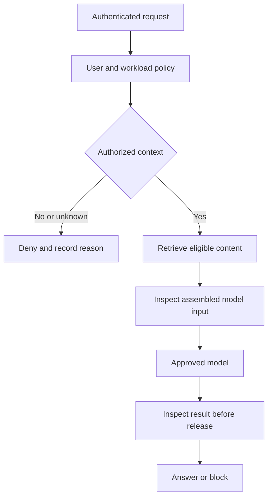

# AI DSPM Implementation Plan

Customer hosted data security for AI applications RAG and agents

Version 1.0 | 10 September 2026 | Implementation specification

Build a product that shows which sensitive data AI can reach, explains the evidence behind that conclusion, and enforces data access and disclosure policies at integrations the customer controls. Start with a working read-only posture MVP. Add a permission-aware RAG application, prompt and response controls, agent and MCP protection, broader connectors, and production operations in that order. Scale only after the supported security workflows pass their release gates.

The first environment is custom AI applications and RAG. Sensitive content is processed inside the customer environment. The sequence is independent of team size: dependencies determine when work can start, and a task becomes complete only when its acceptance evidence exists. A larger team can work on independent dependencies without changing the release gates.

This is the specification for software to build. The repository paths, Make targets, APIs, fixtures, and tests below are implementation contracts to create during the tasks. They are not a supplied application or a report that those product tests have already passed. Numeric thresholds are proposed acceptance targets, not measured performance claims.

## 1 How to use this plan

Read Sections 2 through 8 before coding. Implement T01 first, followed by T02 and T03. Complete the numbered tasks in dependency order. Use the phase gates to decide whether to add the next group of features. The glossary explains the technical vocabulary; the technology decisions explain what to adopt, what to defer, and the conditions that could change a decision.

Every task contains a starting point, a purpose and tradeoff, concrete implementation steps, a worked scenario, live Docker verification, frontend verification, success criteria, failure criteria, hard constraints, and evidence to retain. The common verification protocol is part of every task. A passing unit test alone does not complete an integration or product task.

For each task, create a small change set containing its implementation, relevant tests, migration when needed, and a short evidence manifest. If a task is too large for one change set, split it into child tasks while preserving the parent acceptance criteria. Do not mark the parent complete until the children work together in the live stack.

Use three statuses: Planned, In progress, and Verified. Blocked describes an unresolved dependency and must include a reason. Skipped is never equivalent to Verified. Keep elapsed estimates separate from effort estimates; determine delivery dates from actual task throughput after the first MVP, rather than guessing from team size.

## 2 Product scope and the nine questions

Data Security Posture Management discovers data, classifies its sensitivity, evaluates access and exposure, prioritizes findings, and tracks remediation. AI-focused DSPM adds the relationships between data, retrieval systems, models, agents, tools, and the people or workloads receiving their outputs. An AI classifier inside a generic scanner is insufficient by itself.

Posture is a statement about configuration and observed evidence at a recorded time. Runtime enforcement is a decision made while an operation is happening. Both are required for the full product, but they have different integration points, failure modes, latency budgets, and proof requirements. The first MVP delivers posture. Later gates progressively establish enforcement.

The copied market estimates and vendor ratings are not used as architecture requirements. This document defines a testable product capability set. It does not rely on a precise competitor count or assume that another vendor's feature description proves feasibility for every environment.

### 2 1 Coverage matrix

| User question | Evidence and implementation | First release with a supported answer | Boundary to show in the UI |
| --- | --- | --- | --- |
| What sensitive data can an AI agent access | Join agent identity, tool bindings, source permissions, classification, and a time-stamped access path | P2 for the demo RAG application; P4 for agents | Declared, observed, and source-verified access are different evidence levels; incomplete conditions mean unknown |
| Which RAG or vector databases contain regulated data | Classify source text and stored chunk payloads; bind labels to source and chunk versions | P2 pgvector; P5 Qdrant | An embedding alone is not a reliable source of sensitive text or original permissions; missing payload/provenance means unknown |
| Which employees send sensitive information to AI services | Authenticated gateway events for integrated apps; managed browser, endpoint, or SSE telemetry for employee web use | P3 integrated apps; P5 managed employee coverage | A domain visit is not evidence of prompt content; unmanaged traffic is outside coverage |
| Which agents have excessive permissions | Compare actual capabilities to approved purpose and required actions; show unused access as a review signal | P4 | Lack of observed use does not prove permission is unnecessary |
| What sensitive data enters an LLM prompt | Inspect the complete outbound request after retrieval and message assembly, before provider transmission | P3 | Unsupported attachments and bypass routes must be blocked or clearly excluded |
| What sensitive data an LLM returns | Inspect the complete response before release, plus structured tool results and supported streaming mode | P3 | Bytes already sent to a user cannot be retracted; probabilistic detection is not a zero-leak guarantee |
| Which MCP server or tool can access confidential data | Inventory approved servers, tool schemas, downstream credentials and source bindings; verify supported access paths | P4 | Tool descriptions are untrusted and do not prove downstream privileges |
| Can an agent retrieve something its human user cannot | Evaluate user and workload context before fetching usable content; independently test negative cases | P2; delegated agent cases in P4 | Server-side service credentials must not silently replace the user's authorization |
| Can the product redact block or mask automatically | Versioned policies at request, retrieval, response and tool boundaries; separately approved source remediation | P3 runtime; P6 source remediation | Detection confidence, supported formats, configured policies and control of the path limit protection |

### 2 2 The first two meaningful releases

**Read-only posture MVP at T18.** An operator signs in, registers a read-only local fixture source, starts a scan, sees inventory and coverage, inspects masked classifications and findings, and follows a declared AI application to the data it is configured to use. A rescan updates findings without duplication. Failed and unsupported files are visible. This release does not claim it can block a model or know arbitrary cloud IAM permissions.

**Protected RAG MVP at T26.** A demo AI application uses a separate PostgreSQL source database with pgvector. Alice can retrieve a synthetic payroll document; Bob cannot. Access is checked before forbidden chunk content is returned to the application or sent to the model. The UI explains the decision using source versions and authorization evidence. Revocation and dependency failure tests pass. This is the first release that proves the core AI data access value proposition.

Use synthetic data until these gates pass. External customer data enters only a controlled pilot with the operational and security prerequisites specified later. Scanning customer stores is read-only by default. Runtime blocking is enabled per application after observation and policy simulation.

## 3 Architecture and trust boundaries

### 3 1 Customer deployment

Run the UI, API, catalog database, scan workers, policy evaluation, model adapters, retrieval integrations, secret references, and evidence storage inside the customer environment. No prompts, source text, embeddings, credentials, or sensitive finding values are exported to the product vendor by default. Even filenames, column names, group membership and document titles can be sensitive metadata.

An external LLM is optional and requires an explicit customer-configured provider and data policy. Customer-hosted processing does not automatically make an external provider local: outbound model requests still leave that boundary. The deterministic local model fixture is the default for reproducible tests. Add an approved local inference model to test genuine model behavior; add real external providers only to separately configured integration suites.

Use one modular backend codebase at first. Separate modules own connectors, extraction, classification, inventory, authorization, policy, runtime, audit and remediation. Run API and worker as different processes from the same image when background scans begin. Avoid distributed microservices until independent scaling or failure isolation has a measured benefit.

| Component | Responsibility | Allowed data access |
| --- | --- | --- |
| Web UI | Operator workflows and explanations | Authenticated API responses with masked evidence; no direct database access |
| API and browser session backend | Authentication, tenant context, configuration, queries, policy management | Catalog through restricted application role; secret references rather than revealed secrets |
| Scan worker | Enumerate, extract, classify and reconcile | Approved sources with read-only credentials; ephemeral content buffers |
| Catalog PostgreSQL | Assets, relationships, evidence, scan state, policies, jobs and audit metadata | Product metadata; never the default repository for raw source documents |
| Retrieval adapter | Resolve permitted candidate IDs and retrieve eligible chunks | Source-specific read access constrained by trusted user and workload authorization |
| Runtime gateway | Inspect outbound requests and inbound results; apply policy | Transient content on configured routes; dedicated provider credentials |
| Identity provider | Authenticate users and workloads | Identity records and credentials; separate administration |
| Secret provider | Deliver scoped credentials and encryption keys | Only the service identities that need each secret |
| Optional telemetry collector | Aggregate sanitized metrics and traces | Allowlisted operational fields; customer-controlled destinations |

### 3 2 Correct request ordering

A RAG request is not a fixed sequence in which the LLM always comes before the vector database. A typical protected request authenticates the caller, resolves authorization, searches permitted candidates, retrieves authorized chunks, constructs the model input, inspects that input, calls the model, inspects its result, and releases the answer. An agent can repeat retrieval and tool calls within the same conversation; every iteration requires its own checks.



The product must enforce at the earliest reliable boundary. Output filtering does not repair an authorization failure that has already sent confidential data to a model. Conversely, permission to read a source does not imply permission to send its content to an external provider. Retrieval authorization and disclosure policy are separate decisions.

### 3 3 Three kinds of access evidence

**Declared access** comes from a manifest, administrator configuration or application registration. It is useful for onboarding, but might be wrong. **Observed access** comes from a successful runtime event or source audit event. It proves that one action occurred in that context at that time, not every action the identity could perform. **Verified access** comes from a supported source authorization evaluation or controlled source request, with the principal, resource version, action and relevant conditions recorded.

Every relationship stores its evidence kind, origin, collected time, validity period and limitations. A graph path is an explanation of available evidence; it is not automatically an exact reproduction of a source's complete authorization engine. Use `allowed`, `denied` and `unknown` decisions. Missing user identity, stale ACLs or unresolved source conditions must not silently become `allowed` on protected retrieval paths.

## 4 Technology decisions

Versions below describe compatibility baselines where named; T02 must select supported patch versions, check actual dependency compatibility, and commit lockfiles and image digests. Do not use floating `latest` tags. Revisit dependencies on a regular update process and when security fixes require it.

| Technology | Use and reason | Why not the main alternative yet |
| --- | --- | --- |
| Python and FastAPI | Typed HTTP contracts and a direct path to parsers, SDKs and classifiers; use a supported Python version validated in T02 | A Go or Rust rewrite creates integration work before a measured bottleneck; move a hot component only after profiling |
| Pydantic | Validate API bodies and configuration at boundaries | Dictionaries without schemas hide incompatible changes; validation alone is not authorization |
| SQLAlchemy and Alembic | Explicit transactions and reviewable database migrations | Ad hoc startup SQL makes upgrades and rollback difficult to reproduce |
| PostgreSQL | Durable catalog, joins, JSON attributes, initial job queue and audit metadata | Neo4j, Elasticsearch and separate brokers increase operations before query shape or scale demands them |
| React TypeScript and Vite | Operator UI with a small build pipeline, typed API client and component tests | Server-rendered public-site infrastructure offers little value to this private console initially |
| TanStack Query and Table | API state, paginated lists and filters | A bespoke cache is easy to invalidate incorrectly, especially across tenants |
| Plain CSS or a small established component library | Consistent forms, states and keyboard behavior | A custom design system delays the security workflows; check the chosen package's license and support in T02 |
| Docker Compose | Real local services and repeatable acceptance environments | Kubernetes adds networking, scheduling and storage operations before an MVP exists |
| Keycloak in the development stack and customer OIDC in deployment | Real sign-in and token verification without building an identity provider | Homemade passwords and unsigned development identity headers become production liabilities |
| PostgreSQL leased job table | Durable scans with atomic job state and no extra broker for the initial scale | In-process background tasks lose work on restarts; Kafka or Celery is unnecessary until workload evidence justifies it |
| Regex checksums dictionaries and Presidio adapter | Start explainable, then add local entity detection with an independently measured benefit | Sending every document to a hosted LLM breaks the default processing boundary and adds cost, latency and nondeterminism |
| Python format parsers and isolated parser subprocesses | Limited TXT CSV JSON and text PDF coverage first; explicit resource limits | A universal parser claim hides unsupported formats; add OCR Office files and archives through separately tested adapters |
| pgvector in a separate source database | A real RAG fixture with familiar SQL and exact search at small scale | A dedicated vector platform is not needed to prove permission-aware retrieval; Qdrant becomes a later connector |
| Local embedding model through a narrow adapter | Reproducible vectors with a pinned artifact and checksum | Fine-tuning a model is unnecessary to validate access controls; embedding quality and authorization are distinct |
| Explicit Python policy evaluator with versioned JSON rules | Small auditable decision space and deterministic replay | Arbitrary Python or JavaScript policy execution is unsafe; add OPA or Cedar only for demonstrated expressiveness or interoperability needs |
| pytest and Hypothesis | Behavioral, boundary and property tests | Tests that repeat implementation logic cannot establish correct authorization or redaction |
| Playwright | Browser tests against live backend and real services | API response mocks can validate a component but do not prove the product works |
| k6 | Controlled load with reproducible request mixes and latency distributions | A single curl duration or vendor benchmark does not establish capacity |
| OpenTelemetry and Prometheus | Trace correlation, queue health and measurable service behavior | Logging full prompts is unnecessary for most debugging and turns telemetry into another sensitive data store |
| Customer secret manager with file-mounted development secrets | Scoped credentials and rotation; integrate Vault or a cloud KMS through adapters | Credentials in source control, URLs or browser state are hard to contain and rotate |
| OCI images and signed release manifests | Portable customer deployment with identifiable artifacts | A mutable installation script cannot establish which code actually ran |

PostgreSQL row-level security has privileged-role and table-owner bypass behavior. The application role must be separate from migration ownership; test the actual role, and use appropriate policies plus `FORCE ROW LEVEL SECURITY` where needed. RLS complements application authorization and composite tenant-aware keys. [PostgreSQL row security](https://www.postgresql.org/docs/current/ddl-rowsecurity.html).

Compose dependency order does not prove service readiness. Define health checks and wait for the required healthy state. Pin the Playwright package and browser image together; incompatible versions can prevent browser startup. [Docker startup order](https://docs.docker.com/compose/how-tos/startup-order/) and [Playwright Docker](https://playwright.dev/docs/docker).

Presidio is an extensible detection component, not proof that every sensitive value will be found. Treat its output as model or recognizer evidence evaluated against your corpus. [Presidio FAQ](https://presidio.dataprivacystack.org/faq/).

## 5 Hard constraints

These constraints are release blockers. A scoped exception changes the supported product claim and requires an explicit architecture decision, owner and expiry. It cannot turn a failing security test into a pass.

| ID | Constraint | Required proof |
| --- | --- | --- |
| H01 | Customer content remains inside the configured processing boundary unless a specific provider policy permits export | Egress-deny test and inspection of sanitized outbound telemetry |
| H02 | Untrusted request fields never establish tenant, user or workload identity | Forged header, token audience, tenant switching and cross-tenant object tests |
| H03 | Scanners have read-only access; remediation uses a separate explicitly enabled identity | Attempted source write is denied with scan credentials |
| H04 | Protected retrieval denies absent or unusable authorization context | Forbidden chunk is absent from retrieved content, model input, caches and output |
| H05 | No raw credentials or sensitive fixture values appear in routine logs, traces, URLs, exports or test artifacts | Canary search across every evidence sink and browser trace |
| H06 | Unsupported, unreadable, encrypted, sampled or partially scanned data is visible as incomplete coverage | Denominator and reason counts reconcile without calling unknown data safe |
| H07 | Findings, policy decisions and access paths carry source and rule versions plus evidence freshness | Replay explains the exact revision used; stale state is clearly marked |
| H08 | Tenant isolation applies to all state including jobs, exports, caches, embeddings and subscriptions | Two-tenant suite with identical local IDs and colliding request keys |
| H09 | An authorization or policy failure cannot silently permit a protected request | Dependency outage tests produce the documented deny or controlled degraded result |
| H10 | A supported strict output mode releases no response content until its required inspection completes | Byte-level streaming and disconnect tests using a canary value |
| H11 | Security decisions are enforced in the backend or trusted data path | Direct API and source bypass tests pass independently of hidden UI buttons |
| H12 | Verification is reproducible with pinned artifacts and deterministic synthetic fixtures | Clean-volume rerun produces equivalent semantic results and an evidence manifest |
| H13 | External content, model output, files and tool metadata are untrusted | Parser bounds, prompt injection, XSS and tool-schema mutation cases |
| H14 | Remediation is scoped, previewed, conditionally applied, audited and verified | Stale precondition, unauthorized approval and rollback-conflict tests |
| H15 | No universal zero-leak, full-visibility, complete-compliance or exact-effective-access claims | Capability matrix names formats, integrations, identities, freshness and enforcement limits |
| H16 | Correctness is preserved when adding concurrency or performance optimizations | The security regression corpus passes at the supported load and during failures |

## 6 Data model and interfaces

### 6 1 Core records

Use UUIDs for product IDs and preserve the source's native ID separately. Every tenant-scoped record includes `tenant_id`. Prefer composite unique keys and foreign keys that include tenant identity so references cannot cross tenants accidentally. Source-native identifiers must be namespaced by connector, account and container; a filename is not globally unique.

| Record | Important fields | Meaning and invariant |
| --- | --- | --- |
| Tenant and membership | tenant_id user_id role status | Product isolation boundary and trusted membership |
| Source | source_id connector_type config_ref secret_ref scope capability_version | Registration and explicit collection boundary; no returned plaintext secret |
| Asset | asset_id native_id parent_id source_id asset_type first_seen last_seen | Stable identity across scans; source deletion is a state change |
| Asset version | version_id source_version content_fingerprint metadata_hash | Immutable snapshot used by classification and access evidence |
| Scan and item outcome | scan_id cursor counts item_status reason timestamps | Resumable work and honest enumeration and inspection coverage |
| Classification | asset_version label detector_version confidence span_ref | Sensitivity evidence; confidence is not automatically calibrated probability |
| Finding | stable_key type severity confidence status evidence_refs first_seen last_seen | Deduplicated actionable issue with resolution history |
| Principal and membership edge | principal_id kind external_id member_of observed_at | Human, group, workload or agent identity without conflation |
| Access edge | subject resource action condition decision evidence_kind expires_at | A contextual claim, including unknown and denied cases |
| AI asset and binding | app_or_agent_id owner purpose provider tools source_refs | Declared or observed connection between AI and data |
| Chunk provenance | chunk_id source_version offsets embedding_revision acl_revision | Trace a retrieved fragment to a current authorized source |
| Policy revision | policy_id revision scope rules mode digest activated_at | Immutable input to deterministic decisions |
| Decision event | request_id actor workload stage action reason policy_revision | Minimal evidence of enforcement without routine raw content |
| Job and outbox | job_id tenant_id lease_owner lease_until attempt dedupe_key | At-least-once execution with idempotent effects |
| Remediation action | action_id target expected_revision diff approval status | A bounded source change with verifiable preconditions |

Store relationships in relational edge tables initially. Index by tenant, subject, resource, type and freshness. Use bounded recursive queries for graph views and cap depth and fan-out. Introduce a graph database only when measured relationship queries justify its operational cost and migration path.

### 6 2 API conventions

Publish an OpenAPI specification under versioned `/api/v1` routes. Use cursor pagination with a stable tie-breaker, bounded filters, UTC timestamps, explicit schema versions and opaque external identifiers. Return a request ID and structured error code. Use 401 for unauthenticated callers, 403 for authenticated policy denial, 409 for stale version or conflicting state, 413 for exceeded supported request bounds, 429 for throttling and 503 for a required unavailable dependency. Avoid disclosing another tenant's object existence; a consistent 404 policy can be appropriate for object lookups.

| Endpoint family | Initial operations | Key behavior |
| --- | --- | --- |
| `/sources` | Register list inspect disable test connectivity | Connectivity result includes capabilities and limitations |
| `/scans` | Create inspect cancel list outcomes | POST returns 202 with scan ID; cancellation has an explicit terminal state |
| `/assets` and `/findings` | Paginate filter inspect evidence update workflow state | Masked evidence; access-controlled exports |
| `/ai-assets` and `/access-paths` | Register binding inspect reachability | Declared versus verified evidence is visible |
| `/authorize` | Evaluate subject workload resource action context | Internal trusted interface; allow deny unknown with reasons |
| `/policies` | Create revision simulate activate rollback | Optimistic concurrency and role enforcement |
| `/runtime` | Supported model request adapter | Application and provider allowlist; payload size and timeout limits |
| `/events` | Inspect sanitized decision history | Scope and retention apply to every query |
| `/remediations` | Preview approve apply inspect rollback | Separate permission and write identity |

The policy evaluator accepts trusted identity separately from request content. A client cannot grant itself group membership by including `groups` in JSON. Provider adapters normalize only documented supported shapes; unknown content types or tool variants receive an explicit unsupported result in protected mode.

### 6 3 Failure states

A scan progresses from queued to running and then completed, partial, failed or cancelled. Completed requires complete enumeration and successful inspection of every eligible item; successful inspection does not imply sensitive-data-free content. Partial means useful results exist but enumeration is incomplete or some eligible items failed, were skipped or remain unsupported. Failed means a fatal error prevented usable completion; cancelled means execution stopped at the operator's request while preserving any prior outcomes. Publish both enumeration completeness and inspection completeness. A partial listing must not tombstone unseen assets as deleted.

A finding progresses from open to triaged, accepted risk, remediating, resolved or suppressed. Store who changed its workflow state and why. Suppression requires scope and expiry. A failed rescan cannot resolve a finding. Resolution requires a successful relevant recheck or a verified source deletion.

A runtime request records allowed, redacted, blocked, unsupported, error or approved degraded behavior. Keep security policy outcome separate from provider HTTP success. A provider 200 response can still be blocked before the user receives it.


## 7 Reproducible development and verification

### 7 1 Repository layout

| Path to create | Purpose |
| --- | --- |
| `apps/api` | FastAPI routes, browser sessions and API composition |
| `apps/web` | React console and the protected RAG demonstration screen |
| `packages/domain` | Data contracts, rule types, authorization and risk logic |
| `packages/connectors` | Source adapters and their capability declarations |
| `packages/processing` | Extraction, normalization, detection and span transformations |
| `packages/runtime` | Retrieval hooks, model adapters and MCP boundaries |
| `workers` | Scan dispatch, leases, reconciliation and scheduled work |
| `migrations` | Forward migrations and recovery notes |
| `fixtures` | Synthetic corpus, source ACLs, identities and expected results |
| `tests/unit` and `tests/integration` | Behavioral tests and live service contracts |
| `tests/security` and `tests/e2e` | Negative security cases and live Playwright workflows |
| `tests/load` | k6 mixes and benchmark definitions |
| `ops/compose` and `ops/deploy` | Local profiles and customer installation manifests |
| `scripts` | Preflight, seed, reset, verify, evidence and release commands |
| `docs/adr` and `docs/capabilities` | Decisions, tradeoffs and supported connector claims |
| `artifacts` | Ignored local test evidence; never commit secret-bearing captures |

### 7 2 Docker profiles

The `core` profile evolves with its tasks. T04 starts only web, API and catalog database. T06 adds the identity provider. T14 adds a separate worker process. Do not start services for an unimplemented feature simply to resemble the final architecture.

| Profile | Added live services | Activated by |
| --- | --- | --- |
| core | Web API catalog database identity provider and worker as introduced | T04 through T18 |
| rag | Separate source PostgreSQL with pgvector, local embedding adapter and deterministic model fixture | T19 |
| runtime | Gateway process when separated, provider fixture and controlled proxy failure endpoints | T28 |
| agents | Approved MCP test servers and authorization-server fixture configuration | T36 |
| connectors | S3 protocol fixture and Qdrant; enable each only for its tests | T43 and T46 |
| observability | OTel collector Prometheus and optional Grafana | T55 or earlier when diagnostic need exists |
| test | API test runner and Playwright browser runner | T03 and T04 |
| load | k6 and metrics collection | T57 |

Bind development UI and API ports to loopback. Databases, parser workers, model fixtures and internal admin ports are not published by default. Use health checks, non-root application containers, read-only root filesystems where compatible, bounded memory and CPU, and private Compose networks. Use temporary writable volumes only where required. A local Docker network is useful isolation, not a replacement for customer production network controls.

### 7 3 Command contract

T02 and T03 implement these commands. Until implemented, a missing command or missing task test returns nonzero and the task remains unverified. Commands run from the future product repository root. `make verify` uses the task registry to start only required profiles, run the specified checks and collect evidence. Authentication helpers must use the real test identity provider; they must not install a production authentication bypass.

```bash
# Inspect tools, ports, image availability, disk and memory
make doctor

# Build from committed lockfiles and record image digests
make build

# Start the current implemented core and wait for health
make up PROFILE=core

# Seed deterministic data into disposable test resources
make seed DATASET=golden-v1

# Run the task's real integration and browser checks
make verify TASK=T18

# Run every required check for a release boundary
make gate PHASE=P1

# Repeat from new disposable volumes and compare semantics
make reproduce PHASE=P1 RUNS=2

# Package sanitized evidence for review
make evidence TASK=T18

# Stop containers while preserving ordinary dev volumes
make down
```

Implement `make reset-test CONFIRM_TEST_PROJECT=ai-dspm-test` as a guarded destructive command for disposable test volumes only. It must refuse a production context, an unrecognized project name, a missing test marker or an external source. Do not suggest a broad `docker system prune` or an unscoped volume deletion as normal troubleshooting.

The registry at `tests/task_registry.yaml` maps T01 through T64 to prerequisite tasks, profiles, test selectors, frontend checks and required evidence. The runner fails on zero collected tests, required skips, missing credentials for a required live gate, and unexpected retries. Optional external-provider suites may be absent from local runs, but the corresponding connector release stays blocked until its live external gate has evidence.

For example, T23 runs authorization integration tests in the source database and the Playwright test for Bob's blocked retrieval. The frontend test must not stub API responses with `page.route().fulfill()`. The backend test also inspects the model fixture's received request because a clean-looking UI could hide an upstream data leak.

### 7 4 Golden corpus

Create `golden-v1` from a fixed seed and commit its generation code, expected manifests and SHA-256 file checksums. The corpus contains fictitious records and nonfunctional secrets. Use reserved example domains for email addresses. Never seed a real customer export or a real provider key.

| Fixture | Contents and access | Expected result |
| --- | --- | --- |
| `public_handbook.txt` | Harmless policy text; Alice and Bob can read | No configured sensitive rule match; both retrieve |
| `payroll.csv` | Synthetic names, emails and salary values; Alice in HR, Bob outside HR | Classified personal/confidential; Alice allowed, Bob denied |
| `support_ticket.json` | Fictitious customer email and configured nonfunctional secret marker | Entity and secret findings with masked evidence |
| `research_note.txt` | Confidential project codename that has no PII pattern | Dictionary/business-label detection after configured rule; demonstrates that PII alone is insufficient |
| `fake_key_near_miss.txt` | Key-like string that intentionally fails the configured format or checksum | Negative control; no high-confidence secret finding |
| `scanned_form.pdf` | Synthetic image-only PDF | Explicit OCR-required status until OCR support is implemented |
| `encrypted_report.pdf` | Password-protected synthetic document | Explicit encrypted/unreadable outcome, never a clean scan |
| `oversized.txt` | Deterministically generated file over the configured size bound | Bounded rejection with reason and counted coverage gap |
| `revoked_doc.txt` | Initially readable by Bob then access revoked | Denied after the defined freshness boundary; stale chunks unusable |
| `tool_injection.txt` | Synthetic instruction to bypass policy or use an unapproved tool | Treated as source data; no permission or tool authority granted |
| Tenant Alpha and Tenant Beta | Same filenames and source-native IDs, different content | No cross-tenant identity, finding, cache or export collision |
| Unknown-ACL document | Content exists but permission evidence is missing | Inventory can show unknown; protected retrieval denies |

The full deterministic detection evaluation contains at least 400 text snippets: 100 positive configured-secret cases, 100 positive supported-PII cases, 100 clean negatives and 100 difficult near-misses or format variations. Keep train/tuning and holdout partitions separate by document template and value family, not only random row splits. Add a later customer-approved validation corpus without relabeling the holdout to match the implementation.

### 7 5 Verification layers and evidence

**Unit layer.** Test decision tables, parser bounds, span coordinate handling, stable finding keys, risk ordering and error transitions. Use properties for tenant scoping, idempotency and transformation invariants. Do not write a second copy of a policy evaluator and compare it with the first as the only oracle.

**Live integration layer.** Use real containers for PostgreSQL, identity, vector retrieval, source protocols and MCP servers. Inject faults at network and process boundaries, not only through mocked Python methods. A protocol emulator is allowed for deterministic local coverage; it cannot prove the live cloud provider's IAM, throttling, consistency or license behavior.

**Browser layer.** Sign in, use real forms and filters, wait on visible state rather than arbitrary sleeps, inspect requests when useful, and verify persisted state after refresh. Check loading, empty, partial, unauthorized and dependency-failure states. For secrets, test the DOM, network response, downloaded file and diagnostic artifacts, not just visible text.

**External integration layer.** Use approved disposable cloud resources and actual provider APIs to validate source permissions, event availability and enterprise prerequisites. Keep bounded object counts and cleanup manifests. If this environment is unavailable, report the integration as not yet verified instead of replacing the external gate with a mock result.

**Evidence manifest.** Record task ID, Git commit and dirty status, UTC time, OS and CPU architecture, resource limits, Compose configuration digest, image digests, dependency lock hashes, model and detector revisions, fixture version/checksum, random seed, policy revision, commands, test counts, failures/skips, durations and artifact hashes. Exclude tokens, secret values, raw sensitive prompts and cloud account identifiers that are not required. Store authorized evidence inside the customer environment with access control and retention.

### 7 6 Proposed initial acceptance thresholds

These thresholds constrain a documented test profile. They are starting targets to validate and refine, not production promises. Report cold and warm runs separately and never subtract provider time from one metric while labeling it total latency.

| Metric | Initial target and exact scope | Failure interpretation |
| --- | --- | --- |
| Tenant and authorization isolation | Zero forbidden successes across the full deterministic negative suite | Any failure blocks release regardless of averages |
| Secret detection | Precision and recall each at least 0.99 for the explicitly configured formats in the holdout corpus | Investigate per-format errors; does not imply all secret formats are supported |
| Supported PII detection | Precision at least 0.95 and recall at least 0.95, reported per entity type where sample count supports it | Unmet types remain monitor-only or explicitly unsupported for automated enforcement |
| Sensitive artifact leakage | Zero exact or normalized golden canary values in unauthorized sinks | Any positive match requires root cause and re-run |
| Small corpus scan | 1,000 eligible text files of at most 100 KiB each complete within 5 minutes on a documented 4 vCPU and 8 GiB Linux test allocation | Profile actual bottleneck; retain accurate coverage even if speed target misses |
| List API | Warm p95 under 500 ms at 10 requests per second with 10,000 catalog assets | Check indexes, pagination and serialization before adding infrastructure |
| Metadata authorization | Warm p95 under 50 ms at 20 requests per second with the documented ACL graph | Source online checks and model work are separate distributions |
| Deterministic request inspection | Added p95 under 100 ms at 20 requests per second for text requests of at most 8 KiB on the reference allocation | Report regex/model paths separately; do not claim semantic scanning meets this target automatically |
| Revocation | Source-verified sensitive retrieval checks authorization on each request; cached low-risk demo ACLs have maximum age 60 seconds | Sensitive reads cannot use that 60-second allowance by accident |
| UI correctness | All phase-critical Playwright flows pass without mocked backend data or required-test skips | A screenshot by itself is not an end-to-end pass |

Precision means correct detections divided by all detections. Recall means correct detections divided by all labeled positives. Report denominators, span-matching rules, micro and per-type results, and uncertainty for small samples. An observed zero miss count in a finite corpus does not establish a universal zero miss rate.

## 8 Release sequence and stop gates

| Phase | Tasks | Deliverable | Gate before proceeding |
| --- | --- | --- | --- |
| P0 Foundations | T01 to T08 | Reproducible authenticated local stack and fixture/evidence discipline | Fresh boot, real sign-in, tenant checks and privacy checks |
| P1 Read only posture MVP | T09 to T18 | Scan inventory classifications findings and declared AI access views | One real browser workflow plus rescan, partial scan and restart recovery |
| P2 Protected RAG MVP | T19 to T26 | Source-backed RAG with user-aware retrieval enforcement | Alice/Bob negative tests, unknown permissions, revocation and provenance |
| P3 Runtime data protection | T27 to T34 | Versioned prompt/output policies and controlled gateway routing | Raw request/response boundary tests, streaming bounds and bypass denial |
| P4 Agent and MCP controls | T35 to T42 | Agent identity, approved tools, delegated authorization and tool decisions | Confused-deputy, wrong-audience, schema-drift and side-effect tests |
| P5 Broader integrations | T43 to T50 | S3 PostgreSQL Qdrant Microsoft and managed employee visibility | Connector-specific live external evidence and honest coverage matrix |
| P6 Production operations | T51 to T56 | Controlled remediation, packaging, backup, recovery and pilot readiness | Source write safeguards, restore drill, retention and security review |
| P7 Scaling and release | T57 to T64 | Measured concurrency, failure isolation, capacity envelope and release bundle | Security under load, soak, upgrade and disaster recovery evidence |

P5 integrations are individually releasable. S3 and Qdrant do not have to wait for Microsoft enterprise licenses, but a missing Microsoft gate means that feature stays unavailable or clearly labeled unverified. P6 can begin for already supported integrations without pretending every optional connector is finished. P7 targets the actual supported release scope selected at T56; it does not require building every possible integration in the market.

At each gate demonstrate: what a user can do now, the exact evidence that proves it, known unsupported cases, how the feature fails safely, and how to disable or roll back that release. If a foundational isolation or authorization check fails, stop feature expansion and fix that failure first.

## 9 Detailed implementation tasks

The standard commands in Section 7 are shorthand for real tests created with each task. Unless a task explicitly says the UI does not exist yet, frontend verification runs against the live backend. Apply all H01 through H16 constraints wherever relevant; the task-specific constraint highlights the most likely failure. Save evidence under `artifacts/Txx/<run-id>/` and retain only sanitized files.


### P0 Foundations


#### T01 Freeze the first product contract

**Prerequisites:** None start here. Full scope dependencies; apply the committed release scope rules in Section 14.

**Files to create or change:** `docs/scope.json`; `docs/capabilities/mvp.md`; `docs/adr/0001-boundaries.md`.

**Start and purpose:** Start with the nine questions and the customer-hosted custom-RAG decision. A written capability contract prevents a generic scanner from being mistaken for an AI protection product. Do not begin with an all-cloud connector list.

**Implementation steps**

1. Define the P1 read-only demo and P2 protected RAG demo as separate acceptance stories, including Alice, Bob, the source and the expected denial.
2. Write machine-readable supported formats, local processing boundary, initial size limits, identity assumptions and read-only collection permissions.
3. Assign each original question to its first supported phase and name what evidence remains unknown before that phase.
4. Record explicit exclusions: arbitrary SaaS visibility, image inspection before OCR, universal IAM equivalence, model training and production scalability claims.
5. Create the first risk register entries for cross-tenant access, broad service credentials, parser compromise, stale permissions and telemetry leakage.
6. Create task registry entries with dependencies and Planned status; keep scheduling and staffing outside the security acceptance contract.

**Worked example:** The P1 acceptance story says "show that HR Bot is declared to use payroll"; P2 adds "prove Bob cannot retrieve payroll through HR Bot".

**Live Docker verification:** Create the verification target in T03. Before the harness exists, validate scope.json as JSON and manually check all nine question mappings. T03 later adds a contract test for required fields and unresolved placeholders.

**Frontend verification:** No product UI exists yet. Write the exact future demo clicks and expected states in the contract; T18 and T26 execute them in the browser.

**Success criteria:** The first two demos are unambiguous, all nine questions have an owner phase, and every unsupported capability has a visible wording requirement.

**Failure criteria:** The plan requires all integrations before the first demo, conflates discovery with blocking, or leaves where content is processed unspecified.

**Hard constraint:** H01 and H15: the MVP cannot advertise capabilities that its evidence cannot establish.

**Recovery:** Revise the scope contract before dependent code changes; retain the previous decision and reason for the revision.

**Completion evidence:** Save the Section 14 record under `artifacts/T01/<run-id>/`, including actual assertions, failure cases, sanitized frontend evidence where applicable and artifact hashes.


#### T02 Create the repository and lock the toolchain

**Prerequisites:** T01. Full scope dependencies; apply the committed release scope rules in Section 14.

**Files to create or change:** `pyproject.toml`; `uv.lock`; `apps/web/package.json`; `pnpm-lock.yaml`; `ops/images.lock.json`; `Makefile`.

**Start and purpose:** Start from an empty repository and the approved module layout. Pinning makes future failures attributable to code or data changes. Avoid installing an unrecorded global toolchain or using floating container tags.

**Implementation steps**

1. Create the module directories and minimal Python and TypeScript packages with a single documented supported development setup.
2. Resolve compatible supported Python, Node, PostgreSQL and library versions; record the compatibility run rather than merely naming a major release.
3. Commit Python and JavaScript lockfiles and digest-pin base images; record platform-specific digests for supported CPU architectures.
4. Add lint, type-check and build targets using containerized or explicitly pinned tooling; ensure generated API clients can be recreated.
5. Implement make doctor to check Docker Compose, available ports, test-only context, architecture, disk and configurable memory requirements.
6. Add secret exclusion rules, environment examples containing references only, and an inventory of dependency licenses and update ownership.

**Worked example:** Two clean machines build the same dependency set; the arm64 run records different platform image digests without claiming binary identity with amd64.

**Live Docker verification:** Create the verification target in T03. Run make doctor and make build on a clean checkout. Intentionally alter a lockfile without its manifest update and confirm the frozen install fails.

**Frontend verification:** No connected UI exists yet. Build the minimal web package and record that visual acceptance begins at T04.

**Success criteria:** Frozen builds succeed for the declared platform, inputs are recorded, and no dependency is fetched with an unbounded version during verification.

**Failure criteria:** A clean build needs undocumented host packages, a private developer cache, a real secret, or an automatically upgraded dependency.

**Hard constraint:** H12: reproducibility includes transitive dependencies, container images and later model artifacts.

**Recovery:** Revert an incompatible pin as a reviewed change and rebuild; never patch managed dependencies in place.

**Completion evidence:** Save the Section 14 record under `artifacts/T02/<run-id>/`, including actual assertions, failure cases, sanitized frontend evidence where applicable and artifact hashes.


#### T03 Implement the task verification and evidence harness

**Prerequisites:** T02. Full scope dependencies; apply the committed release scope rules in Section 14.

**Files to create or change:** `scripts/verify.py`; `scripts/evidence.py`; `tests/task_registry.yaml`; `tests/conftest.py`.

**Start and purpose:** Start with T01 and T02 checks, then make the same harness usable by later tasks. A task must not pass because its test selector collected nothing. Avoid a green badge produced by skipped or mocked integration tests.

**Implementation steps**

1. Map each task to profiles, test selectors, prerequisite tasks and required artifacts; mark not-yet-implemented tests explicitly unavailable.
2. Implement make verify, gate and evidence with nonzero exit codes for failures, missing checks and required skips.
3. Create unique disposable Compose project names and run directories; pass their identity consistently to all seed and test commands.
4. Collect the manifest fields from Section 7 and hash the resulting sanitized evidence files.
5. Implement secret and synthetic-canary filtering before copying logs, screenshots or traces into retained artifacts.
6. Add harness self-tests for zero-test collection, timeout, failing child process, partial artifact generation and interrupted cleanup.

**Worked example:** Running make verify TASK=T23 before T23 exists reports unimplemented with exit code 2; it never reports zero tests as a pass.

**Live Docker verification:** Create the verification target in T03. Run the harness against one deliberately passing and one deliberately failing sentinel. Confirm exit codes, manifest status and cleanup on interruption.

**Frontend verification:** Browser checks are declared but not runnable until T04. The harness records this as not applicable for T01 to T03, not a passed browser test.

**Success criteria:** A failed assertion, missing required browser flow or absent required credential blocks its task; a valid run records complete provenance.

**Failure criteria:** The wrapper swallows errors, automatically retries a security failure into success, or stores session credentials in its evidence.

**Hard constraint:** H05 and H12: evidence must be safe to retain and must accurately describe what ran.

**Recovery:** Preserve failure diagnostics and remove only run-scoped disposable resources; fix the runner before trusting dependent green results.

**Completion evidence:** Save the Section 14 record under `artifacts/T03/<run-id>/`, including actual assertions, failure cases, sanitized frontend evidence where applicable and artifact hashes.


#### T04 Boot the first live API database and frontend

**Prerequisites:** T03. Full scope dependencies; apply the committed release scope rules in Section 14.

**Files to create or change:** `ops/compose/compose.yaml`; `apps/api/main.py`; `apps/web/src`; `tests/e2e/T04.spec.ts`.

**Start and purpose:** Start with three services and one real data round trip. This establishes an executable vertical slice without pretending that a static dashboard is an MVP. Authentication arrives before sensitive content.

**Implementation steps**

1. Add PostgreSQL, API and web services with health checks, loopback-only public ports and explicit dependency readiness.
2. Implement separate liveness and readiness endpoints; readiness checks a bounded database query and reports a sanitized failure.
3. Create a harmless installation record in the database and an API endpoint returning its persisted ID and build revision.
4. Make the System screen fetch the actual API endpoint and show ready, loading and unavailable states.
5. Configure the web-to-API reverse proxy and internal DNS so backend container restarts reconnect without manual proxy restarts.
6. Add a Playwright test that reads the persisted installation ID, refreshes, then observes an unavailable state during API shutdown.

**Worked example:** The installation ID survives an API restart; stopping PostgreSQL makes readiness fail and the UI show a useful unavailable message.

**Live Docker verification:** Run `make verify TASK=T04`. Run make up PROFILE=core and make verify TASK=T04. Restart API, then database, and confirm recovery through the existing frontend URL.

**Frontend verification:** Open the System screen, confirm the real installation ID, refresh, trigger a dependency outage and observe recovery without stale success indicators.

**Success criteria:** Live database/API/browser round trips work and restart recovery is automatic; no production data is exposed on unauthenticated routes.

**Failure criteria:** The UI displays hardcoded health, Compose merely starts processes without readiness, or a backend restart requires restarting the reverse proxy.

**Hard constraint:** H11: visible health comes from the real service, and the public health surface contains no source or tenant secrets.

**Recovery:** Use make down to preserve development data; inspect per-service health logs before any targeted rebuild.

**Completion evidence:** Save the Section 14 record under `artifacts/T04/<run-id>/`, including actual assertions, failure cases, sanitized frontend evidence where applicable and artifact hashes.


#### T05 Build the catalog schema and tenant isolation

**Prerequisites:** T04. Full scope dependencies; apply the committed release scope rules in Section 14.

**Files to create or change:** `migrations`; `packages/domain/models`; `tests/security/test_T05_tenants.py`.

**Start and purpose:** Start with tenant, source, asset and job tables plus two fixture tenants. Isolation is inexpensive to establish early and expensive to retrofit. Do not rely on a tenant filter added manually in every route.

**Implementation steps**

1. Create Alembic migrations for the core records and tenant-aware unique keys and foreign keys.
2. Separate migration owner and application database roles; remove superuser and BYPASSRLS from the application role.
3. Enable appropriate row policies and force owner policies where relevant; deny queries when trusted tenant context is absent.
4. Set tenant context transaction-locally from a trusted service layer; prove connection-pool reuse does not retain the previous tenant.
5. Add Alpha and Beta records with identical source-native IDs and exercise reads, writes, joins, bulk updates and relationship inserts.
6. Document that RLS assumes a trusted application connection and does not replace SQL-injection prevention, service identity controls or API authorization.

**Worked example:** Alpha and Beta both have payroll.csv, but an Alpha transaction cannot read or reference Beta's asset even when it knows the UUID.

**Live Docker verification:** Run `make verify TASK=T05`. Run tests as the actual application role against live PostgreSQL. Reuse a small connection pool across alternating tenants and attempt cross-tenant foreign-key inserts.

**Frontend verification:** The System screen continues working after migration. The dedicated tenant-switching browser checks become mandatory with real membership in T06.

**Success criteria:** All covered operations enforce tenant scope, missing context fails, and a repeated migration produces no unintended schema changes.

**Failure criteria:** Tests use a superuser while production uses another role, pooled context leaks, or a cross-tenant join or reference succeeds.

**Hard constraint:** H02 and H08: isolation is a storage and service invariant, including jobs and future exports.

**Recovery:** Take a test snapshot before migration; restore it to validate recovery. Use forward-compatible migrations rather than assuming every downgrade is safe.

**Completion evidence:** Save the Section 14 record under `artifacts/T05/<run-id>/`, including actual assertions, failure cases, sanitized frontend evidence where applicable and artifact hashes.

**Technical reference:** [PostgreSQL row security](https://www.postgresql.org/docs/current/ddl-rowsecurity.html).


#### T06 Add real login sessions and role checks

**Prerequisites:** T05. Full scope dependencies; apply the committed release scope rules in Section 14.

**Files to create or change:** `apps/api/auth`; `apps/web/src/auth`; `ops/identity`; `tests/security/test_T06_auth.py`.

**Start and purpose:** Start with the local identity-provider realm and product memberships. Use OIDC authorization code flow with PKCE and a backend-managed session. Do not make arbitrary headers or browser local storage the authority for identity.

**Implementation steps**

1. Configure development users Alice, Bob and an administrator plus workload clients with distinct audiences and credentials.
2. Validate issuer, audience, signature, expiry and relevant authorization claims; map external subject IDs to tenant membership server-side.
3. Use opaque HttpOnly browser cookies, CSRF protection for state changes, secure production cookie settings and session rotation on login.
4. Define administrator, analyst, viewer and remediation-approver permissions in a backend matrix; separate workload permissions from human roles.
5. Protect all source and catalog routes and add login, logout, forbidden and expired-session UI states.
6. Test wrong issuer/audience, token replay after logout where applicable, forged tenant headers, removed membership and cross-tenant session reuse.

**Worked example:** Bob can view permitted findings but cannot register a connector; hiding the Add source button is backed by an actual API denial.

**Live Docker verification:** Run `make verify TASK=T06`. Run make verify TASK=T06 against live identity and database containers. Use actual token flows and cookies; do not enable password-grant shortcuts in production.

**Frontend verification:** Sign in as each role, refresh, log out and try a direct protected URL. Verify a forged request cannot perform an action missing from the UI.

**Success criteria:** The role matrix holds at API and UI boundaries, expired sessions recover cleanly, and tenant identity never comes from untrusted form data.

**Failure criteria:** An unsigned token works, a wrong-audience token is accepted, logout leaves a usable application session, or a hidden button is the only access control.

**Hard constraint:** H02 and H11: both human and workload identities are authenticated and authorization is server-enforced.

**Recovery:** Keep a tested administrator recovery procedure in the customer environment; disable a faulty identity integration without exposing data anonymously.

**Completion evidence:** Save the Section 14 record under `artifacts/T06/<run-id>/`, including actual assertions, failure cases, sanitized frontend evidence where applicable and artifact hashes.

**Technical reference:** [Keycloak OIDC](https://www.keycloak.org/securing-apps/oidc-layers).


#### T07 Generate the golden data and independent expected results

**Prerequisites:** T03, T06. Full scope dependencies; apply the committed release scope rules in Section 14.

**Files to create or change:** `fixtures/generate.py`; `fixtures/golden-v1`; `fixtures/expected`; `tests/unit/test_T07_corpus.py`.

**Start and purpose:** Start from the named scenarios in Section 7. An independent oracle makes scanner and authorization tests meaningful. Do not generate expected classifications by running the classifier under test.

**Implementation steps**

1. Generate synthetic files, two tenant namespaces and user/group memberships from a fixed seed with stable native IDs.
2. Label expected entities, exact character spans, source ACL outcomes and intentionally unsupported formats in separate manifests.
3. Include difficult negatives, Unicode normalization, multibyte characters, overlapping entities, malformed files and controlled resource-limit cases.
4. Separate detector tuning and holdout sets by template and value families to reduce accidental leakage between them.
5. Record SHA-256 checksums, generator revision, licenses for any borrowed test material and corpus version.
6. Implement idempotent seeding restricted to disposable test sources; refuse a production marker or a customer connector.

**Worked example:** The same seed produces the same payroll rows and expected Alice/Bob access decisions; an image-only PDF is expected to be unsupported initially.

**Live Docker verification:** Run `make verify TASK=T07`. Seed twice, compare checksums and counts, then try to seed an unmarked project and confirm refusal. Validate expected span coordinates without running detection.

**Frontend verification:** Use the live System screen to display corpus version only in test mode; ensure raw fixtures are not exposed through diagnostics.

**Success criteria:** The fixture corpus is deterministic, independently labeled and safe; duplicate seeding changes neither IDs nor expected counts.

**Failure criteria:** Expected labels are copied from detector output, real secrets enter the corpus, or a reset command can target customer sources.

**Hard constraint:** H05 and H12: reproducibility does not justify storing real sensitive data in tests.

**Recovery:** Bump the corpus version when expectations intentionally change, retain prior checksums and rerun all dependent security cases.

**Completion evidence:** Save the Section 14 record under `artifacts/T07/<run-id>/`, including actual assertions, failure cases, sanitized frontend evidence where applicable and artifact hashes.


#### T08 Establish privacy secrets and audit foundations

**Prerequisites:** T06, T07. Full scope dependencies; apply the committed release scope rules in Section 14.

**Files to create or change:** `packages/domain/audit`; `apps/api/logging`; `ops/secrets`; `tests/security/test_T08_leaks.py`.

**Start and purpose:** Start before source content is ingested. Diagnostics and previews can become an accidental second data repository. Prefer minimal structured evidence and secret references over blanket request-body logging.

**Implementation steps**

1. Define an allowlist for logs and decision metadata; exclude authorization headers, cookies, raw payloads, connection strings and sensitive filenames by default.
2. Implement secret-provider interfaces using file-mounted development secrets and references returned by the configuration API.
3. Use tenant-keyed HMAC fingerprints when correlation is required; document that ordinary hashes of low-entropy personal data are reversible by guessing.
4. Add audit entries for login-sensitive actions, configuration changes and access denials with actor, action, target reference and outcome.
5. Set configurable retention defaults and access permissions for evidence, temporary extraction files and diagnostic exports.
6. Inject canary values into error paths, malformed requests and configuration forms; inspect logs, browser network captures and persisted catalog fields.

**Worked example:** A failed connector configuration records credential_missing and a request ID; it never prints the supplied password or full connection URL.

**Live Docker verification:** Run `make verify TASK=T08`. Run make verify TASK=T08 and the leak scanner over all run artifacts. Restart containers and rotate a test secret reference without rebuilding images.

**Frontend verification:** Submit a deliberately failing configuration, inspect the error and network response, and confirm secrets cannot be read back from the form or API.

**Success criteria:** Canary checks find no unauthorized plaintext exposure, secret rotation works and the P0 gate passes from fresh volumes.

**Failure criteria:** A stack trace includes a payload, a read API reveals saved credentials, or test videos retain sign-in secrets.

**Hard constraint:** H01 and H05: raw content is opt-in only where explicitly necessary and its storage boundary is documented.

**Recovery:** Remove leaked artifacts, rotate affected test credentials, fix the logging source and rerun the entire leak suite before scanning data.

**Completion evidence:** Save the Section 14 record under `artifacts/T08/<run-id>/`, including actual assertions, failure cases, sanitized frontend evidence where applicable and artifact hashes.


### P1 Read only posture MVP


#### T09 Define a connector contract and capability model

**Prerequisites:** T08. Full scope dependencies; apply the committed release scope rules in Section 14.

**Files to create or change:** `packages/connectors/base.py`; `docs/capabilities`; `tests/integration/connector_contract`.

**Start and purpose:** Start with one shared contract before writing multiple connectors. A connector must explain what it cannot enumerate or authorize. Do not force every source into a fictitious universal permission model.

**Implementation steps**

1. Define typed operations for connectivity, enumeration, metadata, bounded content reads, optional access evidence, changes and cancellation.
2. Declare supported formats, pagination, delete detection, version semantics, permission evidence quality and retryable errors per connector.
3. Return stable source IDs and opaque continuation cursors; scope every operation to tenant, approved source and configured path or container.
4. Separate inventory capabilities from runtime authorization and source write capabilities; unsupported methods return explicit typed results.
5. Define content byte limits, per-call deadlines, concurrency limits and secret-reference access through the execution context.
6. Build reusable contract tests for duplicate pages, cursor replay, credentials failure, partial listing, oversized content and disabled sources.

**Worked example:** The local connector declares fixture-manifest ACL evidence; the S3 connector later declares IAM evaluation separately. Neither silently claims the other's semantics.

**Live Docker verification:** Run `make verify TASK=T09`. Run the connector contract suite in the live core stack using a deterministic protocol fixture that returns repeated pages and a final error.

**Frontend verification:** On the Sources screen skeleton, display a connector capability list returned by the API and an explicit unsupported-permissions badge.

**Success criteria:** The contract represents incomplete and unsupported states without guessing, and isolates secret access from returned configuration.

**Failure criteria:** A connector returns an empty list after an error, treats a cursor as a source ID, or silently substitutes allowed for unknown authorization.

**Hard constraint:** H03 H06 and H15: discovery capability never implies write or exact authorization capability.

**Recovery:** Version the contract when its semantics change; keep compatibility tests for already implemented connectors.

**Completion evidence:** Save the Section 14 record under `artifacts/T09/<run-id>/`, including actual assertions, failure cases, sanitized frontend evidence where applicable and artifact hashes.


#### T10 Implement read only local source discovery

**Prerequisites:** T09. Full scope dependencies; apply the committed release scope rules in Section 14.

**Files to create or change:** `packages/connectors/filesystem`; `fixtures/source_mount`; `tests/integration/test_T10_filesystem.py`.

**Start and purpose:** Start with the golden files mounted into a dedicated worker-visible directory. This removes cloud setup from the first learning loop. Do not expose a generic arbitrary-host-path scanner through the API.

**Implementation steps**

1. Allow only administrator-registered source roots beneath a configured mount boundary; mount fixture content read-only.
2. Enumerate files with stable relative native IDs and capture size, type hints, modification evidence and scan timestamps.
3. Prevent path traversal and symlink escape using filesystem-safe operations, not only string-prefix checks; account for replacement races.
4. Read content through bounded file descriptors and enforce maximum bytes and timeouts; label inaccessible files explicitly.
5. Import fixture ACL manifests as declared evidence with their origin and revision; do not label them verified operating-system ACLs.
6. Support disable and cancellation while preserving previous inventory and its freshness status.

**Worked example:** A link named public.txt that points outside the approved mount is rejected and appears as excluded_path, rather than exposing another host file.

**Live Docker verification:** Run `make verify TASK=T10`. Run make verify TASK=T10 with valid files, nested directories, denied files and symlink cases. Attempt a write with the scanner UID and confirm denial.

**Frontend verification:** Register the approved source, run connectivity, inspect discovered counts and confirm a failed item has a reason without revealing its contents.

**Success criteria:** Only approved files are read, source writes fail, stable IDs persist on rescan and incomplete permissions remain clearly declared.

**Failure criteria:** A crafted path escapes the root, unreadable files vanish from the denominator, or the service accepts arbitrary host locations.

**Hard constraint:** H03 and H06: the source boundary is enforced at read time and excluded objects remain visible in coverage.

**Recovery:** Disable the source to stop new reads; retain metadata for investigation and avoid deleting the customer's source files.

**Completion evidence:** Save the Section 14 record under `artifacts/T10/<run-id>/`, including actual assertions, failure cases, sanitized frontend evidence where applicable and artifact hashes.


#### T11 Build bounded text extraction with provenance

**Prerequisites:** T10. Full scope dependencies; apply the committed release scope rules in Section 14.

**Files to create or change:** `packages/processing/extractors`; `packages/domain/text_spans.py`; `tests/integration/test_T11_parsers.py`.

**Start and purpose:** Start with TXT, CSV, JSON and text-bearing PDF. Extraction is a security boundary and an accuracy dependency. Do not call a file clean merely because the parser returned no text.

**Implementation steps**

1. Choose a parser based on validated format information and supported content signatures rather than filename extension alone.
2. Run risky parsing in resource-limited subprocesses without outbound network; enforce input, output, page, recursion and execution-time bounds.
3. Normalize text with an explicit coordinate map so detector spans can be mapped back to original characters, cells or page references.
4. Return per-fragment provenance, parser revision, encoding and extraction status, including encrypted, empty, image-only and malformed cases.
5. Prevent CSV formula execution, JSON depth bombs, PDF embedded-action execution and uncontrolled archive expansion; archive support remains disabled initially.
6. Delete temporary content after processing and document handling of disk exhaustion and process termination.

**Worked example:** An emoji before a synthetic email changes byte offsets but not the intended character-span redaction; an image-only PDF reports OCR required.

**Live Docker verification:** Run `make verify TASK=T11`. Run valid and adversarial fixture files through real worker subprocesses. Kill a parser and exceed resource limits; verify the main worker survives.

**Frontend verification:** Inspect an asset's extraction status and location reference; unsupported PDFs show a coverage gap instead of "no sensitive data".

**Success criteria:** Supported files produce correct text and location mappings, resource bounds hold and every file receives a terminal extraction outcome.

**Failure criteria:** An extraction crash kills unrelated scans, spans target the wrong characters, or encrypted/image-only content is reported safe.

**Hard constraint:** H06 and H13: parser uncertainty is observable and untrusted content cannot gain execution or network authority.

**Recovery:** Disable a faulty parser by capability revision, requeue affected assets and preserve their previous findings as stale until rescanned.

**Completion evidence:** Save the Section 14 record under `artifacts/T11/<run-id>/`, including actual assertions, failure cases, sanitized frontend evidence where applicable and artifact hashes.


#### T12 Implement explainable classification rules

**Prerequisites:** T11. Full scope dependencies; apply the committed release scope rules in Section 14.

**Files to create or change:** `packages/processing/detectors`; `fixtures/expected/entities.json`; `tests/unit/test_T12_detection.py`.

**Start and purpose:** Start with a small taxonomy: personal identifiers, configured secret formats, confidential business labels and public/internal labels. PII alone does not cover business-sensitive data. Avoid training a model before deterministic rules have a baseline.

**Implementation steps**

1. Define label IDs, severity relevance and evidence fields independently of display names or regulatory claims.
2. Implement bounded regex recognizers, contextual keywords, checksums where meaningful, tenant dictionaries and explicit source-label import.
3. Use safe regex patterns with adversarial length tests and execution bounds; do not accept arbitrary untrusted regex without validation.
4. Return entity spans, recognizer revision, matching reason and confidence semantics; deduplicate overlapping rule evidence deterministically.
5. Store masked evidence and tenant-keyed fingerprints instead of raw matched values; retain original span mapping for later transformations.
6. Create separate positives and near-miss negatives for every supported rule and report unsupported locale/format coverage.

**Worked example:** A valid configured fake API-key pattern triggers SECRET; a random long identifier does not. A project codename triggers CONFIDENTIAL only when its dictionary rule is enabled.

**Live Docker verification:** Run `make verify TASK=T12`. Run rules over the golden corpus in the live worker pipeline and compare to independent expected spans; include pathological regex inputs.

**Frontend verification:** Inspect label, detector version and masked explanation for a finding; change an authorized dictionary revision and rescan to see the effect.

**Success criteria:** Configured formats produce deterministic explained results, negatives are retained in evaluation, and raw sensitive matches do not persist.

**Failure criteria:** Entropy alone causes every UUID to become a critical secret, rules hang on long input, or user-defined patterns execute arbitrary code.

**Hard constraint:** H05 H07 and H13: detection evidence is versioned, bounded and safe to display.

**Recovery:** Deactivate the faulty detector revision and rescan affected versions; never silently rewrite historical evidence to appear correct.

**Completion evidence:** Save the Section 14 record under `artifacts/T12/<run-id>/`, including actual assertions, failure cases, sanitized frontend evidence where applicable and artifact hashes.


#### T13 Evaluate detectors and add local entity recognition

**Prerequisites:** T12. Full scope dependencies; apply the committed release scope rules in Section 14.

**Files to create or change:** `packages/processing/presidio_adapter`; `tests/evaluation`; `docs/detection-report.md`.

**Start and purpose:** Start with T12 holdout results and add Presidio through an adapter only where it improves a defined entity class. A larger model is not automatically a better detector. Keep deterministic and probabilistic decisions separately measurable.

**Implementation steps**

1. Define span-match policy, per-entity precision/recall, false-positive rates on clean documents and confidence-threshold selection on tuning data.
2. Pin the Presidio package, recognizers, NLP model, language configuration and artifact hashes; load them locally without runtime downloads.
3. Run deterministic-only and combined pipelines on the same holdout and compare error categories and processing cost.
4. Set enforcement eligibility by entity type and measured threshold; leave unreliable types monitor-only and show that state.
5. Add locale-specific tests before claiming country identifier coverage; format/checksum recognition does not establish legal validity.
6. Publish the dataset counts, error examples with synthetic values, model revisions and measured latency distribution.

**Worked example:** If person-name recall improves but harmless product names are misclassified, keep that class advisory while stable secret rules can later block.

**Live Docker verification:** Run `make verify TASK=T13`. Run make verify TASK=T13 with network egress disabled and cold/warm model loads. Compare independent expected results and report actual denominators.

**Frontend verification:** Show recognizer confidence and monitor-only state on finding detail; verify the UI never translates a raw score into an unsupported certainty claim.

**Success criteria:** The configured secret and PII targets pass for supported classes, model loading is reproducible and every unmet class is explicitly constrained.

**Failure criteria:** The holdout is tuned until it passes, aggregate metrics hide a failing entity class, or model downloads are required during offline runtime.

**Hard constraint:** H12 and H15: measured finite-corpus quality is not a universal detection guarantee.

**Recovery:** Return to the prior detector bundle when quality regresses; retain the failed evaluation and require a new version for the next attempt.

**Completion evidence:** Save the Section 14 record under `artifacts/T13/<run-id>/`, including actual assertions, failure cases, sanitized frontend evidence where applicable and artifact hashes.

**Technical reference:** [Presidio FAQ](https://presidio.dataprivacystack.org/faq/).


#### T14 Run durable scans with leases retries and cancellation

**Prerequisites:** T13. Full scope dependencies; apply the committed release scope rules in Section 14.

**Files to create or change:** `workers/scanner.py`; `packages/domain/jobs`; `tests/integration/test_T14_jobs.py`.

**Start and purpose:** Start with the live extraction/classification pipeline and move execution into a separate worker process. Persist work before acknowledging it. Do not use an in-memory task list for jobs that must survive restarts.

**Implementation steps**

1. Create scan and item jobs transactionally with deduplication keys; return 202 only after durable commit.
2. Claim bounded jobs using short database transactions and leases; commit the claim before performing slow source or model work.
3. Heartbeat long work and fence completion by lease owner and attempt token so a stale worker cannot overwrite a newer attempt.
4. Classify errors as transient or permanent; use capped exponential backoff with jitter and a terminal failed-item state.
5. Make item effects idempotent with unique keys for asset version and detector revision; treat delivery as at-least-once, not exactly-once.
6. Implement cooperative cancellation and recovery of expired leases; keep in-flight cancellation distinct from successfully cancelled work.

**Worked example:** The worker dies after committing a classification but before acknowledging its job; the retry produces one classification and one stable finding.

**Live Docker verification:** Run `make verify TASK=T14`. Run two workers, kill one during extraction and restart it. Verify expired-lease recovery, no duplicate effects and cancellation of a large scan.

**Frontend verification:** Start a scan, observe progress, cancel it and refresh. After worker failure, the UI shows recovery or a bounded error instead of permanent running.

**Success criteria:** Work survives process restart, stale attempts cannot commit and counters reconcile after retries and cancellation.

**Failure criteria:** A crash loses accepted work, duplicate workers create duplicate findings, or the scan holds a database transaction open for each file read.

**Hard constraint:** H07 H12 and H16: durability and idempotency hold before horizontal scaling.

**Recovery:** Pause dispatch, retain queued state, inspect lease ownership and resume with corrected workers; do not delete failed jobs to make metrics green.

**Completion evidence:** Save the Section 14 record under `artifacts/T14/<run-id>/`, including actual assertions, failure cases, sanitized frontend evidence where applicable and artifact hashes.


#### T15 Reconcile versions deletions and coverage honestly

**Prerequisites:** T14. Full scope dependencies; apply the committed release scope rules in Section 14.

**Files to create or change:** `packages/domain/reconciliation`; `apps/api/scans`; `tests/integration/test_T15_reconcile.py`.

**Start and purpose:** Start with stable asset IDs and scan outcomes. Incremental scans should reduce work without masking changes. Do not assume every source checksum is a content hash or resolve old findings after a failed scan.

**Implementation steps**

1. Track enumeration completeness separately from content inspection; publish counts for eligible, inspected, skipped, failed, unsupported and pending items.
2. Build immutable asset versions from reliable source version evidence and content fingerprints where needed; record which strategy each connector uses.
3. Skip unchanged classification only when content, parser, detector and relevant label revisions are unchanged.
4. Tombstone absent assets only after complete authoritative enumeration or an explicit source deletion event.
5. Invalidate access and chunk evidence when permissions or source versions change even if document text remains identical.
6. Define deduplication and reconciliation for repeated pages, moved files, renamed objects and a scan interrupted after its final page.

**Worked example:** An unreadable payroll file remains a stale open finding with failed-inspection status; a verified source deletion resolves its exposure with deletion evidence.

**Live Docker verification:** Run `make verify TASK=T15`. Seed, scan, modify content, change ACL only, rename, delete and force a partial listing. Repeat each scan and compare expected counts and state transitions.

**Frontend verification:** Review the coverage denominator and last successful scan time; filter by unsupported and stale assets and confirm unknown items are not green.

**Success criteria:** Rescans are idempotent, metadata-only permission changes matter and partial enumeration never deletes unrelated inventory.

**Failure criteria:** A connector outage resolves findings, changed ACLs reuse a stale authorization decision, or sampled content is presented as a full scan.

**Hard constraint:** H06 and H07: completeness and freshness are explicit evidence, not inferred from a successful HTTP request.

**Recovery:** Re-run a complete reconciliation from the last valid cursor or a full scan; retain earlier snapshots until the replacement is verified.

**Completion evidence:** Save the Section 14 record under `artifacts/T15/<run-id>/`, including actual assertions, failure cases, sanitized frontend evidence where applicable and artifact hashes.


#### T16 Create findings and an explainable risk model

**Prerequisites:** T15. Full scope dependencies; apply the committed release scope rules in Section 14.

**Files to create or change:** `packages/domain/findings`; `packages/domain/risk`; `apps/api/findings`; `tests/unit/test_T16_risk.py`.

**Start and purpose:** Start with classifications and supported access evidence. Risk helps operators choose work, but a decimal score is not an objective breach probability. Avoid ranking every sensitive document as critical.

**Implementation steps**

1. Define finding types such as sensitive data in declared AI sources, broadly shared sensitive data, unknown AI access and stale classification.
2. Create stable finding keys from tenant, source, native asset, finding type and relevant policy scope; preserve first_seen across rescans.
3. Use a documented ordinal risk model based on sensitivity, verified exposure, privilege breadth and evidence freshness; keep confidence separate.
4. Implement monotonic tests: increasing verified exposure cannot reduce risk when other inputs are unchanged.
5. Add triage, accepted-risk, suppression-expiry and resolution workflows with actor and reason audit fields.
6. Serve paginated findings and evidence references using trusted tenant context and masked values.

**Worked example:** A confidential payroll file verified public ranks above an equally sensitive HR-only file; an unknown ACL creates an uncertainty finding rather than a fabricated public exposure.

**Live Docker verification:** Run `make verify TASK=T16`. Run live scans and assert stable finding counts after retries and rescans. Test score ordering and expired suppression with a controlled clock.

**Frontend verification:** Filter findings, inspect the factors behind severity, accept a test risk with expiry and confirm the workflow survives refresh.

**Success criteria:** Risk is reproducible and explained, workflow changes are audited and no duplicate findings appear for the same stable condition.

**Failure criteria:** Scores change without evidence changes, unknown becomes allowed, or suppression silently deletes the underlying evidence.

**Hard constraint:** H07 and H15: risk and confidence remain distinct and every priority has traceable inputs.

**Recovery:** Version the risk rules and recompute views while preserving historical scores and triage actions for audit.

**Completion evidence:** Save the Section 14 record under `artifacts/T16/<run-id>/`, including actual assertions, failure cases, sanitized frontend evidence where applicable and artifact hashes.


#### T17 Complete the posture console and declared AI inventory

**Prerequisites:** T16. Full scope dependencies; apply the committed release scope rules in Section 14.

**Files to create or change:** `apps/web/src/sources`; `apps/web/src/findings`; `apps/web/src/ai-assets`; `apps/api/ai-assets`.

**Start and purpose:** Start from working APIs and build the actual operator journey. The first AI linkage is an explicit application registration. Do not pretend automatic discovery exists because a user can draw an edge on a graph.

**Implementation steps**

1. Build source registration, connectivity status, scan creation, progress, item outcomes and safe disable workflows.
2. Add paginated inventory and finding views with stable filters, masked evidence, parser/detector versions and freshness timestamps.
3. Register an AI application with owner, purpose, approved provider and declared source bindings; validate references and scope server-side.
4. Show a bounded access-path list with origin and declared/observed/verified badges; use a graph view only as an additional representation.
5. Add keyboard-accessible forms, clear loading/empty/partial/error states, UTC/local time labels and role-aware actions.
6. Test direct URLs, refresh, stale form revision, multiple tabs, CSV export injection and inaccessible referenced objects.

**Worked example:** The HR Bot page lists payroll.csv as a declared source with sensitive labels, while clearly saying source authorization is not yet verified.

**Live Docker verification:** Run `make verify TASK=T17`. Run Playwright against the real Compose stack and persisted scans. Inspect network failures and prove filters are implemented by the real paginated API.

**Frontend verification:** Perform the complete Add source to Scan to Finding to AI application journey as analyst and viewer; refresh every detail page.

**Success criteria:** The operator can explain a real finding and its AI relationship, all error states are meaningful and accessibility basics pass.

**Failure criteria:** Tables are hardcoded, graph edges imply unsupported effective access, refresh loses state, or an export leaks raw evidence.

**Hard constraint:** H05 H06 and H11: presentation cannot hide unknown coverage or replace backend enforcement.

**Recovery:** Disable only the broken view or action, preserve underlying findings and provide a working list view if visualization fails.

**Completion evidence:** Save the Section 14 record under `artifacts/T17/<run-id>/`, including actual assertions, failure cases, sanitized frontend evidence where applicable and artifact hashes.


#### T18 Verify the read only posture MVP release

**Prerequisites:** T17. Full scope dependencies; apply the committed release scope rules in Section 14.

**Files to create or change:** `tests/e2e/T18_mvp.spec.ts`; `docs/releases/P1.md`; `tests/gates/P1.yaml`.

**Start and purpose:** Start from fresh disposable volumes. This gate proves that the first product is usable before adding runtime complexity. Do not substitute isolated component demos for one complete persisted workflow.

**Implementation steps**

1. Run P0 and P1 required checks from a clean checkout with a recorded corpus and environment.
2. Sign in, register the approved source, scan, inspect masked findings and follow the declared AI application binding.
3. Change one document, revoke a declared permission, add an unreadable file and remove one source item; verify the next scan explains each change.
4. Restart API and worker during a scan and prove durable recovery and proxy reconnection.
5. Run tenant isolation, leakage and missing-coverage checks against the resulting database, artifacts and UI.
6. Publish the supported scope, unresolved limitations, demonstration procedure and rollback instructions; tag the exact verified build.

**Worked example:** A reviewer can reproduce HR Bot's declared payroll exposure, see an unsupported PDF count and prove that a failed scan does not resolve old findings.

**Live Docker verification:** Run `make verify TASK=T18`. Run make gate PHASE=P1 followed by make reproduce PHASE=P1 RUNS=2. Compare semantic IDs/counts/statuses while allowing timestamps and run IDs to differ.

**Frontend verification:** Execute the full recorded MVP flow without backend mocks, including failure/recovery screens and a second user with restricted permissions.

**Success criteria:** The repeatable workflow passes, required checks have no skips and the released claim is read-only posture with declared AI bindings.

**Failure criteria:** A clean rerun fails, raw sensitive values appear in retained evidence, an unknown scan is green, or runtime blocking is advertised without implementation.

**Hard constraint:** H12 and H15: the release label matches exactly what the verified workflow proves.

**Recovery:** Keep the previous image and schema recovery notes. If the gate fails, remain in P1 and fix its root cause before starting protected retrieval.

**Completion evidence:** Save the Section 14 record under `artifacts/T18/<run-id>/`, including actual assertions, failure cases, sanitized frontend evidence where applicable and artifact hashes.


### P2 Protected RAG MVP


#### T19 Create a real local RAG source and model adapter

**Prerequisites:** T18. Full scope dependencies; apply the committed release scope rules in Section 14.

**Files to create or change:** `ops/compose/rag.yaml`; `fixtures/rag_source`; `packages/runtime/embeddings`; `apps/api/demo_rag`.

**Start and purpose:** Start with a separate source database so product metadata and customer content cannot be confused. Use exact vector search for the small fixture. Avoid ANN tuning before retrieval correctness is established.

**Implementation steps**

1. Add source-db with pgvector under the rag profile; keep source credentials and volumes separate from the product catalog.
2. Create source document and chunk tables with explicit native IDs, source revisions and fixture authorization records.
3. Select a small approved local embedding artifact through an adapter; pin its revision, checksum, dimensions and tokenizer configuration.
4. Implement deterministic chunking and exact similarity search with bounded result count and input size.
5. Add a local deterministic model fixture that records received input in a protected test-only sink and returns predictable responses.
6. Add an optional real local model integration suite to exercise model behavior; keep its results separate from deterministic protocol tests.

**Worked example:** The query "salary policy" finds relevant synthetic payroll chunks; the test model receipt lets later tasks prove which content actually reached the model.

**Live Docker verification:** Run `make verify TASK=T19`. Run make up PROFILE=rag through the wrapper that includes core. Rebuild embeddings twice and verify stable corpus/provenance, dimensions and bounded queries.

**Frontend verification:** Expose a test-only RAG diagnostics screen with corpus/model revision and health. Public protected chat remains unavailable until T23.

**Success criteria:** Real vector storage and retrieval work locally and model requests can be independently inspected in tests without using a paid provider.

**Failure criteria:** The catalog becomes the source corpus, embeddings download unexpectedly, or deterministic stub output is presented as proof of real model safety.

**Hard constraint:** H01 and H12: local test dependencies are reproducible and test-only receipt capture cannot be enabled accidentally in production.

**Recovery:** Recreate only the disposable RAG source volume and re-embed with the previous model revision; never mix vectors from incompatible dimensions.

**Completion evidence:** Save the Section 14 record under `artifacts/T19/<run-id>/`, including actual assertions, failure cases, sanitized frontend evidence where applicable and artifact hashes.

**Technical reference:** [pgvector](https://github.com/pgvector/pgvector).


#### T20 Model source permissions and trusted identity mapping

**Prerequisites:** T19. Full scope dependencies; apply the committed release scope rules in Section 14.

**Files to create or change:** `packages/domain/access`; `packages/connectors/demo_acl`; `fixtures/permissions`; `tests/security/test_T20_acl.py`.

**Start and purpose:** Start with the fixture source's explicit authoritative ACL semantics. Build a supported example before attempting arbitrary enterprise IAM. A list of groups is not enough unless its issuer, membership and freshness are trusted.

**Implementation steps**

1. Define source principals, groups, memberships, resource grants, explicit denies and inheritance semantics for the demo source.
2. Map authenticated user and workload identities to source identities through administrator-approved bindings.
3. Ingest permission snapshots with source revision, evidence origin and expiration; represent unresolved conditions as unknown.
4. Distinguish a source-verified read from a declared application binding and an observed historical event.
5. Implement a capability-specific access evaluator for the demo source and contract tests for nested groups, cycles, deny precedence and absent identity.
6. Document source-adapter limits so later AWS and Microsoft connectors cannot reuse simplified demo semantics as exact source authorization.

**Worked example:** Alice belongs to HR and is allowed payroll; Bob belongs to Support and is denied. A workload's broad service credential does not make Bob an HR user.

**Live Docker verification:** Run `make verify TASK=T20`. Load ACL fixtures in source-db and run the decision table against the actual source records. Change group membership without changing document text.

**Frontend verification:** Inspect source identity mappings and access evidence; unresolved external identities show unknown with a reason and cannot be treated as allowed.

**Success criteria:** Every fixture decision matches the independent source oracle and is linked to a specific source permission revision.

**Failure criteria:** Nested group cycles hang, explicit deny is lost, or product roles are confused with rights to read customer documents.

**Hard constraint:** H02 H04 and H07: product administrator status alone never grants customer-source content access.

**Recovery:** Disable an invalid identity binding, expire affected permission evidence and require revalidation before protected reads resume.

**Completion evidence:** Save the Section 14 record under `artifacts/T20/<run-id>/`, including actual assertions, failure cases, sanitized frontend evidence where applicable and artifact hashes.


#### T21 Carry source and permission provenance into chunks

**Prerequisites:** T20. Full scope dependencies; apply the committed release scope rules in Section 14.

**Files to create or change:** `packages/runtime/chunking`; `packages/domain/provenance`; `migrations`; `tests/integration/test_T21_provenance.py`.

**Start and purpose:** Start with source versions and deterministic chunking. A vector row without source lineage cannot support trustworthy permission decisions or deletion. Do not infer original text or rights from embedding values.

**Implementation steps**

1. Store chunk ID, source native ID, immutable source version, offsets, chunker revision and embedding revision for every indexed chunk.
2. Reference authoritative permissions by source document and ACL revision; avoid copying unversioned broad allowlists into payloads.
3. Bind classification to the source/chunk version and mark derived findings stale when either changes.
4. Implement reindex and delete propagation as idempotent jobs, with tombstones preventing stale chunks from becoming retrievable.
5. Reject chunks with missing source identity, incompatible model revision or an unresolved current authorization reference.
6. Keep provenance visible without exposing restricted document titles or content to unauthorized users.

**Worked example:** Payroll revision 2 replaces revision 1; a stale vector for revision 1 cannot reappear in an answer even if physical cleanup is still queued.

**Live Docker verification:** Run `make verify TASK=T21`. Update, re-chunk and delete the source while a worker is interrupted. Query the real vector store and verify logical exclusion before cleanup completes.

**Frontend verification:** Open a permitted chunk's lineage and verify source, chunker and ACL revisions; Bob must not see payroll's restricted details through this screen.

**Success criteria:** Every usable chunk resolves to a current source/version and deleted or stale chunks are excluded from protected retrieval.

**Failure criteria:** A vector row has no source mapping, a delete is only reflected in the UI, or reindexing mixes incompatible embeddings.

**Hard constraint:** H04 H07 and H08: provenance and its access control are part of the security boundary.

**Recovery:** Invalidate the affected index revision, fall back to an eligible verified revision or deny retrieval until a clean reindex completes.

**Completion evidence:** Save the Section 14 record under `artifacts/T21/<run-id>/`, including actual assertions, failure cases, sanitized frontend evidence where applicable and artifact hashes.


#### T22 Implement the retrieval authorization decision point

**Prerequisites:** T21. Full scope dependencies; apply the committed release scope rules in Section 14.

**Files to create or change:** `packages/domain/authorization`; `apps/api/internal_authorize`; `tests/security/test_T22_authorize.py`.

**Start and purpose:** Start with a deterministic decision table. Evaluate who is asking, which workload is acting and which source action is required. Do not use an LLM to make the final permission decision.

**Implementation steps**

1. Define human-delegated and explicitly approved service-only modes; missing human identity cannot silently switch a request into service mode.
2. For delegated reads, require user eligibility, workload scope, application policy and source conditions to permit the action.
3. Return allowed, denied or unknown with bounded reason codes, evidence references, evaluated source revision and expiry.
4. Accept trusted identity through internal authenticated context, separately from prompt or client-supplied metadata.
5. Implement deny-on-required-dependency-failure and test missing principal, stale evidence, conditional grants and cross-tenant resource IDs.
6. Log sanitized decision metadata and bind the decision to action, resource/version and request context so it cannot authorize a different operation.

**Worked example:** Alice may read payroll, but an external-provider app policy forbids transmitting it; source-read permission alone cannot approve that disclosure.

**Live Docker verification:** Run `make verify TASK=T22`. Run the decision table against live identity and source services, then stop the permission service and confirm protected decisions do not become allowed.

**Frontend verification:** Use an authorized policy explanation screen to inspect allow/deny reasons; unauthorized users get a generic denial without restricted resource details.

**Success criteria:** All negative cases deny or remain unknown as specified, and a decision cannot be replayed against a different resource, user or action.

**Failure criteria:** Client-provided groups affect the outcome, an unknown ACL becomes allowed, or a read decision is reused for a write/tool action.

**Hard constraint:** H02 H04 and H09: authorization is deterministic and fails safely when required evidence is absent.

**Recovery:** Deactivate the affected policy revision and deny protected requests until a known-good evaluator and evidence set are restored.

**Completion evidence:** Save the Section 14 record under `artifacts/T22/<run-id>/`, including actual assertions, failure cases, sanitized frontend evidence where applicable and artifact hashes.


#### T23 Enforce permissions before returning retrieved content

**Prerequisites:** T22. Full scope dependencies; apply the committed release scope rules in Section 14.

**Files to create or change:** `packages/runtime/retriever`; `apps/api/demo_rag`; `tests/security/test_T23_retrieval.py`.

**Start and purpose:** Start with the real vector store and authorization decision point. Unauthorized content must not reach the application or model. Filtering only the final natural-language answer is too late.

**Implementation steps**

1. Derive allowed source scope and candidate constraints server-side from trusted identity; never accept a client-provided tenant filter as sufficient.
2. Apply ACL constraints within the source query or an equivalently trusted retrieval layer before chunk text is returned to the application.
3. Revalidate candidate source/version decisions before materializing usable text when the connector cannot enforce authorization atomically.
4. Cap candidate expansion and return fewer results when fewer eligible documents exist; never relax ACLs to fill top-k.
5. Bind retrieved chunks and model construction to the same authorized request context; isolate caches by tenant, user/scope, source and policy revision.
6. Add direct API, alternate retrieval path and model-receipt assertions for every forbidden fixture document.

**Worked example:** Bob asks the same salary question as Alice. His request may return public policy text or a denial, but payroll text never appears in his retrieved context or model input.

**Live Docker verification:** Run `make verify TASK=T23`. Run make verify TASK=T23 with actual pgvector queries. Inspect source result sets, the application response and model fixture receipts for the forbidden canary.

**Frontend verification:** Sign in as Alice then Bob using separate browser contexts; compare permitted answers and verify changing a form user_id cannot impersonate Alice.

**Success criteria:** The negative corpus produces zero forbidden materialized chunks and zero forbidden model inputs while permitted retrieval still works.

**Failure criteria:** The system retrieves everything and masks only the final output, relaxes filters when results are sparse, or shares an answer cache across users.

**Hard constraint:** H04 and H11: authorization precedes disclosure to the application/model and applies outside the UI.

**Recovery:** Disable the protected RAG route if enforcement is uncertain; preserve the read-only posture console and audit the failed request path.

**Completion evidence:** Save the Section 14 record under `artifacts/T23/<run-id>/`, including actual assertions, failure cases, sanitized frontend evidence where applicable and artifact hashes.


#### T24 Enforce revocation freshness and concurrent change rules

**Prerequisites:** T23. Full scope dependencies; apply the committed release scope rules in Section 14.

**Files to create or change:** `packages/domain/permission_cache`; `packages/runtime/retriever`; `tests/security/test_T24_revocation.py`.

**Start and purpose:** Start with a successful allowed read, then revoke it. Permission freshness is a product contract. Do not promise instantaneous global revocation from a periodically collected snapshot.

**Implementation steps**

1. Define strict sensitive reads as source-verified on each request and low-risk snapshot reads as explicitly bounded by a maximum 60-second age initially.
2. Use atomic source authorization/content reads when supported; otherwise bind versions, recheck before disclosure and document the residual source-specific race boundary.
3. Invalidate decisions on membership, ACL, policy or source-version changes, including events that arrive out of order.
4. Treat an expired permission snapshot or unreachable required verifier as a protected-read denial.
5. Cancel or re-evaluate queued work whose authorization expires before execution; do not let a long-lived job preserve obsolete privileges.
6. Test a source change between candidate selection, content materialization and model submission with a controlled test barrier.

**Worked example:** Bob loses access after candidate selection. The pending protected request rechecks and denies; a stale cached answer cannot be returned.

**Live Docker verification:** Run `make verify TASK=T24`. Use real source transactions and deterministic barriers to revoke mid-request. Advance a test clock across the snapshot bound and stop the verifier.

**Frontend verification:** Display last verification time and stale state; repeat Bob's request before and after revocation and inspect the reason shown.

**Success criteria:** Strict reads use the documented fresh source check, stale cached paths deny and the tested race behavior matches the connector capability statement.

**Failure criteria:** Revoked users receive cached content, permission TTL is reset by reading the cache, or eventual refresh is marketed as instantaneous revocation.

**Hard constraint:** H04 H07 and H09: time-of-check limitations are explicit and expired authority is not reused.

**Recovery:** Invalidate the affected cache namespace and force fresh checks; if the source cannot verify required rights, keep sensitive retrieval disabled.

**Completion evidence:** Save the Section 14 record under `artifacts/T24/<run-id>/`, including actual assertions, failure cases, sanitized frontend evidence where applicable and artifact hashes.


#### T25 Expose permission aware RAG and access explanations

**Prerequisites:** T24. Full scope dependencies; apply the committed release scope rules in Section 14.

**Files to create or change:** `apps/web/src/rag`; `apps/web/src/access`; `apps/api/access_paths`; `tests/e2e/T25.spec.ts`.

**Start and purpose:** Start with enforced backend behavior and make it understandable. Operators need evidence; end users need a safe actionable result. Do not reveal restricted filenames through a detailed denial.

**Implementation steps**

1. Build the protected RAG page with authenticated requests, bounded input and separate empty-result, denied and dependency-unavailable states.
2. Show allowed citations only after checking the viewer's source rights; protect citation download routes with the same current authorization.
3. Add operator access-path views with principal, workload, source, evidence level, revision and freshness.
4. Provide a policy simulation view that evaluates supplied scenarios without granting the simulated identity real access.
5. Ensure conversation history, copied links, exports and browser cache handling retain user and tenant boundaries.
6. Test keyboard navigation, multiple tabs, logout/login as another user and opening an old citation after revocation.

**Worked example:** An analyst can see why Bob's request was denied without Bob learning the title or contents of the restricted payroll file.

**Live Docker verification:** Run `make verify TASK=T25`. Run live Playwright flows plus direct citation API tests. Switch identities in separate sessions and inspect network responses for forbidden metadata.

**Frontend verification:** Complete Alice's allowed query, Bob's denied query, an unknown-ACL query and a revoked citation attempt; refresh each result page.

**Success criteria:** The UI explains supported decisions accurately, every citation is authorized and old browser state cannot expose another user's content.

**Failure criteria:** A hidden document title appears in an error, a citation bypasses retrieval checks, or simulation produces real source access.

**Hard constraint:** H05 H08 and H11: explanations and convenience features obey the same content boundary.

**Recovery:** Disable citation downloads or history independently if faulty; keep the enforced query endpoint closed where safety cannot be demonstrated.

**Completion evidence:** Save the Section 14 record under `artifacts/T25/<run-id>/`, including actual assertions, failure cases, sanitized frontend evidence where applicable and artifact hashes.


#### T26 Verify the protected RAG MVP release

**Prerequisites:** T25. Full scope dependencies; apply the committed release scope rules in Section 14.

**Files to create or change:** `tests/gates/P2.yaml`; `tests/e2e/T26_rag.spec.ts`; `docs/releases/P2.md`.

**Start and purpose:** Start from the P1 build plus the real rag profile. This gate proves the core AI access-control claim. A useful answer is not enough; verify what the model received and why.

**Implementation steps**

1. Replay every fixture user, workload, source and action combination in the independent authorization matrix.
2. Verify allowed retrieval, explicit deny, unknown permission, stale evidence, cross-tenant IDs, deleted chunks and denied citations.
3. Inject worker/API/source restarts and permission changes during retrieval, retaining exact stage and revision evidence.
4. Inspect all forbidden canaries across model receipts, application outputs, caches, logs, UI responses and exports.
5. Run a separate genuine local-model smoke test to show adapter compatibility while retaining deterministic tests as the authorization oracle.
6. Publish supported source semantics, freshness contract, known races and the protected-path deployment requirement.

**Worked example:** A reviewer can demonstrate an allowed payroll answer for Alice and prove that Bob's model input never contained payroll, including after cache warmup.

**Live Docker verification:** Run `make verify TASK=T26`. Run make gate PHASE=P2 and two clean reproducibility runs. Re-run the P1 gate to ensure new source/identity logic did not break posture.

**Frontend verification:** Demonstrate the full allowed, denied, unknown and revoked flows in the live console, including a direct old citation link.

**Success criteria:** Zero unauthorized disclosures in the deterministic corpus, correct positive retrieval and complete evidence for supported permission semantics.

**Failure criteria:** Only final answers are checked, required failures are skipped, or arbitrary cloud effective-access claims are made from the demo ACL implementation.

**Hard constraint:** H04 H12 and H15: release only the protected integrations and contexts actually exercised.

**Recovery:** Return to the prior verified RAG revision or disable its route; keep P1 available while correcting any failed security invariant.

**Completion evidence:** Save the Section 14 record under `artifacts/T26/<run-id>/`, including actual assertions, failure cases, sanitized frontend evidence where applicable and artifact hashes.


### P3 Runtime data protection


#### T27 Define versioned runtime policies and simulation

**Prerequisites:** T26. Full scope dependencies; apply the committed release scope rules in Section 14.

**Files to create or change:** `packages/domain/policy`; `apps/api/policies`; `apps/web/src/policies`; `fixtures/policies`.

**Start and purpose:** Start with deterministic decisions already used by retrieval. Add disclosure rules without conflating them with source rights. Avoid executable user-supplied policy code and ambiguous rule ordering.

**Implementation steps**

1. Define a bounded JSON schema for tenant/app scope, stage, label conditions, destinations, action, priority and error behavior.
2. Support allow, monitor, redact and block initially; define explicit deny precedence, conflicting-transform behavior and default outcomes.
3. Store immutable revisions with a digest; activate by compare-and-swap so concurrent editors cannot overwrite each other.
4. Implement simulation over sanitized stored metadata or locally supplied synthetic samples without making provider calls.
5. Record policy revision and detector bundle on every decision; preserve a known-good revision for rollback.
6. Add role checks, scope validation and tests for unsupported fields, malicious patterns, overly broad conditions and expired exceptions.

**Worked example:** A policy permits internal email data to an approved local model but blocks the same label when the destination is an external provider.

**Live Docker verification:** Run `make verify TASK=T27`. Run make verify TASK=T27 with conflicting rules and a concurrent activation attempt. Replay identical inputs and assert identical normalized decisions.

**Frontend verification:** Create a revision, simulate a synthetic prompt, compare expected action, activate it and verify a stale editor receives a conflict.

**Success criteria:** Decision order is unambiguous, simulation has no side effects and every active rule can be traced and rolled back.

**Failure criteria:** Different workers apply different implicit defaults, policy JSON executes code, or editing a historical revision changes old evidence.

**Hard constraint:** H07 H09 and H11: policy identity and failure behavior are part of each runtime decision.

**Recovery:** Atomically reactivate the previous revision; expire decision caches tied to the replaced policy digest.

**Completion evidence:** Save the Section 14 record under `artifacts/T27/<run-id>/`, including actual assertions, failure cases, sanitized frontend evidence where applicable and artifact hashes.


#### T28 Inspect outbound model requests through an adapter

**Prerequisites:** T27. Full scope dependencies; apply the committed release scope rules in Section 14.

**Files to create or change:** `packages/runtime/gateway`; `packages/runtime/providers`; `tests/integration/test_T28_requests.py`.

**Start and purpose:** Start with one supported text model API shape and the deterministic local provider. Inspect the actual assembled request. Scanning only the user's latest message misses retrieved context, history and tool results.

**Implementation steps**

1. Authenticate application/workload requests and bind them to trusted tenant, user mode, provider and policy scope.
2. Normalize supported message fields, system content, history, retrieved context and tool-result text into an inspection representation with reversible mappings.
3. Enforce request byte, nesting, content-type and timeout limits before expensive detection; reject unsupported modalities in protected mode.
4. Evaluate disclosure rules immediately before outbound transmission and ensure blocked requests make no provider call.
5. Use allowlisted provider endpoints and scoped secret references; prevent arbitrary URL forwarding and SSRF.
6. Create a receipt-testing provider adapter and one optional real-provider conformance suite without claiming all API shapes are compatible.

**Worked example:** The user types a harmless question, but retrieved context contains a configured secret. The final assembled request is blocked before the provider sees it.

**Live Docker verification:** Run `make verify TASK=T28`. Run live requests with canaries in each supported message location; inspect provider receipts and network counts to prove zero outbound calls for blocks.

**Frontend verification:** Use the runtime test console to compare allow, monitor and block actions, showing policy reason and provider status separately.

**Success criteria:** All supported outbound content is inspected and blocked requests have no provider receipt; unsupported shapes are explicit.

**Failure criteria:** The gateway scans only user text, accepts arbitrary provider URLs, or logs the full normalized prompt for debugging.

**Hard constraint:** H01 H05 and H11: the actual egress boundary is checked, and body normalization does not create an uninspected channel.

**Recovery:** Disable an incompatible provider adapter and preserve fail-closed behavior for its protected routes until conformance tests pass.

**Completion evidence:** Save the Section 14 record under `artifacts/T28/<run-id>/`, including actual assertions, failure cases, sanitized frontend evidence where applicable and artifact hashes.


#### T29 Implement masking redaction and optional tokenization

**Prerequisites:** T28. Full scope dependencies; apply the committed release scope rules in Section 14.

**Files to create or change:** `packages/processing/transforms`; `tests/security/test_T29_transforms.py`; `apps/web/src/policy_preview`.

**Start and purpose:** Start with detector spans mapped to original content. Masking changes presentation, redaction removes/replaces content, and reversible tokenization needs a separate protected mapping store. Do not treat those operations as interchangeable.

**Implementation steps**

1. Define typed replacement operators with deterministic overlap resolution and apply original-coordinate text replacements from the end backward.
2. Preserve valid JSON/message structure and rescan transformed supported content to catch mapping or serialization errors.
3. Handle Unicode normalization, multibyte characters, repeated entities, overlapping spans and content embedded in structured tool fields.
4. Block when a requested transformation is unsupported or destroys a required schema; avoid corrupting tool arguments silently.
5. Keep reversible tokenization disabled initially; if required, implement tenant-scoped encrypted mappings, expiry and independently authorized detokenization.
6. Record transform operator and policy revision without storing original sensitive values in the decision event.

**Worked example:** An email appearing twice after emoji characters becomes [EMAIL] in both places. A required structured account field is blocked rather than replaced with invalid JSON.

**Live Docker verification:** Run `make verify TASK=T29`. Run property tests and live gateway requests; compare exact provider receipts, valid serialized structure and absence of original canaries.

**Frontend verification:** Preview synthetic before/after content with role-restricted access, then submit through the real gateway and compare the reported transformation.

**Success criteria:** Supported transforms target correct spans, preserve valid required structure and never disclose token mappings to an unauthorized caller.

**Failure criteria:** Byte/character confusion redacts the wrong text, an overlap leaves part of a secret, or a response returns the reversible mapping.

**Hard constraint:** H05 H08 and H13: transformations and token stores do not create a secondary leak path.

**Recovery:** Disable the faulty transform and switch affected protected policies to block until their exact span and schema tests pass.

**Completion evidence:** Save the Section 14 record under `artifacts/T29/<run-id>/`, including actual assertions, failure cases, sanitized frontend evidence where applicable and artifact hashes.


#### T30 Inspect responses and define safe streaming modes

**Prerequisites:** T29. Full scope dependencies; apply the committed release scope rules in Section 14.

**Files to create or change:** `packages/runtime/response_filter`; `packages/runtime/streaming`; `tests/security/test_T30_streaming.py`.

**Start and purpose:** Start with fully buffered responses. A stream can leak a value before the detector sees its remainder. Do not promise full-response protection from a small rolling token window.

**Implementation steps**

1. Implement strict bounded buffering: collect the complete supported response, inspect it, transform or block, then release content.
2. Set response byte, total duration and memory bounds; abort or block rather than releasing an uninspected over-limit response.
3. Parse provider stream framing correctly across arbitrary byte boundaries, including UTF-8 fragments, tool calls, usage events and termination.
4. Keep transport streaming with full security buffering distinct from a later low-latency incremental mode; document the latter's residual semantic and boundary limits.
5. Propagate client cancellation to upstream work and prevent partial buffered content from entering logs or shared caches.
6. Measure total latency and time to first released content separately; keepalive frames must not carry uninspected model text.

**Worked example:** The fixture provider emits a secret across five SSE fragments. Strict mode releases no content until the combined response is inspected and blocked.

**Live Docker verification:** Run `make verify TASK=T30`. Run byte-level stream clients against live gateway/provider containers. Split canaries at every boundary, disconnect mid-stream and exceed the buffer bound.

**Frontend verification:** Show "inspecting response" while buffered, then a safe result or block. Verify no transient secret appears in the DOM or network response.

**Success criteria:** Strict mode releases zero uninspected content in supported cases, bounds are enforced and cancellation terminates upstream work.

**Failure criteria:** The first half of a secret streams before a block, a timeout flushes buffered content, or bounded-window mode is advertised as equivalent to full buffering.

**Hard constraint:** H09 and H10: bytes cannot be retracted after release, so failure behavior must be chosen before transmission.

**Recovery:** Disable streaming for the affected adapter and retain bounded non-streaming strict mode until framing and leak tests pass.

**Completion evidence:** Save the Section 14 record under `artifacts/T30/<run-id>/`, including actual assertions, failure cases, sanitized frontend evidence where applicable and artifact hashes.


#### T31 Correlate runtime events without retaining raw content

**Prerequisites:** T30. Full scope dependencies; apply the committed release scope rules in Section 14.

**Files to create or change:** `packages/runtime/events`; `apps/api/events`; `apps/web/src/activity`; `tests/security/test_T31_events.py`.

**Start and purpose:** Start with gateway decisions and the privacy allowlist. Operators need to know which authenticated actor used which AI app, but raw transcript storage should not be the default. Avoid inferring employee identity from IP address alone.

**Implementation steps**

1. Record trusted human/workload IDs, application, approved provider, direction, labels, action, policy revision, byte counts and latency timestamps.
2. Use pseudonymous actor references where the viewer lacks identity access; scope identity resolution separately from aggregate dashboards.
3. Correlate retrieval and model/tool events by request and parent IDs while preserving distinct decision stages.
4. Implement paginated activity filters, retention deletion and role-restricted safe export with CSV formula defenses.
5. Track missing-identity and uninstrumented-route coverage explicitly; distinguish authenticated sending from mere website visitation.
6. Test tracing exporters, exception handlers and queued events for accidental raw payload capture.

**Worked example:** An analyst sees that a configured employee identity's request to an approved AI app was blocked for SECRET, with no secret value or full prompt retained.

**Live Docker verification:** Run `make verify TASK=T31`. Generate allowed, redacted, blocked and failed live requests, then inspect all event stores and exporters with the golden-canary leak scanner.

**Frontend verification:** Filter activity by user, app and action; verify identity-restricted viewers see only allowed attribution and safe aggregate counts.

**Success criteria:** Each controlled request has a consistent sanitized trace and accurate stage outcomes; retention and exports preserve access boundaries.

**Failure criteria:** A provider success is counted as user-visible success after blocking, a domain visit is called a data leak, or traces retain prompts by default.

**Hard constraint:** H01 H05 and H08: observability is scoped data processing with its own access controls.

**Recovery:** Disable the leaking exporter or field, purge affected retained data according to the customer process and rerun artifact checks.

**Completion evidence:** Save the Section 14 record under `artifacts/T31/<run-id>/`, including actual assertions, failure cases, sanitized frontend evidence where applicable and artifact hashes.


#### T32 Test evasion and prompt injection as untrusted input

**Prerequisites:** T31. Full scope dependencies; apply the committed release scope rules in Section 14.

**Files to create or change:** `tests/security/evasion`; `tests/security/injection`; `docs/capabilities/detection-limits.md`.

**Start and purpose:** Start from explicit supported detector and parser behavior. Prompt injection is untrusted content attempting to redirect an AI system; text classification alone cannot guarantee resistance. Hard permissions remain the primary boundary.

**Implementation steps**

1. Add synthetic cases for whitespace insertion, Unicode confusables, supported encodings, split fields, multilingual text and repeated long context.
2. Normalize only documented encodings with strict size/depth bounds and preserve original span mapping; do not recursively decode arbitrary data without limits.
3. Place injection instructions in retrieved documents and provider responses and verify they cannot modify policy, identity, destinations or allowed tools.
4. Add tests for secrets in conversation history, permitted tool outputs and error messages rather than only simple user prompts.
5. Classify unsupported images, audio, encrypted files and novel encodings explicitly; block them where policy requires complete supported inspection.
6. Publish a matrix of tested attacks, deterministic enforcement outcomes, detector misses and residual model-behavior limitations.

**Worked example:** A retrieved page says to ignore policy and call an unapproved URL. The gateway and later tool authorization still reject that destination independently of the model's wording.

**Live Docker verification:** Run `make verify TASK=T32`. Run the bounded adversarial corpus against the live gateway. Track false positives on matched harmless controls as well as attack detection.

**Frontend verification:** Review synthetic cases in policy simulation and confirm the UI differentiates policy denial, detector evidence and unsupported content.

**Success criteria:** Mandatory authorization boundaries hold even when a detector misses an injection, and supported evasion cases have measured outcomes.

**Failure criteria:** The product relies on a system prompt to enforce access, silently processes unsupported modalities, or claims universal jailbreak resistance.

**Hard constraint:** H13 and H15: untrusted text never changes execution authority and finite tests define a bounded claim.

**Recovery:** Tighten unsupported-content policy or disable a faulty parser path; preserve the failed case in the regression corpus with an independent expected result.

**Completion evidence:** Save the Section 14 record under `artifacts/T32/<run-id>/`, including actual assertions, failure cases, sanitized frontend evidence where applicable and artifact hashes.


#### T33 Force configured applications through the protected path

**Prerequisites:** T32. Full scope dependencies; apply the committed release scope rules in Section 14.

**Files to create or change:** `ops/compose/runtime-networks.yaml`; `ops/deploy/egress`; `packages/runtime/admission`; `tests/security/test_T33_bypass.py`.

**Start and purpose:** Start with one integrated application whose network and credentials the customer controls. A gateway only protects requests that traverse it. Avoid claiming browser or whole-company coverage from an optional SDK hook.

**Implementation steps**

1. Give provider credentials only to the gateway identity and restrict the demo application to the gateway endpoint.
2. Separate Compose networks so the app cannot reach the provider fixture directly; implement analogous customer egress controls in deployment examples.
3. Allowlist provider hostnames and protocols at the approved egress boundary; account for redirects, DNS changes and private metadata endpoints.
4. Require authenticated application registration and a supported policy revision before forwarding requests.
5. Define failure behavior for gateway, policy service, detector, audit spool and provider outages; high-risk protected routes fail closed.
6. Expose coverage and bypass-attempt events so operators know which apps are actually constrained.

**Worked example:** A test application attempts a direct provider connection with a copied URL. Network controls deny it and the app has no provider credential to reuse.

**Live Docker verification:** Run `make verify TASK=T33`. Run direct-route and alternate-DNS attempts from the real application container. Stop the gateway and confirm the app does not fall back to direct access.

**Frontend verification:** Inspect application protection status and dependency failure messages; verify an SDK-only integration is labeled with its bypass limitation.

**Success criteria:** The declared protected app can call only the approved gateway path and its failure modes match the configured contract.

**Failure criteria:** Provider keys remain in the app, fallback code bypasses inspection, or network controls protect only one of several enabled protocols.

**Hard constraint:** H01 H09 and H11: enforcement depends on control of the real request path, not a dashboard toggle.

**Recovery:** Disable the application's outbound model route if gateway safety is uncertain; restore a verified gateway before reopening egress.

**Completion evidence:** Save the Section 14 record under `artifacts/T33/<run-id>/`, including actual assertions, failure cases, sanitized frontend evidence where applicable and artifact hashes.


#### T34 Verify the runtime protection release

**Prerequisites:** T33. Full scope dependencies; apply the committed release scope rules in Section 14.

**Files to create or change:** `tests/gates/P3.yaml`; `tests/e2e/T34_runtime.spec.ts`; `docs/releases/P3.md`.

**Start and purpose:** Start with one supported provider adapter, policy bundle and protected app. This gate proves a bounded runtime data-protection release. Do not infer provider compatibility or detection quality from an OpenAI-like URL shape.

**Implementation steps**

1. Run allow, monitor, redact and block cases for all supported prompt, history, retrieval, response and structured content locations.
2. Verify exact provider-receipt and client-byte outcomes, strict stream boundaries, cancellation and maximum-size behavior.
3. Run wrong-identity, cross-tenant, direct-provider bypass and required-dependency failure tests.
4. Replay decisions against their pinned policy and detector revisions and confirm accurate activity attribution.
5. Measure the declared reference-profile latency and publish buffer-related time-to-first-content tradeoffs.
6. Record provider API revision, supported fields, omitted features, deployment controls and rollback procedure in the release capability matrix.

**Worked example:** A payroll-bearing prompt is blocked before provider transmission, while a synthetic email response is redacted before any user-visible content is released.

**Live Docker verification:** Run `make verify TASK=T34`. Run make gate PHASE=P3 and clean reproduction; verify P2 authorization still passes with gateway inspection enabled.

**Frontend verification:** Demonstrate policy simulation, activation, allowed chat, blocked chat, response redaction, streaming failure and sanitized activity detail.

**Success criteria:** All mandatory boundary checks pass with no forbidden bytes at controlled sinks, and supported accuracy/latency results include their exact test scope.

**Failure criteria:** Required checks are skipped, only UI text is inspected, or the release claims all providers, modalities or employee devices are protected.

**Hard constraint:** H10 H12 and H15: report observed corpus results and integration limits rather than absolute prevention guarantees.

**Recovery:** Revert the policy/adapter bundle together or disable affected runtime routes; preserve the prior verified protected RAG behavior.

**Completion evidence:** Save the Section 14 record under `artifacts/T34/<run-id>/`, including actual assertions, failure cases, sanitized frontend evidence where applicable and artifact hashes.


### P4 Agent and MCP controls


#### T35 Inventory agents and their execution identities

**Prerequisites:** T34. Full scope dependencies; apply the committed release scope rules in Section 14.

**Files to create or change:** `packages/domain/agents`; `apps/api/agents`; `apps/web/src/agents`; `fixtures/agents`.

**Start and purpose:** Start with registered applications and workload identities. An agent is a workload that can choose or sequence actions; its display name is not an authorization identity. Avoid discovering agents solely by searching cloud resource names.

**Implementation steps**

1. Define agent records with owner, purpose, environment, runtime identity, delegation mode, approved tools and source bindings.
2. Register explicit service identities and distinguish human-delegated requests from scheduled service-only execution.
3. Ingest optional signed runtime registration events and correlate them to known identities without trusting client-submitted ownership claims.
4. Track discovered, declared, observed and verified evidence for model, tool and data bindings.
5. Identify orphaned ownership, unapproved destinations, stale registration and missing delegation context as separate findings.
6. Add lifecycle actions for disable, identity rotation and tool-scope revision with audit history.

**Worked example:** Support Agent may summarize support tickets for Bob, but its service account's broader technical access does not authorize Bob to request payroll.

**Live Docker verification:** Run `make verify TASK=T35`. Run registered and unregistered agent requests against live identity/gateway services; rotate the workload identity and verify old credentials cease working as configured.

**Frontend verification:** Create an agent, assign an owner, inspect its declared tools and disable it; confirm execution is denied by the backend after disable.

**Success criteria:** Every supported agent execution has a trusted workload identity and explicit user mode; ownership and coverage gaps are visible.

**Failure criteria:** Agent name grants privileges, absent user identity becomes an unrestricted service job, or disable affects only the dashboard.

**Hard constraint:** H02 H04 and H11: agent identity and human identity are different inputs with explicit authority bounds.

**Recovery:** Disable the agent registration and its credentials, retaining historical evidence and any independent posture views.

**Completion evidence:** Save the Section 14 record under `artifacts/T35/<run-id>/`, including actual assertions, failure cases, sanitized frontend evidence where applicable and artifact hashes.


#### T36 Onboard approved MCP servers and tool metadata

**Prerequisites:** T35. Full scope dependencies; apply the committed release scope rules in Section 14.

**Files to create or change:** `packages/runtime/mcp_registry`; `ops/compose/agents.yaml`; `fixtures/mcp_servers`.

**Start and purpose:** Start with approved local MCP fixtures and a pinned protocol/SDK compatibility target. MCP describes a tool communication interface; tool descriptions do not prove safe behavior or downstream access. Do not automatically execute newly discovered tools.

**Implementation steps**

1. Create an allowlisted server registry with owner, transport, endpoint or local command reference and protocol compatibility revision.
2. Support the selected remote HTTP transport first; keep local stdio as a later explicitly sandboxed transport with no arbitrary shell execution.
3. Inventory tools and resources through real protocol calls with timeouts, pagination and size bounds.
4. Canonicalize and hash tool names, input/output schemas and approved metadata; record metadata changes for review.
5. Bind tools to declared downstream source/action scopes and mark unresolved credentials or sources as unknown.
6. Treat descriptions, schemas and results as untrusted text in both UI and model context; sanitize display and do not elevate instructions.

**Worked example:** An approved search_documents tool is inventoried read-only. If its input schema later adds an arbitrary destination URL, execution remains blocked pending review.

**Live Docker verification:** Run `make verify TASK=T36`. Run live MCP fixtures with paginated tool lists, malformed responses, schema drift and slow metadata calls; confirm discovery performs no tool invocation.

**Frontend verification:** Add an approved server, inspect tool capabilities and see a changed-schema badge; an unapproved endpoint cannot be enabled by a viewer.

**Success criteria:** Inventory is bounded and reproducible, schema drift is visible and no unreviewed tool is executed during onboarding.

**Failure criteria:** The registry auto-runs tools, accepts arbitrary local commands or treats tool descriptions as verified permission evidence.

**Hard constraint:** H13 and H15: metadata is untrusted and MCP support is explicitly transport/protocol scoped.

**Recovery:** Disable the affected server/tool revision and retain the last approved metadata digest for comparison.

**Completion evidence:** Save the Section 14 record under `artifacts/T36/<run-id>/`, including actual assertions, failure cases, sanitized frontend evidence where applicable and artifact hashes.


#### T37 Implement MCP authorization and token separation

**Prerequisites:** T36. Full scope dependencies; apply the committed release scope rules in Section 14.

**Files to create or change:** `packages/runtime/mcp_auth`; `ops/identity/mcp`; `tests/security/test_T37_mcp_auth.py`.

**Start and purpose:** Start from the selected MCP authorization specification and the real test identity provider. Tokens are issued for intended resources; possession of one token must not grant access to unrelated downstream services.

**Implementation steps**

1. Implement the supported authorization flow with resource binding, discovery validation, PKCE where required and exact redirect handling.
2. Validate inbound issuer, intended audience, expiry and required scopes before processing protected MCP requests.
3. Acquire separate downstream API credentials through explicit delegation or service policy; never forward the inbound MCP token as a generic downstream credential.
4. Bind consent and client registration to the correct user, server and downstream resource; prevent confused-deputy use of a shared proxy identity.
5. Restrict metadata-fetch and redirect destinations with SSRF-aware validation including private metadata addresses and DNS revalidation.
6. Test wrong audience, missing resource binding, revoked consent, replayed state, changed issuer and token leakage through logs.

**Worked example:** A token intended for the document MCP server is rejected by the remediation server, and the document server uses a distinct source API token.

**Live Docker verification:** Run `make verify TASK=T37`. Run real authorization exchanges across fixture identity/MCP services and capture sanitized protocol evidence; inspect that no inbound token reaches a downstream receipt.

**Frontend verification:** Connect and revoke a server authorization, inspect only safe scope/status details and confirm tokens are never displayed or exported.

**Success criteria:** The pinned protocol conformance and negative token suite pass; consent and downstream authority are explicit.

**Failure criteria:** Wrong-audience tokens work, a proxy reuses a privileged token across users, or an authorization flow fetches attacker-selected metadata endpoints.

**Hard constraint:** H02 H05 and H13: audience validation and token separation are mandatory, not optional hardening.

**Recovery:** Revoke affected sessions/credentials, disable the server integration and restore a verified authorization configuration before reconnecting.

**Completion evidence:** Save the Section 14 record under `artifacts/T37/<run-id>/`, including actual assertions, failure cases, sanitized frontend evidence where applicable and artifact hashes.

**Technical reference:** [MCP authorization security](https://modelcontextprotocol.io/specification/2026-07-28/basic/authorization/security-considerations).


#### T38 Authorize tool arguments and resource access

**Prerequisites:** T37. Full scope dependencies; apply the committed release scope rules in Section 14.

**Files to create or change:** `packages/runtime/tool_policy`; `packages/runtime/tool_adapters`; `tests/security/test_T38_tools.py`.

**Start and purpose:** Start with a small allowlisted tool set such as search_documents and read_document. A tool name is too coarse to establish safety. Arguments select the real resource and operation.

**Implementation steps**

1. Validate tool arguments against the approved schema and deny unknown fields or changed schema revisions.
2. Resolve source resource IDs, actions, destination constraints and user/workload context through tool-specific adapters before execution.
3. Apply source authorization and disclosure policy to each tool call, including every iteration in an agent loop.
4. Constrain query tools to parameterized bounded operations and supported resource scopes; leave arbitrary SQL/shell tools unsupported initially.
5. Bind the decision to canonical arguments, tool revision, identity and request nonce so changed arguments cannot reuse it.
6. Bound tool depth, call count, execution time, fan-out and cancellation propagation.

**Worked example:** Bob can call read_document for a support ticket, but changing the document_id to payroll is denied even though the tool itself is approved.

**Live Docker verification:** Run `make verify TASK=T38`. Call the real fixture tool with valid, unauthorized, extra-field, traversal and schema-mismatch arguments; confirm blocked requests never reach its execution counter.

**Frontend verification:** Inspect an agent trace showing allowed and denied tool calls with safe argument summaries and clear reason codes.

**Success criteria:** Every call is checked using its actual arguments and current source context; a previously allowed tool cannot broaden scope through parameters.

**Failure criteria:** Approval attaches only to a tool name, arbitrary SQL bypasses scope, or one authorized call grants an entire agent session unrestricted access.

**Hard constraint:** H04 and H11: resource/action authorization occurs before tool execution, not after a response is generated.

**Recovery:** Disable the specific tool adapter on a failed boundary case and keep other independently verified tools available.

**Completion evidence:** Save the Section 14 record under `artifacts/T38/<run-id>/`, including actual assertions, failure cases, sanitized frontend evidence where applicable and artifact hashes.


#### T39 Inspect tool results and control side effects

**Prerequisites:** T38. Full scope dependencies; apply the committed release scope rules in Section 14.

**Files to create or change:** `packages/runtime/tool_results`; `fixtures/mcp_side_effects`; `tests/security/test_T39_results.py`.

**Start and purpose:** Start with read tools, then add a local reversible write fixture. Tool outputs may contain sensitive data and new instructions. Filtering an output cannot undo an already executed side effect.

**Implementation steps**

1. Inspect supported text and structured result fields before returning them to the model, user or another tool.
2. Preserve valid result schemas or return an explicit block/error; do not silently corrupt a result expected by the next tool.
3. Apply argument and destination policy before any write, send or delete operation; keep unsupported side-effecting tools disabled.
4. Add idempotency records and action IDs for supported side effects, with source-specific verification of the resulting state.
5. Prevent untrusted returned URLs, resource handles or instructions from creating new authority on the next agent step.
6. Test oversized results, hidden fields, tool-result prompt injection and retries after ambiguous execution timeouts.

**Worked example:** A support search result unexpectedly contains a synthetic secret. It is blocked before the next model call, while a retry of a test write cannot create two records.

**Live Docker verification:** Run `make verify TASK=T39`. Use real MCP result streams and a counted local write fixture. Inspect subsequent model receipts and source state after timeouts and retries.

**Frontend verification:** Show result-inspection outcome separately from tool execution outcome; an ambiguous side effect appears pending verification rather than successful.

**Success criteria:** Results are filtered at every downstream disclosure boundary and supported side effects are verified without blind duplicate execution.

**Failure criteria:** Sensitive tool fields bypass inspection, output masking is called prevention of an already completed send, or timeout retries duplicate writes.

**Hard constraint:** H05 H10 and H14: side-effect authorization precedes action and ambiguous outcomes require reconciliation.

**Recovery:** Disable further writes, reconcile the source using action ID and conditionally reverse only the verified reversible change.

**Completion evidence:** Save the Section 14 record under `artifacts/T39/<run-id>/`, including actual assertions, failure cases, sanitized frontend evidence where applicable and artifact hashes.


#### T40 Add scoped human approval for consequential tools

**Prerequisites:** T39. Full scope dependencies; apply the committed release scope rules in Section 14.

**Files to create or change:** `packages/domain/approvals`; `apps/web/src/approvals`; `tests/security/test_T40_approval.py`.

**Start and purpose:** Start only for supported consequential actions that require approval under the customer policy. Approval must describe the concrete operation. A vague "allow this agent" confirmation cannot safely authorize changing future arguments.

**Implementation steps**

1. Create a pending approval containing tool/schema revision, canonical arguments digest, target, action, user/workload context and expiry.
2. Present a safe preview of the exact change and expected impact without exposing source content beyond the approver's rights.
3. Enforce approver role and separation-of-duties rules where configured; prevent self-approval when the policy disallows it.
4. Revalidate user/source authority and target version immediately before execution, even after human approval.
5. Consume approval once and bind it to the exact operation; reject stale, replayed, altered or cross-tenant approvals.
6. Handle denied, expired, cancelled and partially executed states with a source verification path and audit history.

**Worked example:** An approver authorizes changing one synthetic ticket label. Changing the target to payroll or changing the label invalidates the approval.

**Live Docker verification:** Run `make verify TASK=T40`. Run concurrent approval and execution attempts against real services, including target changes after approval and replayed approval IDs.

**Frontend verification:** Review, approve and deny synthetic actions; inspect the exact preview and confirm expired approvals cannot be executed from an old browser tab.

**Success criteria:** Only the approved unchanged operation can execute once, and current source authorization is checked again before its side effect.

**Failure criteria:** Approval is reusable, authorizes future tool calls, or bypasses a permission revoked after the approval was granted.

**Hard constraint:** H02 H07 and H14: approval is a scoped input to current authorization, not a permanent privilege grant.

**Recovery:** Cancel pending approvals for a faulty tool revision and reconcile already-started actions before issuing any replacement.

**Completion evidence:** Save the Section 14 record under `artifacts/T40/<run-id>/`, including actual assertions, failure cases, sanitized frontend evidence where applicable and artifact hashes.


#### T41 Identify agent overprivilege and data access paths

**Prerequisites:** T40. Full scope dependencies; apply the committed release scope rules in Section 14.

**Files to create or change:** `packages/domain/agent_risk`; `apps/api/access_graph`; `apps/web/src/agent_risk`.

**Start and purpose:** Start with approved purpose, source evidence and observed tool use. Overprivilege requires a comparison to intended authority. Do not equate an unused permission with a proven unnecessary permission.

**Implementation steps**

1. Construct bounded paths from agent identity through tool, downstream principal, source and classified asset.
2. Preserve edge-level evidence origin and freshness; aggregate a path conservatively when any required edge is unknown.
3. Compare actual capabilities against approved purpose/action scopes and report broad grants, unapproved tools and sensitive reachability.
4. Use observed inactivity only as a review hint with an explicit observation window and collection-coverage statement.
5. Offer a proposed least-privilege change with evidence and impact simulation; execution stays under remediation approval controls.
6. Test cycles, high fan-out, mixed evidence kinds, overlapping groups and restricted metadata disclosure.

**Worked example:** A summarization agent has a source role with write permission. The product flags the mismatch with its read-only approved purpose and shows the supporting path.

**Live Docker verification:** Run `make verify TASK=T41`. Seed known permission graphs and compare paths and findings to an independently authored expected matrix; cap traversal and inspect query plans.

**Frontend verification:** Open an agent, follow a sensitive-data path, inspect every evidence edge and compare a proposed narrowed scope without applying it.

**Success criteria:** Findings distinguish verified overbroad authority, declared concerns and uncertain paths; traversal stays bounded and tenant scoped.

**Failure criteria:** An unknown edge becomes proof of access, no-use telemetry is treated as definitive, or graph queries disclose restricted source metadata.

**Hard constraint:** H07 H08 and H15: access-path visualization cannot strengthen evidence beyond its weakest relevant edge.

**Recovery:** Disable a problematic graph query or rule revision and retain underlying evidence while recalculating corrected findings.

**Completion evidence:** Save the Section 14 record under `artifacts/T41/<run-id>/`, including actual assertions, failure cases, sanitized frontend evidence where applicable and artifact hashes.


#### T42 Verify the agent and MCP release

**Prerequisites:** T41. Full scope dependencies; apply the committed release scope rules in Section 14.

**Files to create or change:** `tests/gates/P4.yaml`; `tests/e2e/T42_agents.spec.ts`; `docs/releases/P4.md`.

**Start and purpose:** Start with the approved fixture tool set and pinned MCP protocol target. This gate proves controlled agent integrations. It does not make arbitrary MCP servers safe by association.

**Implementation steps**

1. Exercise discovery, connection, token validation, per-call authorization, result inspection and consequential-action approval end to end.
2. Inject wrong-audience tokens, missing user context, schema drift, argument changes, result injection and revoked source permissions.
3. Verify tool execution counters and source state for all denied and ambiguous operations.
4. Prove no inbound token is passed downstream and no forbidden result enters subsequent model context.
5. Demonstrate access-path risk evidence and safe handling of unknown downstream privileges.
6. Publish supported transports, protocol/SDK revisions, tools, approval modes and local-transport exclusions.

**Worked example:** A support agent can retrieve an authorized ticket, cannot read payroll, and cannot reuse an old approval to perform a different write.

**Live Docker verification:** Run `make verify TASK=T42`. Run make gate PHASE=P4 plus P2/P3 regression; reproduce the agent fixture state from clean volumes and compare action counters and decision outcomes.

**Frontend verification:** Demonstrate onboarding, a permitted tool call, a denied call, schema change, result redaction and a stale approval in real browser sessions.

**Success criteria:** All supported tool boundaries hold, consequential actions match approvals and scope limitations are explicit in the release.

**Failure criteria:** Tests rely only on agent answer text, arbitrary tools execute, downstream credentials are shared across users incorrectly, or schema changes bypass review.

**Hard constraint:** H04 H12 and H15: agent autonomy does not expand its approved authority.

**Recovery:** Disable the affected server/tool integration and invalidate its pending approvals; preserve independent gateway and posture functionality.

**Completion evidence:** Save the Section 14 record under `artifacts/T42/<run-id>/`, including actual assertions, failure cases, sanitized frontend evidence where applicable and artifact hashes.


### P5 Broader integrations


#### T43 Add S3 inventory and content scanning

**Prerequisites:** T18. Full scope dependencies; apply the committed release scope rules in Section 14.

**Files to create or change:** `packages/connectors/s3`; `ops/compose/s3-fixture.yaml`; `tests/integration/test_T43_s3.py`.

**Start and purpose:** Start with the common connector contract and a Moto server for deterministic S3 protocol tests. Then run the same core scenarios in a real disposable AWS bucket. An emulator is not an IAM or encryption conformance proof.

**Implementation steps**

1. Implement boto3-based bucket/prefix-scoped enumeration with pagination, bounded GetObject reads, metadata and version evidence.
2. Use workload credentials or scoped temporary credentials; isolate cross-account role configuration and never return credentials through the API.
3. Handle access denied, archived objects, encrypted objects, KMS denial, object deletion and source changes during reads as explicit outcomes.
4. Do not assume an ETag is an MD5 content checksum; record the source version/checksum strategy and perform safe revalidation where needed.
5. Add throttling backoff, per-bucket concurrency and request budgets; persist cursors without marking incomplete listings complete.
6. Create a live AWS fixture with bounded synthetic objects and read-only scan permissions; retain a cleanup manifest for those resources only.

**Worked example:** A scanner can list a payroll object but cannot decrypt it. The asset appears with a permission/encryption coverage gap rather than a clean classification.

**Live Docker verification:** Run `make verify TASK=T43`. Run live Docker protocol tests, then the opt-in real AWS suite with versioned objects and restricted KMS access. Record the external suite as blocked if credentials are absent.

**Frontend verification:** Register a bucket/prefix, inspect capabilities and scan outcomes, and confirm credentials are never readable from the saved source form.

**Success criteria:** The local contract and live AWS content/version cases pass with bounded requests and read-only credentials.

**Failure criteria:** ETag is always treated as MD5, denied objects disappear, or emulator success is the only evidence for a released AWS integration.

**Hard constraint:** H03 H06 and H12: cloud collection remains scoped and provider-specific behavior requires provider evidence.

**Recovery:** Disable the connector, preserve its last cursor and metadata, and clean up only the explicitly created test resources.

**Completion evidence:** Save the Section 14 record under `artifacts/T43/<run-id>/`, including actual assertions, failure cases, sanitized frontend evidence where applicable and artifact hashes.

**Technical reference:** [S3 object version evidence](https://docs.aws.amazon.com/AmazonS3/latest/API/API_Object.html).


#### T44 Evaluate AWS access with explicit evidence limits

**Prerequisites:** T42, T43. Full scope dependencies; apply the committed release scope rules in Section 14.

**Files to create or change:** `packages/connectors/aws_access`; `fixtures/aws_roles`; `docs/capabilities/aws-access.md`.

**Start and purpose:** Start with real AWS test principals and the exact source actions being claimed. AWS authorization includes multiple policy layers and conditions. Do not implement a few Allow statements and call it complete effective IAM.

**Implementation steps**

1. Collect supported identity/resource policies and relevant conditions, recording missing policy layers or inaccessible context as unknown.
2. Account for explicit denies and applicable organization, boundary, session, resource and KMS controls in supported evaluation paths.
3. Use permitted source authorization checks or controlled reads by explicitly mapped test roles to verify specific action/resource/context combinations.
4. For third-party cross-account role assumption, validate the expected trust relationship and customer-specific ExternalId configuration where applicable.
5. Keep policy-analysis results, successful observed reads and source-verified decisions separate; avoid generalizing one context to every user or session.
6. Create positive/negative live fixtures for bucket policy, prefix restrictions, explicit deny, KMS and assumed-role context, with clear unsupported cases.

**Worked example:** A role's identity policy allows GetObject, but a bucket policy explicitly denies the target prefix. The supported path reports denied and shows the evidence.

**Live Docker verification:** Run `make verify TASK=T44`. Run the real AWS permission matrix using authorized fixture roles. Attempt the same reads in allowed/denied contexts and compare source outcomes to product evidence.

**Frontend verification:** Inspect an AWS access path with evaluated action, principal, conditions and freshness; missing organization context must show unknown.

**Success criteria:** Supported evaluated contexts match source outcomes, and incomplete policy visibility never becomes an unconditional allow claim.

**Failure criteria:** An identity Allow overrides a real deny, product admin is treated as a source principal, or broad credentials impersonate arbitrary employees.

**Hard constraint:** H04 H07 and H15: exact access claims are limited to explicitly supported verified contexts.

**Recovery:** Downgrade affected access evidence to unknown and require source verification for protected reads until the evaluator is corrected.

**Completion evidence:** Save the Section 14 record under `artifacts/T44/<run-id>/`, including actual assertions, failure cases, sanitized frontend evidence where applicable and artifact hashes.

**Technical reference:** [AWS policy evaluation](https://docs.aws.amazon.com/IAM/latest/UserGuide/reference_policies_evaluation-logic_policy-eval-denyallow.html).


#### T45 Add PostgreSQL source scanning and permission evidence

**Prerequisites:** T26, T43. Full scope dependencies; apply the committed release scope rules in Section 14.

**Files to create or change:** `packages/connectors/postgres`; `fixtures/customer_postgres`; `tests/integration/test_T45_postgres.py`.

**Start and purpose:** Start with a database separate from both the catalog and the RAG fixture. Structured data needs table, column and row context. Do not execute arbitrary administrator-provided SQL as a scanner feature.

**Implementation steps**

1. Support approved databases/schemas/tables with read-only roles, encrypted connections in deployment and secret references.
2. Enumerate schema metadata safely and classify bounded samples or approved full scans using parameterized queries and quoted identifiers.
3. Record sample method, sample counts and population uncertainty; sampled columns cannot be labeled fully scanned.
4. Collect supported role/grant and RLS evidence using the actual scan/source roles; track permissions the connector cannot inspect.
5. Apply statement timeouts, lock timeouts, batch limits and connection budgets to avoid overwhelming the source application.
6. Test column restrictions, row-level policies, denied tables, large objects, schema drift and connection loss during a batch.

**Worked example:** A table sample contains synthetic emails, while RLS hides payroll rows from Bob. A table-level grant alone must not imply Bob can read those rows.

**Live Docker verification:** Run `make verify TASK=T45`. Run the contract against a real PostgreSQL container with multiple roles and RLS. For a customer pilot, repeat the approved minimal suite in its scoped environment.

**Frontend verification:** Inspect database/table/column inventory, sample coverage and permission limitations; blocked tables remain visible as incomplete.

**Success criteria:** Source load stays within configured bounds, supported grants are accurately represented and sampled evidence is labeled honestly.

**Failure criteria:** The scanner uses a superuser, holds disruptive locks, stores full sample rows by default, or ignores source RLS in access explanations.

**Hard constraint:** H03 H05 and H06: structured scans are least-privilege bounded reads with explicit sampling.

**Recovery:** Disable the source, release connections and resume from the last completed batch after reducing scope or load limits.

**Completion evidence:** Save the Section 14 record under `artifacts/T45/<run-id>/`, including actual assertions, failure cases, sanitized frontend evidence where applicable and artifact hashes.


#### T46 Add Qdrant payload lineage and protected retrieval

**Prerequisites:** T26, T45. Full scope dependencies; apply the committed release scope rules in Section 14.

**Files to create or change:** `packages/connectors/qdrant`; `packages/runtime/qdrant_retriever`; `ops/compose/qdrant.yaml`.

**Start and purpose:** Start with a real Qdrant fixture whose payloads contain source IDs and versions. Vectors are not reliable substitutes for original text or ACLs. Keep missing lineage as an explicit unknown.

**Implementation steps**

1. Inventory approved collections and bounded payloads using paginated APIs and least-privilege supported access.
2. Classify available text payloads and follow source references where authorized; record embeddings-only collections as not content-inspectable by this method.
3. Validate required tenant, source ID, source revision and ACL reference fields at ingestion and retrieval boundaries.
4. Implement server-derived filters plus current source authorization before returning usable chunk text; keep direct Qdrant credentials out of browsers and untrusted apps.
5. Handle missing payloads, stale source versions, deleted points, mixed embedding revisions and collection configuration changes.
6. Compare allowed-set recall to an exact or exhaustive fixture oracle; sparse filtered search cannot relax authorization to improve relevance.

**Worked example:** A Qdrant point has a vector but no source mapping. The inventory shows a provenance gap and protected retrieval excludes it.

**Live Docker verification:** Run `make verify TASK=T46`. Run real Qdrant and source containers with allowed, denied, stale and embeddings-only points. Inspect query results, model receipts and direct-route restrictions.

**Frontend verification:** Inspect collection coverage and a chunk lineage path; repeat Alice/Bob protected queries against the Qdrant adapter.

**Success criteria:** Supported payload data is classified, missing lineage is explicit and zero unauthorized content reaches the model under negative tests.

**Failure criteria:** The product claims to decode regulated data from all embeddings, trusts client-supplied filters, or relaxes ACLs when too few matches return.

**Hard constraint:** H04 H06 and H15: vector retrieval quality and source authorization are independent acceptance checks.

**Recovery:** Disable the affected collection/adapter, invalidate stale index references and re-enable only after lineage and authorization reconciliation.

**Completion evidence:** Save the Section 14 record under `artifacts/T46/<run-id>/`, including actual assertions, failure cases, sanitized frontend evidence where applicable and artifact hashes.

**Technical reference:** [Qdrant multitenancy](https://qdrant.tech/documentation/manage-data/multitenancy/).


#### T47 Add SharePoint and OneDrive inventory with Graph

**Prerequisites:** T45. Full scope dependencies; apply the committed release scope rules in Section 14.

**Files to create or change:** `packages/connectors/microsoft_graph`; `fixtures/graph_protocol`; `docs/capabilities/sharepoint.md`.

**Start and purpose:** Start with a dedicated approved Microsoft test tenant and narrowly scoped sites. Graph permissions and source sharing semantics require explicit verification. Do not request broad write access merely to make read-only scanning easier.

**Implementation steps**

1. Register a customer-controlled application and choose the least-privilege supported selected-site/resource permissions with explicit grants.
2. Implement drive/site/item enumeration, pagination, bounded downloads and delta-token handling against documented API revisions.
3. Collect supported sharing and permission evidence, including inheritance and link context where available; record API visibility limitations.
4. Handle throttling, revoked consent, expired delta tokens, item moves/deletes and permission-only changes with reconciliation.
5. Keep content and credential processing local to the customer deployment; do not imply that using Graph moves the product's control plane to Microsoft.
6. Validate live positive and negative source access for selected test identities/resources before claiming permission-aware integration.

**Worked example:** A file shared through a supported broad link creates a specific exposure finding; an inaccessible permission record creates unknown rather than an invented employee access list.

**Live Docker verification:** Run `make verify TASK=T47`. Use Docker protocol fixtures for failures, then the real Graph tenant for selected permissions, delta behavior and sharing cases. Missing tenant consent blocks release of this connector.

**Frontend verification:** Connect a selected site, inspect consent/capability status, run a scan and verify sharing evidence and incomplete items in the live console.

**Success criteria:** Live enumeration/change cases pass, scope stays within approved resources and permission claims match supported source evidence.

**Failure criteria:** Broad write permissions are required without need, delta responses are treated as a complete immutable history, or unsupported sharing cases are called verified.

**Hard constraint:** H03 H06 and H15: Microsoft capabilities depend on actual consent, endpoint behavior and source visibility.

**Recovery:** Revoke the connector grant or disable it locally; preserve the last valid delta token and perform scoped full reconciliation when required.

**Completion evidence:** Save the Section 14 record under `artifacts/T47/<run-id>/`, including actual assertions, failure cases, sanitized frontend evidence where applicable and artifact hashes.

**Technical reference:** [Graph delta](https://learn.microsoft.com/en-us/graph/api/driveitem-delta?view=graph-rest-1.0) and [selected permissions](https://learn.microsoft.com/en-us/graph/permissions-selected-overview).


#### T48 Integrate supported Copilot and Microsoft audit evidence

**Prerequisites:** T31, T47. Full scope dependencies; apply the committed release scope rules in Section 14.

**Files to create or change:** `packages/connectors/m365_audit`; `docs/capabilities/copilot.md`; `tests/external/microsoft`.

**Start and purpose:** Start with verified source inventory and the Microsoft tenant's supported audit services. Copilot data posture and runtime enforcement are different. A third-party product cannot assume it can intercept every Microsoft-hosted prompt or response.

**Implementation steps**

1. Record tenant prerequisites, actual licenses, consent, audit configuration and supported event/API schemas during a capability spike.
2. Use supported audit export such as the Office 365 Management Activity API where the required records are available; validate exact content type and event fields in the tenant.
3. Correlate authenticated actor, AI activity, source references and sensitivity evidence without inventing missing prompt/response content.
4. Handle ingestion delay, duplicate events, pagination, retention windows, subscription renewal and out-of-order timestamps.
5. Represent prevention through separately configured native Microsoft controls only when their supported API/action and actual effect are verified.
6. Build a live scenario that produces a known Copilot interaction and documents which fields and outcomes the integration can actually observe.

**Worked example:** A Copilot event proves an interaction occurred but contains no retrievable prompt text. The UI shows activity observed, content inspection unavailable.

**Live Docker verification:** Run `make verify TASK=T48`. Replay sanitized schema fixtures in Docker, then perform the real licensed-tenant scenario. Record observed event availability/lag and verify any supported native-control change separately.

**Frontend verification:** Inspect Copilot activity with source timestamps, collection coverage and missing-field explanations; do not show a gateway-protected badge for audit-only ingestion.

**Success criteria:** The supported tenant/API combination yields verified evidence and the UI distinguishes posture, observation and native enforcement.

**Failure criteria:** Synthetic events are the only proof, license prerequisites are assumed, or audit collection is described as universal inline blocking.

**Hard constraint:** H06 H07 and H15: absent fields and delayed events cannot establish realtime full-content protection.

**Recovery:** Disable affected event mappings or native-control actions, retain raw-schema-free diagnostics and revalidate against the tenant's current supported contract.

**Completion evidence:** Save the Section 14 record under `artifacts/T48/<run-id>/`, including actual assertions, failure cases, sanitized frontend evidence where applicable and artifact hashes.

**Technical reference:** [Microsoft activity API](https://learn.microsoft.com/en-us/office/office-365-management-api/office-365-management-activity-api-reference).


#### T49 Add managed employee AI usage coverage

**Prerequisites:** T31, T34. Full scope dependencies; apply the committed release scope rules in Section 14.

**Files to create or change:** `packages/connectors/employee_events`; `docs/capabilities/endpoint-matrix.md`; `tests/external/managed-device`.

**Start and purpose:** Start with the deployment's available managed browser, endpoint DLP or SSE integration. Use an existing supported enforcement plane before attempting a full endpoint agent. An API gateway does not automatically observe consumer AI tabs.

**Implementation steps**

1. Choose one concrete managed-browser or endpoint/SSE integration and document supported OS, browser, app actions and device enrollment prerequisites.
2. Separate domain visit, authenticated user attribution, content inspection and actual block outcomes as distinct event types.
3. Integrate customer-authorized telemetry with stable identity correlation and limited retention; avoid covert or unconsented personal-device collection.
4. Test paste, file upload and supported API/browser actions separately; encrypted traffic without supported inspection remains a visibility gap.
5. Track managed/unmanaged device coverage, disabled extension or agent, unsupported browser and off-network behavior.
6. If a custom browser extension is needed later, scope a separate signed managed-deployment project with permissions, policy delivery, update and bypass testing.

**Worked example:** The system sees that Bob visited an AI site but cannot inspect content on an unmanaged browser. It reports a visit and a coverage gap, not a confirmed sensitive upload.

**Live Docker verification:** Run `make verify TASK=T49`. Run event-contract tests in Docker and an actual managed-device/browser test for each claimed action. A container-only browser test cannot prove OS endpoint enforcement.

**Frontend verification:** View coverage by device/browser and compare visit, inspected upload and blocked upload records; verify unsupported devices remain clearly marked.

**Success criteria:** Each claimed observation/enforcement action has real-device evidence and accurate identity and coverage semantics.

**Failure criteria:** DNS logs are called prompt inspection, an extension installation is treated as all-app coverage, or Docker simulation is used as proof of endpoint controls.

**Hard constraint:** H01 H06 and H15: collection and prevention claims are limited to authorized managed surfaces actually tested.

**Recovery:** Disable the faulty collection/policy integration through its supported management channel and preserve clear coverage warnings during rollback.

**Completion evidence:** Save the Section 14 record under `artifacts/T49/<run-id>/`, including actual assertions, failure cases, sanitized frontend evidence where applicable and artifact hashes.

**Technical reference:** [Microsoft deployment considerations](https://learn.microsoft.com/en-us/purview/dspm-for-ai-considerations).


#### T50 Verify the connector capability and coverage release

**Prerequisites:** T44, T46, T47, T48, T49. Full scope dependencies; apply the committed release scope rules in Section 14.

**Files to create or change:** `docs/capabilities/matrix.md`; `tests/gates/P5.yaml`; `docs/releases/P5.md`.

**Start and purpose:** Start from per-connector evidence, not a single green global test. Each integration is independently releasable. Unsupported optional connectors may stay disabled while verified integrations proceed to production hardening.

**Implementation steps**

1. Publish a matrix for enumerate, classify, source permissions, runtime enforcement, deletion, remediation, supported formats and live-test status per connector.
2. Require each enabled connector's Docker contract and provider/device-specific live acceptance evidence.
3. Run a combined tenant with several sources and check deduplication, identity mapping, cross-source lineage and aggregate coverage denominators.
4. Inject one connector failure and prove it does not erase other inventory or make global coverage appear complete.
5. Review every original question against the enabled integration scope and show which answers are known, partial or unsupported.
6. Create a scoped release manifest; disabled connectors remain planned/unverified and are excluded from enabled capability claims.

**Worked example:** S3 and Qdrant can be released after their live gates even if the Copilot test tenant is unavailable; the manifest explicitly leaves Copilot disabled.

**Live Docker verification:** Run `make verify TASK=T50`. Run make gate PHASE=P5 SCOPE=<committed-scope-id>. The runner rejects enabled connectors with missing external evidence and reports excluded ones separately.

**Frontend verification:** Inspect combined coverage, a failed source, employee visibility limitations and each original question's supported answer in the console.

**Success criteria:** Every enabled capability has matching evidence and one failed integration cannot misrepresent another or the overall coverage.

**Failure criteria:** A global pass hides unverified connectors, external gates are silently skipped, or vendor marketing terms replace tested capability boundaries.

**Hard constraint:** H06 H12 and H15: release scope is explicit and excludes unsupported or unverified capabilities.

**Recovery:** Disable only the failing connector scope when isolation holds; rerun combined coverage and permission regressions before updating the manifest.

**Completion evidence:** Save the Section 14 record under `artifacts/T50/<run-id>/`, including actual assertions, failure cases, sanitized frontend evidence where applicable and artifact hashes.


### P6 Production operations


#### T51 Implement previewed and verified source remediation

**Prerequisites:** T42, T50. Full scope dependencies; apply the committed release scope rules in Section 14.

**Files to create or change:** `packages/domain/remediation`; `packages/connectors/remediation_adapters`; `apps/web/src/remediation`.

**Start and purpose:** Start with one reversible supported change, such as removing a specific excessive grant from the demo source. Source remediation changes stored state; runtime redaction only changes a particular transmission. Avoid destructive bulk edits as the first action.

**Implementation steps**

1. Define a finite action catalog with required permissions, target type, supported preconditions, reversibility and verification method.
2. Compute an exact before/after diff from a current source version and store only the required encrypted recovery evidence.
3. Use a separate disabled-by-default write identity and the scoped approval flow; scanner credentials remain read-only.
4. Apply changes conditionally against expected source state and reconcile timeouts before retrying to avoid duplicate or conflicting effects.
5. Read the source again to verify the intended result and rerun the finding; mark resolved only after that verification.
6. Implement conditional rollback that refuses to overwrite intervening legitimate changes; add bounded policy-authorized automation only after dry-run evidence passes.

**Worked example:** The product proposes removing one broad read grant. Another administrator changes it before approval; apply returns stale target and requires a fresh preview.

**Live Docker verification:** Run `make verify TASK=T51`. Run real source changes with allowed/denied identities, stale revisions, timeout-after-commit and rollback conflicts. Inspect actual source state and audit records.

**Frontend verification:** Preview a diff, approve it, apply it, inspect verification and attempt a safe rollback; see explicit pending-verification and conflict states.

**Success criteria:** Only the approved scoped change occurs, source verification closes the finding and rollback respects subsequent changes.

**Failure criteria:** A scan credential can write, an API success alone resolves the finding, or rollback replaces the entire permission policy indiscriminately.

**Hard constraint:** H03 H07 and H14: write scope, preconditions and verified outcomes are mandatory.

**Recovery:** Stop automation, reconcile action IDs against the source and revert only an unchanged verified reversible target.

**Completion evidence:** Save the Section 14 record under `artifacts/T51/<run-id>/`, including actual assertions, failure cases, sanitized frontend evidence where applicable and artifact hashes.


#### T52 Add enterprise policy lifecycle and audit integrity

**Prerequisites:** T51. Full scope dependencies; apply the committed release scope rules in Section 14.

**Files to create or change:** `packages/domain/policy_lifecycle`; `apps/web/src/policy_changes`; `packages/domain/audit_integrity`.

**Start and purpose:** Start with versioned policies, roles and decision events. Enterprise operations need staged change and accountable overrides. Do not call a normal mutable database audit table immutable.

**Implementation steps**

1. Add draft, simulation, observation, limited-enforcement and active policy states with explicit scope and rollout controls.
2. Require appropriate roles for activation, exceptions, source-write automation and cross-project administration; enforce separation of duties when configured.
3. Add exception reason, owner, expiry and affected rules; expire exceptions predictably and notify only through explicitly configured customer channels.
4. Make audit writes append-only for application roles and support customer-controlled external checkpoints or append-only storage for stronger tamper evidence.
5. Provide policy impact comparison and false-positive review using sanitized data with separately controlled access to approved samples.
6. Test concurrent editing, unauthorized exceptions, audit modification attempts and rollback from a harmful policy without losing decision history.

**Worked example:** A rule first runs in observation for one app, then a limited enforcement scope. An exception expires and no longer permits the same request.

**Live Docker verification:** Run `make verify TASK=T52`. Run live role and lifecycle transitions, controlled-clock expiry and database permission tests against the actual application role.

**Frontend verification:** Compare rule impact, activate a limited scope, inspect audit history and try an unauthorized exception from a viewer session.

**Success criteria:** Every consequential configuration change is attributable and versioned, exceptions are bounded and integrity claims match the deployed audit sink.

**Failure criteria:** A viewer activates policy, an expired exception persists in cache, or a hash chain in a rewritable database is advertised as absolute immutability.

**Hard constraint:** H07 H11 and H15: policy operations and audit assurances are precise and enforceable.

**Recovery:** Reactivate a known-good revision, invalidate exception caches and preserve the complete change history for review.

**Completion evidence:** Save the Section 14 record under `artifacts/T52/<run-id>/`, including actual assertions, failure cases, sanitized frontend evidence where applicable and artifact hashes.


#### T53 Package a secure customer installation

**Prerequisites:** T52. Full scope dependencies; apply the committed release scope rules in Section 14.

**Files to create or change:** `ops/deploy/compose`; `ops/deploy/preflight`; `docs/install.md`; `release/images.lock.json`.

**Start and purpose:** Start with a verified scoped release on one customer-hosted Linux machine. Provide a repeatable installation before a cluster platform. Do not require outbound vendor connectivity for normal data processing.

**Implementation steps**

1. Create a production Compose deployment with TLS termination, customer OIDC, persistent encrypted storage and secrets supplied by customer-managed providers.
2. Refuse development identities, test-only receipt endpoints, debug logs, default secrets and broad public database bindings in production mode.
3. Define inbound admin access, source egress and optional approved model egress; keep sensitive telemetry destinations local by default.
4. Package image digests, migrations, model artifacts, configuration schema and install preflight checks for connected and offline workflows.
5. Provide health, upgrade, credential-rotation and uninstall procedures that distinguish product metadata from customer source data.
6. Install on a fresh VM with a clean operator account and verify restart recovery, TLS, identity and egress controls.

**Worked example:** An offline installation can scan local data and use a bundled local detector; it does not try to download a model or contact a vendor telemetry endpoint.

**Live Docker verification:** Run `make verify TASK=T53`. Run installation acceptance in a fresh Linux environment with real Docker and denied outbound internet; test an explicitly approved external provider separately.

**Frontend verification:** Open the installed HTTPS console, sign in through the configured identity provider and repeat the scoped MVP workflow after a host restart.

**Success criteria:** A new operator can install the pinned release, test features remain disabled and the configured processing boundary is enforced.

**Failure criteria:** Installation depends on a developer cache, ships sample admin credentials, exposes databases publicly or exports content by default.

**Hard constraint:** H01 H02 H05 and H12: development convenience cannot become a production bypass.

**Recovery:** Use the documented previous image/configuration bundle and compatible schema recovery path; preserve customer source data and validated backups.

**Completion evidence:** Save the Section 14 record under `artifacts/T53/<run-id>/`, including actual assertions, failure cases, sanitized frontend evidence where applicable and artifact hashes.


#### T54 Implement backup restore retention and deletion

**Prerequisites:** T53. Full scope dependencies; apply the committed release scope rules in Section 14.

**Files to create or change:** `ops/backup`; `ops/restore`; `packages/domain/retention`; `tests/integration/test_T54_restore.py`.

**Start and purpose:** Start with the catalog, policies, audit metadata, secret references and required encryption keys. A successful backup command is not proof of recoverability. Do not delete customer source data when deleting a product connector.

**Implementation steps**

1. Inventory durable state and define backup frequency, encryption, access, retention and key-recovery requirements for each store.
2. Create consistent catalog backups and include required policy/model/config revisions; protect backup credentials from ordinary application access.
3. Restore to a separate environment and verify tenant isolation, source bindings, policy revisions and usable decryption of required protected metadata.
4. Define deletion for product metadata, caches, job payloads, temporary files, exports and product-owned indexes without modifying external sources by default.
5. Document backup expiry and legal-hold/customer-retention configuration as operational requirements; do not promise immediate removal from immutable expired-later backups.
6. Measure actual recovery point and recovery time in a drill, then compare them with the configured pilot objectives.

**Worked example:** Deleting a connector removes its product-owned cached evidence under policy but leaves the source bucket untouched. A restored backup cannot resurrect a deleted user's active access.

**Live Docker verification:** Run `make verify TASK=T54`. Back up a populated live stack, restore into new volumes, rotate credentials and run isolation/authorization gates. Verify deletion across owned stores and record backup expiry behavior.

**Frontend verification:** Inspect backup status and retention configuration; after restore confirm the console shows current verification needs rather than stale "healthy" source permissions.

**Success criteria:** Restore is demonstrated, keys are recoverable through the customer process and deletion scope is explicit and verified.

**Failure criteria:** Backups cannot be decrypted, restore re-enables revoked credentials, or connector deletion destroys source files.

**Hard constraint:** H03 H05 H07 and H08: recovery and deletion preserve both data boundaries and authorization freshness.

**Recovery:** Keep the original environment isolated until restore verification passes; reconcile current source permissions before enabling protected traffic.

**Completion evidence:** Save the Section 14 record under `artifacts/T54/<run-id>/`, including actual assertions, failure cases, sanitized frontend evidence where applicable and artifact hashes.


#### T55 Add operational telemetry and failure reconciliation

**Prerequisites:** T54. Full scope dependencies; apply the committed release scope rules in Section 14.

**Files to create or change:** `ops/observability`; `packages/domain/reconciliation`; `tests/faults`; `docs/runbooks`.

**Start and purpose:** Start with the installed scoped product and its measured failure modes. Operators need actionable symptoms and recovery paths. Avoid collecting raw payloads simply because they are easy to log.

**Implementation steps**

1. Instrument API latency/errors, scan throughput, queue depth/age, lease expiry, detector failures, stale ACLs, source throttling and protected denials.
2. Export allowlisted telemetry to customer-controlled OTel/Prometheus endpoints with bounded cardinality and retention.
3. Define durable local handling for required audit events: continue only while the authorized spool is healthy and bounded, then fail protected traffic according to policy.
4. Add reconciliation for interrupted scans, ambiguous remediation, duplicate/out-of-order events and expired source subscriptions.
5. Write symptom-driven runbooks for database outage, worker crash, source credentials, full disk, missing model artifacts and identity-provider unavailability.
6. Inject those faults in live containers and verify useful alerts, no raw leaks and recovery without false resolution.

**Worked example:** A source starts returning throttling responses. Queue age rises, retries stay bounded and the console reports degraded freshness rather than continuously restarting every worker.

**Live Docker verification:** Run `make verify TASK=T55`. Run make verify TASK=T55 with network failures, full temporary storage and killed processes. Confirm queue/audit bounds and compare state before and after reconciliation.

**Frontend verification:** Inspect degraded dependency, stale coverage and recovery states; follow the runbook to resolve a fixture credential failure and confirm it clears only after verification.

**Success criteria:** Failures are detected and recoverable with bounded resource use, and telemetry explains the incident without revealing sensitive content.

**Failure criteria:** An outage creates a retry storm, a full audit spool silently drops required events, or a reconciler marks failed work successful.

**Hard constraint:** H05 H06 H09 and H16: operational failures preserve security and truthful state.

**Recovery:** Pause affected dispatch or protected routes, preserve bounded evidence and follow the specific recovery runbook before resuming.

**Completion evidence:** Save the Section 14 record under `artifacts/T55/<run-id>/`, including actual assertions, failure cases, sanitized frontend evidence where applicable and artifact hashes.

**Technical reference:** [OpenTelemetry sensitive data](https://opentelemetry.io/docs/security/handling-sensitive-data/).


#### T56 Run the production pilot readiness gate

**Prerequisites:** T55. Full scope dependencies; apply the committed release scope rules in Section 14.

**Files to create or change:** `docs/threat-model.md`; `tests/gates/P6.yaml`; `docs/pilot-readiness.md`; `release/scope.json`.

**Start and purpose:** Start with an explicit enabled-connector release scope and installation evidence. Verify security and operability before scaling. A feature-complete UI is not a production-readiness signal.

**Implementation steps**

1. Review the threat model for malicious source content, compromised application, confused deputy, tenant escape, insider misuse, SSRF, parser execution and source-write mistakes.
2. Run dependency/container scans, secret scans and focused authorization, injection and SSRF tests; triage actual findings with owners and fixes.
3. Require zero unresolved critical isolation, authorization, content-leak or arbitrary-execution failures in enabled scope.
4. Validate least-privilege installation, restored backup, current source permissions, policy rollback and customer-controlled egress.
5. Select pilot applications/data scope, observation period, support owner, failure thresholds and a stop procedure before enabling enforcement.
6. Freeze the feature/capability manifest and collect measured baseline workload data that will drive the scaling phase.

**Worked example:** A pilot starts with one approved RAG app and bounded data sources in observation, then enables tested policies for a limited scope after false-positive review.

**Live Docker verification:** Run `make verify TASK=T56`. Run make gate PHASE=P6 SCOPE=<committed-scope-id> on the actual candidate installation and restore environment, including all enabled connector live gates.

**Frontend verification:** Have a reviewer complete onboarding, finding triage, protected query, policy rollback and recovery from the supplied instructions without developer intervention.

**Success criteria:** The bounded pilot is installable, recoverable and enforceable, with no unresolved release-blocking security failures and named operational ownership.

**Failure criteria:** A required connector is unverified, recovery is theoretical, production test endpoints remain enabled, or performance work is used to excuse a security failure.

**Hard constraint:** H01 through H16: this is the admission gate for customer traffic, not an optional checklist.

**Recovery:** Stop pilot enforcement or disable the affected scope using the tested procedure; fix and reverify before expanding customer usage.

**Completion evidence:** Save the Section 14 record under `artifacts/T56/<run-id>/`, including actual assertions, failure cases, sanitized frontend evidence where applicable and artifact hashes.


### P7 Scaling and release


#### T57 Measure performance and establish a workload baseline

**Prerequisites:** T56. Full scope dependencies; apply the committed release scope rules in Section 14.

**Files to create or change:** `tests/load`; `scripts/benchmark.py`; `docs/performance/baseline.md`.

**Start and purpose:** Start with the verified pilot scope and real workload measurements. Separate scans, metadata queries, authorization, deterministic inspection and model work. Do not optimize to a single averaged latency number.

**Implementation steps**

1. Define fixed benchmark profiles with CPU/RAM limits, corpus size/types, source locality, request sizes, concurrency, model revisions and warmup procedure.
2. Measure p50/p95/p99 latency, throughput, error rate, queue age, CPU, memory, database waits and source throttling.
3. Separate total client latency, model latency, inspection overhead and time to first released content; include strict response buffering honestly.
4. Test cold starts, warm steady load, bursts and mixed scans plus interactive traffic for a fixed recorded duration.
5. Run correctness/canary assertions during the load test, not only before and after it.
6. Create a prioritized bottleneck report with one hypothesis, proposed change and regression gate for each optimization.

**Worked example:** If scans saturate database connections and delay authorization, the evidence supports connection budgeting or worker isolation before buying a GPU.

**Live Docker verification:** Run `make verify TASK=T57`. Run make benchmark PROFILE=reference-v1 and the embedded security checks using real services. Repeat three runs and report spread, not only the best run.

**Frontend verification:** Use the console under mixed load and check source progress, filters, error states and protected requests remain accurate and responsive.

**Success criteria:** The benchmark is repeatable, identifies actual resource limits and includes security outcomes under the same load.

**Failure criteria:** Results omit hardware or payload sizes, report only averages, exclude errors or claim model-stub speed as production model performance.

**Hard constraint:** H12 and H16: performance evidence is scoped and cannot trade away security correctness.

**Recovery:** Keep the baseline unchanged as a comparison artifact; discard unsupported optimization conclusions and improve measurement before changing architecture.

**Completion evidence:** Save the Section 14 record under `artifacts/T57/<run-id>/`, including actual assertions, failure cases, sanitized frontend evidence where applicable and artifact hashes.


#### T58 Scale scan workers with fair scheduling and backpressure

**Prerequisites:** T57. Full scope dependencies; apply the committed release scope rules in Section 14.

**Files to create or change:** `workers/scheduler`; `packages/domain/jobs`; `tests/load/scans`; `tests/faults/worker_pool`.

**Start and purpose:** Start with T14's durable lease semantics and evidence of scan bottlenecks. More workers can overload sources and starve small tenants. Do not equate increasing replica count with safe scaling.

**Implementation steps**

1. Partition scan work into bounded independent items with per-source and per-tenant concurrency budgets.
2. Add fair scheduling and queue-age visibility so one large scan cannot indefinitely delay smaller sources.
3. Use source-aware throttling and bounded pending work; backpressure admission when memory, queue or downstream budgets are exhausted.
4. Preserve lease fencing, idempotent effects and cancellation across multiple workers and retry attempts.
5. Separate expensive parser/model work from lightweight enumeration where profiling supports different resource pools.
6. Test worker loss, duplicate delivery, throttled sources and tenant bursts under sustained load.

**Worked example:** A large Alpha scan fills its assigned budget while Beta's small scan still progresses; neither source exceeds its configured request limit.

**Live Docker verification:** Run `make verify TASK=T58`. Run one, two and four worker configurations against the same real sources. Compare throughput, source throttles, queue age and duplicate-effect counts.

**Frontend verification:** Inspect concurrent scans from two tenants and verify progress/freshness counts stay correct when one worker is killed.

**Success criteria:** Measured useful throughput improves without source overload, starvation, stale-worker commits or duplicate findings.

**Failure criteria:** Replicas increase retries more than completions, a large tenant monopolizes work, or memory grows without bounded admission.

**Hard constraint:** H08 and H16: fairness and correctness survive worker concurrency.

**Recovery:** Reduce worker/admission limits, pause the overloaded source and resume from durable leases after the downstream service recovers.

**Completion evidence:** Save the Section 14 record under `artifacts/T58/<run-id>/`, including actual assertions, failure cases, sanitized frontend evidence where applicable and artifact hashes.


#### T59 Optimize catalog queries and authorization caches

**Prerequisites:** T58. Full scope dependencies; apply the committed release scope rules in Section 14.

**Files to create or change:** `migrations/performance`; `packages/domain/cache`; `docs/performance/query-plans.md`.

**Start and purpose:** Start with slow query plans and measured storage growth. Add the smallest justified optimization. A cache that improves latency but preserves revoked access is a security regression.

**Implementation steps**

1. Capture representative EXPLAIN plans and add tenant-aware indexes for actual filter, join and ordering patterns.
2. Enforce cursor pagination and bounded graph traversals; avoid loading entire inventories into the API or browser.
3. Introduce partitioning only where table size, retention deletion or write contention justifies its operational complexity.
4. Cache non-sensitive immutable metadata first; key permission-related entries by tenant, principal/scope, resource/version and policy/ACL revision.
5. Keep strict sensitive authorization off stale replicas/caches unless freshness semantics are demonstrably equivalent to the required source check.
6. If adding connection pooling, verify transaction-scoped tenant context and compare pool exhaustion behavior with the baseline.

**Worked example:** A faster findings index reduces list latency; a user permission cache is invalidated when membership changes, and cannot serve a stale payroll answer.

**Live Docker verification:** Run `make verify TASK=T59`. Run representative catalog volumes, pool reuse and revocation-under-load tests. Compare query plans, latency distributions and all isolation results.

**Frontend verification:** Test filters and deep pagination during concurrent scans; verify rows do not disappear or duplicate because sort keys lack a stable tie-breaker.

**Success criteria:** Measured bottlenecks improve without tenant leaks, stale authorization or unbounded browser payloads.

**Failure criteria:** A cache ignores identity/revision, a read replica delays revocation beyond the contract, or an index migration blocks normal traffic unexpectedly.

**Hard constraint:** H04 H08 and H16: authorization freshness is preserved by every cache and read path.

**Recovery:** Disable the new cache or route sensitive reads to the verified source path; roll back index/configuration changes through tested migration procedures.

**Completion evidence:** Save the Section 14 record under `artifacts/T59/<run-id>/`, including actual assertions, failure cases, sanitized frontend evidence where applicable and artifact hashes.


#### T60 Isolate and optimize the runtime processing path

**Prerequisites:** T59. Full scope dependencies; apply the committed release scope rules in Section 14.

**Files to create or change:** `apps/gateway`; `packages/runtime`; `tests/load/runtime`; `docs/performance/runtime.md`.

**Start and purpose:** Start with measured runtime contention. Separate the gateway process when scans or control-plane requests interfere with latency or availability. Do not rewrite everything in another language or add a GPU by default.

**Implementation steps**

1. Split runtime and control-plane process deployment while reusing versioned domain contracts and policy schemas.
2. Bound request concurrency, queue waiting, connection pools and body buffers; reject overload explicitly rather than accumulating infinite work.
3. Profile normalization, deterministic rules, local NLP, serialization and provider I/O separately.
4. Apply batching only to compatible model work with an explicit maximum wait and per-request identity/policy separation.
5. Evaluate local inference optimization, ONNX or accelerator use only against measured detection quality, memory and latency on the same corpus.
6. Test policy rollout compatibility, detector crashes, cancellation and strict output buffering at the new concurrency limits.

**Worked example:** A neural classifier dominates latency. A quantized alternative is accepted only if its supported-entity quality gates and boundary tests still pass.

**Live Docker verification:** Run `make verify TASK=T60`. Run mixed runtime/scanning load against separate processes, compare full distributions and inject detector failure while checking protected fail behavior.

**Frontend verification:** Use live policy activation and chat flows during load; inspect overload messages and ensure no request is mislabeled as allowed after timeout.

**Success criteria:** The runtime meets its measured target envelope with bounded queues and unchanged security results.

**Failure criteria:** Batching mixes tenants, timeouts release uninspected data, model compression silently lowers recall or control-plane failure removes required policy checks.

**Hard constraint:** H09 H10 and H16: lower latency cannot weaken inspection or tenant/identity boundaries.

**Recovery:** Revert the processing bundle and concurrency limits together; retain the verified deterministic path or block unsupported semantic policies.

**Completion evidence:** Save the Section 14 record under `artifacts/T60/<run-id>/`, including actual assertions, failure cases, sanitized frontend evidence where applicable and artifact hashes.


#### T61 Add high availability and durable messaging only where needed

**Prerequisites:** T60. Full scope dependencies; apply the committed release scope rules in Section 14.

**Files to create or change:** `ops/deploy/ha`; `packages/domain/outbox`; `docs/adr/ha-and-queue.md`.

**Start and purpose:** Start with measured availability needs, queue contention or multi-node requirements. PostgreSQL may remain a sufficient job queue. Do not add Kafka, Redis and Kubernetes merely because they are common architecture boxes.

**Implementation steps**

1. Define required failure domains and recovery objectives, then choose independent API/gateway replicas and a supported database HA topology.
2. If a broker is justified, use an outbox to bridge committed state and delivery; retain at-least-once semantics and idempotent consumers.
3. Specify acknowledgment, retry, dead-letter, ordering and poison-message handling without claiming broker delivery equals exactly-once effects.
4. Use authoritative policy/authorization reads consistent with the required freshness contract across replicas.
5. Deploy on the customer's supported scheduler only when multiple hosts or operational requirements demand it; provide health and graceful-shutdown behavior.
6. Test primary failover, worker/node loss, partition, duplicate events and rolling mixed-version operation.

**Worked example:** An outbox event is delivered twice after broker recovery; the resulting finding or remediation action still has one logical effect.

**Live Docker verification:** Run `make verify TASK=T61`. Run live multi-process/multi-node fault tests in the selected deployment, including database failover and split-network behavior. Compose alone does not establish multi-host availability.

**Frontend verification:** Keep the console active during a replica failure; show degraded dependencies and preserve correct scan and runtime decision states.

**Success criteria:** The chosen topology meets measured recovery objectives and duplicates/failovers preserve authorization and state consistency.

**Failure criteria:** A stale replica allows revoked access, broker acknowledgments hide lost database state, or single-host Docker tests are claimed as HA proof.

**Hard constraint:** H07 H09 and H16: failure domains and delivery guarantees are stated accurately.

**Recovery:** Revert to the previous supported topology or pause affected writers/traffic; reconcile durable state before draining duplicate messages.

**Completion evidence:** Save the Section 14 record under `artifacts/T61/<run-id>/`, including actual assertions, failure cases, sanitized frontend evidence where applicable and artifact hashes.


#### T62 Create capacity and operating cost models

**Prerequisites:** T61. Full scope dependencies; apply the committed release scope rules in Section 14.

**Files to create or change:** `docs/capacity/model.md`; `scripts/capacity.py`; `release/slo.yaml`.

**Start and purpose:** Start with measured bytes, operations, event size and latency from T57 through T61. Estimate capacity from the workload, not from a vendor instance label. Keep prices as dated customer/provider inputs.

**Implementation steps**

1. Measure bytes and source API calls per scan, average asset/finding footprint, event bytes per request and retention volumes.
2. Model full-scan and incremental-scan rates separately, including retry overhead, change rate and approved source request limits.
3. Derive runtime capacity from measured service time, concurrency, memory buffers and required burst/headroom assumptions.
4. Define availability, latency, scan freshness and recovery objectives independently, with an error-budget policy appropriate to the supported deployment.
5. Compute cost components for compute, storage, backups, source requests, telemetry, egress and optional model inference using current entered unit prices.
6. Record sensitivity cases for doubled data volume, larger prompts, longer retention and one failed capacity unit.

**Worked example:** At an assumed 1 KiB of retained event metadata, 100 requests per second creates about 8.85 GB per day before indexing and replicas; retention must be budgeted explicitly.

**Live Docker verification:** Run `make verify TASK=T62`. Run the model with benchmark manifests as inputs and validate arithmetic with boundary cases. Compare predicted saturation to an actual held-out load run.

**Frontend verification:** Show safe operational capacity indicators and freshness estimates; avoid promising a hard completion time when source throttling makes it uncertain.

**Success criteria:** Every estimate names its inputs, unit basis and uncertainty, and the model predicts the measured supported envelope reasonably.

**Failure criteria:** Cost omits telemetry or backups, RPS is extrapolated from a different payload/model, or estimated latency is represented as measured.

**Hard constraint:** H12 H15 and H16: capacity and cost claims are reproducible and workload-specific.

**Recovery:** Revise assumptions when measurements disagree; reduce supported limits or add justified capacity before expanding the release envelope.

**Completion evidence:** Save the Section 14 record under `artifacts/T62/<run-id>/`, including actual assertions, failure cases, sanitized frontend evidence where applicable and artifact hashes.


#### T63 Run sustained load upgrade and recovery exercises

**Prerequisites:** T62. Full scope dependencies; apply the committed release scope rules in Section 14.

**Files to create or change:** `tests/soak`; `tests/upgrade`; `tests/disaster_recovery`; `docs/releases/qualification.md`.

**Start and purpose:** Start with the candidate supported capacity envelope. Short load tests miss memory leaks, backlog growth and delayed revocation bugs. A backup drill and an upgrade drill validate different failure modes.

**Implementation steps**

1. Run a 24-hour initial qualification soak with a documented mixture of scans, interactive queries, policy changes and controlled source changes.
2. Track memory, file descriptors, queue age, storage growth, detector health and security canary outcomes throughout the run.
3. Perform a supported rolling upgrade with compatible schema/contract changes; test old and new worker coexistence explicitly.
4. Exercise rollback and restored backup in a separate environment, then revalidate current source permissions before reopening traffic.
5. Inject one defined failure at a time and a documented combined failure where the deployment claims tolerance.
6. Publish all error counts, missing intervals, retries, security failures and measured recovery times; investigate drift from the T57 baseline.

**Worked example:** During a rolling upgrade Bob loses a group membership. Neither old nor new workers may keep serving his cached restricted context.

**Live Docker verification:** Run `make verify TASK=T63`. Run make qualify RELEASE=<candidate-id> against real deployment services, preserving sanitized metrics and fault timelines. Stop on a forbidden disclosure.

**Frontend verification:** Periodically exercise onboarding, finding filters, policy changes and protected chat through Playwright during the soak; inspect after restore and upgrade.

**Success criteria:** No security invariant fails, resources/backlogs stay bounded within the stated envelope and upgrade/recovery objectives are measured.

**Failure criteria:** A memory leak grows continuously, security checks are suspended during load, or an upgrade requires undocumented manual data repair.

**Hard constraint:** H04 H12 and H16: qualification includes security during change and failure, not only steady-state throughput.

**Recovery:** Stop the qualification run, preserve diagnostics, restore the previous qualified release and add the discovered failure to deterministic regression tests.

**Completion evidence:** Save the Section 14 record under `artifacts/T63/<run-id>/`, including actual assertions, failure cases, sanitized frontend evidence where applicable and artifact hashes.


#### T64 Publish the verified release and operational handover

**Prerequisites:** T63. Full scope dependencies; apply the committed release scope rules in Section 14.

**Files to create or change:** `release/manifest.json`; `docs/operator-handbook.md`; `docs/releases/GA.md`; `tests/gates/GA.yaml`.

**Start and purpose:** Start with the qualified candidate and explicit supported scope. General availability is a commitment to documented behavior and operations, not to every future connector. Finish the implementation chain with a reviewable reproducible bundle.

**Implementation steps**

1. Freeze source commit, image digests, dependency/model versions, schema revision, policies and supported configuration matrix.
2. Include installation, upgrade, backup/restore, rotation, outage, remediation and rollback instructions plus known limitations.
3. Attach sanitized verification manifests for all enabled phases and connectors and record qualified capacity/freshness objectives.
4. Publish a feature matrix distinguishing discovery, classification, permission evidence, observation, inline enforcement and source remediation.
5. Assign maintenance ownership for dependencies, detector evaluation, connector API drift, incident handling and release qualification.
6. Run a final clean-install smoke and security gate on the frozen artifacts; sign the release manifest through the chosen customer/vendor distribution process.

**Worked example:** A new operator installs the exact release, reproduces the Alice/Bob scenario, restores a backup and knows which employee AI routes remain outside coverage.

**Live Docker verification:** Run `make verify TASK=T64`. Run make gate PHASE=GA RELEASE=<candidate-id> with the committed enabled scope. Verify artifact hashes and a fresh installation of those exact images.

**Frontend verification:** Complete the operator handover scenario in the live console and confirm every supported feature and limitation matches the shipped UI.

**Success criteria:** The release is reproducible, scoped, qualified and operable, with no unresolved release-blocking failures or misleading capability claims.

**Failure criteria:** The delivered images differ from tested digests, optional unverified integrations are enabled, or essential recovery knowledge exists only in a developer's memory.

**Hard constraint:** H01 through H16: the shipping gate preserves the full contract established at the start.

**Recovery:** Withdraw or disable the affected release scope and use the last qualified bundle; communicate the precise limitation through the documented customer process.

**Completion evidence:** Save the Section 14 record under `artifacts/T64/<run-id>/`, including actual assertions, failure cases, sanitized frontend evidence where applicable and artifact hashes.


## 10 Worked implementation examples

### 10 1 A source scan from UI to database

The source form posts a connector type, approved root identifier and secret reference if needed. It does not send a tenant ID to establish authority. The API derives tenant and actor from the authenticated session, validates source configuration, persists the source and returns its ID. A scan request persists a scan and its first job in one transaction, then returns 202. The worker enumerates and records terminal outcomes. The UI polls or subscribes to persisted scan state using the same authorization boundary.

Example request body for the local fixture connector:

```json
{
  "name": "HR knowledge source",
  "connector_type": "filesystem",
  "root_ref": "approved-fixture-root",
  "scope": {"include": ["hr/**", "public/**"]},
  "content_limit_bytes": 1048576,
  "acl_mode": "declared_fixture_manifest"
}
```

`root_ref` resolves to an administrator-approved mount. It is not an arbitrary absolute filesystem path supplied by the browser. The include pattern narrows the approved root and cannot expand it. A production administrator must explicitly approve source mounts; the development fixture root is never silently reused for customer data.

Example scan outcome after complete enumeration:

```json
{
  "status": "partial",
  "enumeration_complete": true,
  "eligible": 12,
  "inspected": 8,
  "unsupported": 2,
  "failed": 1,
  "skipped": 1,
  "pending": 0,
  "inspection_coverage": 0.6666667
}
```

The counts reconcile because 8 + 2 + 1 + 1 + 0 = 12. Inspection coverage is 8 divided by 12, with the denominator displayed. If enumeration is incomplete, that percentage is only for known eligible objects; the UI must also say the total scope remains unknown. A partial result is useful evidence and a coverage warning. It is not a clean scan.

The corresponding verification checks the persisted scan row, item outcomes, finding counts and live browser display. Change one previously inspected file to unreadable and rescan: the old classification becomes stale; the system must not claim the sensitive data disappeared.

### 10 2 Tenant isolation at the database boundary

The following SQL is a design example to implement and test in T05, not a complete migration. Application roles, membership verification, parameterized SQL, appropriate grants and tenant-aware foreign keys are still required. The configured tenant setting is trusted only because the application sets it after authentication; customers must not receive direct access to this shared application database role.

```sql
ALTER TABLE assets ENABLE ROW LEVEL SECURITY;
ALTER TABLE assets FORCE ROW LEVEL SECURITY;

CREATE POLICY assets_tenant_policy ON assets
  USING (
    tenant_id = NULLIF(
      current_setting('app.tenant_id', true), ''
    )::uuid
  )
  WITH CHECK (
    tenant_id = NULLIF(
      current_setting('app.tenant_id', true), ''
    )::uuid
  );
```

Use a transaction-local setting established by the trusted service layer for each transaction. Test that a missing setting exposes no rows and rejects writes, that a pool connection changes tenant safely, and that the real application role cannot bypass the policies. PostgreSQL documents privileged-role and owner behavior; that is why a superuser test connection is an invalid isolation test. [PostgreSQL row security policies](https://www.postgresql.org/docs/current/ddl-rowsecurity.html).

### 10 3 A complete delegated retrieval decision

Use a decision table before implementing the evaluator. For the demo source, the final delegated authorization is the intersection of the user's permitted source action, the workload's permitted scope, application policy and tool restrictions. Within each source's own policy evaluator, its specific allow/deny/condition semantics apply. This product-level intersection does not replace AWS, Microsoft or database-specific permission evaluation.

| Case | User source permission | Workload scope | Current evidence | Product policy | Result |
| --- | --- | --- | --- | --- | --- |
| Alice local HR summary | Allow | Read payroll | Fresh | Allow local model | Allow read and local disclosure |
| Bob local HR summary | Deny | Read payroll | Fresh | Allow local model | Deny before usable content retrieval |
| Alice external summary | Allow | Read payroll | Fresh | Block confidential external disclosure | Source read may be permitted but outbound model submission is blocked |
| Unknown user | Unknown | Read payroll | Fresh | Allow | Deny protected delegated request |
| Alice stale ACL | Previously allow | Read payroll | Expired | Allow | Verify current source rights or deny |
| Approved scheduled job | No human by design | Explicit service-only scope | Fresh | Approved service policy | Evaluate service-only policy; never infer this mode from a missing user |

An authorization response includes `decision`, `reason_codes`, `resource_version`, `acl_revision`, `policy_revision`, `evaluated_at`, `expires_at` and a request binding. Do not return sensitive source details in a denial to an unauthorized end user. Operators may inspect richer evidence only under their own evidence-view permissions.

### 10 4 A live browser and model boundary test

T03 creates the test helpers used by this prospective example. `signInAs` uses the actual local identity provider. `providerFixture.receiptsFor` accesses a protected test fixture from the test runner, not a production debug endpoint. The canary is generated from the fixture version, and retained evidence records pass/fail and hashes rather than raw model receipts.

```typescript
test('T23 Bob cannot send payroll to the model', async ({ page }) => {
  await signInAs(page, 'bob');
  await page.goto('/rag');
  await page.getByLabel('Question').fill('Summarize payroll');
  await page.getByRole('button', { name: 'Ask' }).click();

  await expect(page.getByTestId('rag-status'))
    .toHaveText('Access denied');

  const requestId = await page.getByTestId('request-id')
    .getAttribute('data-request-id');
  expect(requestId).toBeTruthy();

  const receipts = await providerFixture.receiptsFor(requestId!);
  expect(receipts).toHaveLength(0);
  await assertNoForbiddenCanaryInResponse(page, 'payroll');
});
```

Configure this test query to target only the restricted fixture scope so the expected result is a denial with no model call. Other product queries can validly return public-only answers; those tests expect a provider receipt containing only authorized context. A zero-receipt assertion is therefore scenario-specific, not a universal assertion for every query that mentions payroll.

Add an independent Alice test proving permitted content reaches the model and produces a usable answer. Add a warm-cache Bob test after Alice's request. Add a direct API test with a forged `user_id`. Add a citation test after revocation. These checks cover different leak paths and should not all be replaced by one screenshot assertion.

### 10 5 A versioned disclosure policy

```json
{
  "policy_id": "external-secret-control",
  "revision": 1,
  "mode": "enforce",
  "scope": {"app_ids": ["demo-support-agent"]},
  "rules": [
    {
      "rule_id": "block-secrets-outbound",
      "stage": "model_request",
      "labels_any": ["SECRET"],
      "destination_kind": "external_model",
      "action": "block"
    }
  ],
  "default_action": "allow",
  "required_inspection_error": "block",
  "unsupported_content_action": "block"
}
```

This example's `default_action` applies only after the separate identity, tenant, source authorization and supported-inspection admission checks succeed. It does not authorize unknown users or uninspected content. Rules have a deterministic conflict policy, and every decision carries the activated revision. A local-only policy can use a different destination condition; the processing boundary remains explicit.

### 10 6 Diagnosis when a task fails

| Symptom | Inspect first | Likely repair | Evidence that closes the failure |
| --- | --- | --- | --- |
| Compose reports running but UI cannot load | Readiness and service DNS/proxy logs | Correct health dependencies, endpoint names or retry behavior | Fresh boot and restart browser flow succeeds |
| Scan stays running after a crash | Lease expiry heartbeat and attempt fencing | Recover expired lease and make completion conditional | Kill/restart test completes once logically |
| Bob sees Alice's answer | Cache key source ACL query and citation path | Fix identity/revision scope and invalidate unsafe cache | Warm-cache cross-user negative suite passes |
| Findings duplicate after retries | Stable finding key and unique constraint | Fix idempotent upsert and source identity | Retry/rescan counts remain stable |
| Classification looks accurate but redaction misses | Normalized versus original span mapping | Preserve coordinate mapping and resolve overlaps | Exact provider/client bytes contain no forbidden canary |
| Streaming leaks before a block | Whether model bytes are forwarded before inspection | Use strict complete bounded buffering | Every byte-split test passes |
| Cloud emulator passes but real connector fails | Provider permissions encryption limits and API schema | Fix provider-specific behavior and capability declaration | Required real-provider matrix passes |
| Permission page says allowed but source denies | Evidence kind conditions and principal mapping | Downgrade uncertain evidence and add verified context | Supported source request agrees with the displayed decision |
| A load test is fast but drops decisions | Rejected requests timeouts audit spool and queue loss | Bound admission and count failures accurately | Same workload meets both outcome and latency criteria |

## 11 Deployment growth and architecture decision rules

### 11 1 Start small and keep interfaces replaceable

The first deployment is a single customer-hosted stack with separate processes for interactive API and background scanning. The first vector source is a demonstration dependency, not a required replacement for every customer vector database. Customer sources remain systems of record; the product stores enough metadata and evidence to explain risk without copying every document indefinitely.

Add a component only to resolve a measured problem or meet a concrete deployment requirement. For example, a separate broker may help sustained job traffic and independent workers; it is not needed merely because scans are asynchronous. A graph database can help large relationship traversals; it does not automatically solve source authorization semantics. A GPU can accelerate a suitable classifier; it does not make database permission lookups faster.

| Decision | Keep the simpler option while | Introduce the alternative when | Required verification |
| --- | --- | --- | --- |
| PostgreSQL job queue versus broker | Queue contention and recovery meet objectives | Sustained contention, operational isolation or event fan-out justifies a broker | Outbox, duplicate delivery and failover cases |
| Relational edges versus graph database | Bounded queries meet UI/analysis latency | Repeated measured graph queries exceed the documented envelope | Query equivalence, tenant isolation and migration |
| Single host versus multi-host scheduler | Pilot availability and resource needs fit one host | Customer availability or resource requirements demand separate failure domains | Actual node failure and recovery tests |
| Shared backend module versus isolated gateway | Workload contention and availability are acceptable | Runtime latency or independent release needs justify separation | Policy compatibility and failure behavior |
| CPU detector versus optimized model or GPU | Required quality and latency meet objectives | Measured model inference is the bottleneck and acceleration is cost-effective | Same holdout quality and end-to-end boundary tests |
| Exact versus approximate vector search | Small corpus latency is acceptable | Exact search exceeds measured query budget at target size | Allowed-set recall and zero authorization regression |
| Polling versus change events | Required freshness fits source limits | Supported events reduce delay or scan load | Duplicate, missing and out-of-order event reconciliation |
| One customer instance versus SaaS control plane | Customer-hosted operations meet product needs | A later approved business requirement needs central management | Separate design for metadata export, tenant isolation and residency |

pgvector documents exact search as its default and supports approximate index options. Its filtering behavior and recall tradeoffs must be evaluated on the allowed result set when adding ANN indexes. Increasing search breadth can improve recall, but must never expand authorization scope. [pgvector documentation](https://github.com/pgvector/pgvector).

### 11 2 Optional AWS mapping

The product remains cloud-agnostic. If a customer chooses AWS, map responsibilities rather than hardcoding an instance family: a customer EC2 host can run the initial container deployment; EBS or an approved managed database provides persistent state; customer KMS and Secrets Manager can supply encryption and secret references; ECR can distribute private images; S3 can hold encrypted backups; and customer monitoring can collect sanitized operational data. These are optional deployment adapters and must be verified in that customer's account and region.

A later multi-host deployment may use the customer's existing ECS or Kubernetes/EKS platform. Do not require a cluster for the first MVP. Select compute size from measured CPU, RAM, disk, network and model requirements. Do not promise a particular RPS from an instance name, GPU label or unrelated benchmark. Current service availability, supported versions, permissions and unit prices are inputs to the deployment task and capacity model, not fixed values in this plan.

### 11 3 Capacity arithmetic examples

If a selected scope contains 1 TB of eligible content and requires one complete scan per 24 hours, the raw sustained read rate is approximately 11.6 MB per second using decimal units. That excludes parsing, detector work, API request overhead, throttling, retries and headroom. A million tiny objects can be request-limited even when byte throughput is low. Incremental scanning depends on changed bytes and metadata/permission changes, not only total source size.

If a gateway receives 100 requests per second and retains 1 KiB of sanitized event metadata per request, it produces 100 × 1,024 × 86,400 = 8,847,360,000 bytes per day, about 8.85 GB or 8.24 GiB. Thirty days is about 265 GB before indexes, backups and replicas. This is an arithmetic illustration with an assumed event size, not a forecast for the product.

Budget scan requests, storage, backups, telemetry, source egress and optional model inference separately. BYOK means the customer supplies provider credentials or an account; it does not mean model tokens or network transfers are free. Use dated unit prices and measured activity to calculate cost, then show sensitivity to retention, payload size and scan frequency.

## 12 Glossary and design implications

### 12 1 Product and data concepts

**DSPM — Data Security Posture Management.** Discovery, classification, exposure analysis and remediation tracking for data. It answers where sensitive data exists and how access is configured; runtime prevention requires an enforcement integration.

**AI DSPM.** The product scope in this plan: DSPM extended to AI data paths, retrieval, agents, tools and disclosure. It is a capability description, not a guarantee attached to a market label.

**AI SPM — AI Security Posture Management.** Broader posture of AI assets and configurations, potentially including models and pipelines. This plan focuses on its data-security intersection rather than all model supply-chain or training risks.

**DLP — Data Loss Prevention.** Policies that detect and control sensitive data movement. Here it includes prompt, response and tool-result decisions on supported paths. It cannot inspect traffic the product cannot access.

**GenAI — Generative AI.** Systems that generate text or other content. Different modalities require different inspection capabilities; text support does not imply image or audio coverage.

**LLM — Large Language Model.** A model that processes and generates token sequences. It is a content processor, not an authority source for access permissions.

**RAG — Retrieval Augmented Generation.** A workflow that fetches external information and includes it in model context. Source authorization must happen before forbidden retrieved content reaches that context.

**Agent.** A workload that can choose or sequence tools/actions. Its autonomy does not grant new rights; each call retains trusted human and workload context.

**Copilot.** An AI assistant embedded in another product; Microsoft 365 Copilot is one specific integration. The generic word does not identify a universal API or enforcement point.

**Shadow AI.** AI usage outside the organization's approved inventory or controls. Discovery requires telemetry from a surface that actually observes the usage; a cloud data scanner alone is insufficient.

**Sensitive data.** Information whose disclosure or misuse could harm people or an organization. It includes personal identifiers, secrets and business-confidential content; not all sensitive data matches a PII pattern.

**PII — Personally Identifiable Information.** Information relating to or identifying a person in the configured taxonomy. Exact legal scope varies; classifier labels alone do not establish regulatory compliance.

**Secret.** A credential or token that can confer access, such as an API key. Detection requires supported formats and context; an arbitrary high-entropy string may be harmless.

**Classification and taxonomy.** Classification assigns labels; a taxonomy defines those labels and relationships. Keep stable IDs and versions so policy remains understandable after display-name changes.

**Business label.** A classification such as confidential roadmap or payroll. It may come from dictionaries, source labels or local classifiers and is not reducible to a personal-data detector.

**Posture finding.** A persistent explainable issue derived from evidence. A finding's workflow state differs from a particular runtime request's allowed/blocked outcome.

**Coverage.** The scope the product successfully observed or inspected. Enumeration coverage and content-inspection coverage are separate; neither proves zero sensitive content outside the supported scope.

**Provenance.** The origin and transformation history of a data fragment. Chunk provenance links a vector result to a source version and permission evidence.

**Lineage.** Relationships describing where data came from and where it moved or was used. Declared lineage, observed flows and verified source relationships have different assurance.

**Inference risk.** The possibility that allowed information reveals sensitive facts indirectly. Output evaluation and source policy can reduce specific risks, but this plan does not claim to enumerate every fact a model could infer.

### 12 2 Identity authorization and trust

**Authentication.** Proving who a caller is. It precedes authorization but does not itself grant permission to read a document.

**Authorization.** Deciding whether that identity may perform an action on a resource in the current context. The action, source conditions and evidence freshness matter.

**Principal.** An identity recognized by a source or application: person, group, service or workload. Product user IDs and source principal IDs require trusted mapping.

**Workload identity.** The identity of executing software. A broad workload credential must not erase the narrower permissions of a human on whose behalf it acts.

**Delegated mode.** Execution on behalf of an authenticated human. The application must retain that user's authority limits through retrieval and tool calls.

**Service only mode.** An explicitly approved workload acts without a human user, such as a scheduled report job. It must be configured; missing user context does not automatically select it.

**Tenant.** A product isolation boundary representing a customer or separately isolated organization. Tenant scope applies to records, jobs, caches, exports and credentials.

**ACL — Access Control List.** A source-specific list or structure of permissions. Reading an ACL snapshot does not always establish all effective source conditions.

**IAM — Identity and Access Management.** The broader system of identities, policies and credentials. AWS IAM has source-specific evaluation semantics that a generic graph must not oversimplify.

**RBAC — Role Based Access Control.** Product permissions assigned through roles such as analyst or administrator. Product RBAC does not confer rights to customer source documents.

**ABAC — Attribute Based Access Control.** Decisions based on trusted attributes such as department, resource label or destination. Untrusted JSON fields must not become trusted attributes.

**RLS — Row Level Security.** Database policies limiting eligible rows. It is a storage defense that still requires correct roles, tenant context and application authorization.

**PDP — Policy Decision Point.** The component evaluating a request and returning a decision. In this plan it is deterministic and versioned.

**PEP — Policy Enforcement Point.** The component that actually blocks, permits or transforms an operation. A decision has no prevention effect if callers can bypass its enforcement point.

**Least privilege.** Grant only required actions on approved resources. Read-only scanning and separately authorized remediation are practical applications.

**Effective access.** The access resulting from all applicable source rules and context. A partial policy inventory supports a qualified analysis, not necessarily an exact effective-access claim.

**Confused deputy.** A privileged intermediary is tricked into using its rights for an unauthorized caller. Bind requests, tenants, resources and downstream credentials to the correct authority.

**OIDC — OpenID Connect.** An identity protocol layered on OAuth. Used for real user authentication through the local or customer identity provider.

**OAuth.** A framework for delegated access to protected resources. An access token is scoped to its issuer, intended resource and permissions.

**PKCE — Proof Key for Code Exchange.** A protection for authorization code flows using a verifier/challenge. Use the supported required method through the identity/MCP implementation.

**JWT — JSON Web Token.** A signed token format. Parsing its payload without checking signature, issuer, audience and expiry is not authentication.

**Issuer and audience.** The issuer identifies who created a token; the audience identifies its intended recipient. Accepting a token intended for another service enables privilege confusion.

**BFF — Backend For Frontend.** A server layer managing browser-facing sessions and API interactions. Here it keeps an opaque HttpOnly session rather than exposing long-lived provider credentials to the browser.

**CSRF — Cross Site Request Forgery.** A browser attack causing unintended authenticated actions. Cookie-based sessions require appropriate CSRF and origin protections for state changes.

**XSS — Cross Site Scripting.** Execution of untrusted content in the application's browser origin. Source filenames, tool descriptions, findings and exports must be rendered safely.

**SSRF — Server Side Request Forgery.** Tricking a server into fetching unauthorized destinations. Connector endpoints, OAuth metadata and returned URLs need bounded destination validation.

**TOCTOU — Time Of Check To Time Of Use.** A permission or resource changes between checking and using it. Prefer atomic source checks or version-bound revalidation and disclose residual source limits.

**TTL — Time To Live.** A maximum validity period, such as a permission cache entry's age. Reading a cached entry must not extend stale authority indefinitely.

**Fail closed and fail open.** Fail closed denies protected work when required checks fail; fail open permits it despite that failure. This plan defaults protected sensitive paths to deny, with any lower-risk degraded mode explicit and tested.

### 12 3 Retrieval detection and transformation

**Embedding.** A numeric representation used for similarity. It does not reliably encode recoverable original text or its ACL in a form this scanner can simply inspect.

**Vector database.** A store supporting vector similarity queries and often payload metadata. Authorization requires trusted scope and source evidence beyond vector distance.

**Chunk.** A bounded fragment of source content indexed for retrieval. It needs source version, location, transformation and ACL references.

**Tokenizer and token.** A tokenizer converts text into model units. Tokens are not bytes or characters; limits and detector spans must name their coordinate system.

**Top k.** The requested number of retrieval results. Return fewer authorized results rather than broadening permissions to fill the count.

**Exact search.** Searches the full eligible candidate space for the true nearest results under the configured metric. Useful as a small-corpus correctness baseline.

**ANN — Approximate Nearest Neighbor search.** Faster approximate vector retrieval for larger corpora, with recall tradeoffs. It must preserve access scope independently of relevance performance.

**HNSW and IVFFlat.** Examples of approximate vector index families. Their tuning affects retrieval performance/recall; it does not replace document authorization.

**Pre filtering and post filtering.** Applying eligibility before candidate/content return versus filtering after retrieval. A trusted database may process vectors internally, but forbidden usable text must not enter untrusted application/model context.

**NER — Named Entity Recognition.** Model-assisted identification of names, organizations or similar entities. Its accuracy is corpus/language dependent and requires evaluation.

**Regex.** A pattern language for matching text. Prefer bounded safe patterns; badly designed expressions can consume excessive compute on adversarial input.

**Entropy.** A measure related to unpredictability in a string distribution. High entropy may be a secret signal, but random IDs create false positives.

**Checksum.** A calculated value used to detect errors or validate a supported format. Passing a checksum does not prove a record is real or legally valid.

**False positive and false negative.** A false positive labels harmless content sensitive; a false negative misses labeled sensitive content. Both affect product safety and usability.

**Precision and recall.** Precision measures correctness among detections; recall measures detection among labeled positives. Always report the supported classes and denominators.

**Holdout set.** Evaluation examples not used to tune thresholds or rules. Repeatedly tuning to it destroys its independence.

**Confidence.** A recognizer score or qualitative evidence strength. It is not automatically a calibrated probability that content is sensitive.

**Calibration.** Checking whether a stated probability corresponds to observed frequencies on suitable data. Do not present arbitrary detector scores as calibrated percentages.

**Redaction.** Removal or replacement of sensitive content. It must operate on correct original spans and preserve or reject structured schemas safely.

**Masking.** Hiding part or all of a value for display or transmission. Partial masking can still reveal information and needs an explicit policy.

**Tokenization and detokenization.** Replacing a value with a surrogate and optionally recovering it from a protected map. Reversibility requires separate authorization, encryption and retention controls.

**OCR — Optical Character Recognition.** Extracting text from images. Image-only PDFs remain explicitly uninspected until a tested OCR path exists.

**Prompt injection.** Instructions embedded in untrusted inputs that attempt to redirect a model or agent. Deterministic authority checks must remain effective even if the model follows the text.

**SSE — Server Sent Events.** An HTTP streaming format often used for model responses. This abbreviation also means Security Service Edge in network security; the context must make the meaning clear.

**Strict response buffering.** Retaining the complete bounded response until required inspection finishes. It delays first visible content and avoids releasing bytes before that inspection.

**Time to first content.** Time until the user receives actual answer content. It differs from provider first-token time when security buffering is enabled.

### 12 4 Implementation reliability and operations

**API and SDK.** An API is an interface between software systems; an SDK is a library helping use it. An SDK integration protects only paths that use it unless deployment prevents bypass.

**REST and OpenAPI.** REST commonly describes resource-oriented HTTP interfaces; OpenAPI defines their machine-readable request/response contracts. Neither establishes authorization by itself.

**JSON and schema.** JSON is a structured data format; a schema constrains supported fields and types. Schema-valid input can still request an unauthorized resource.

**MCP — Model Context Protocol.** A protocol for model-facing tools/resources. Its transport, authorization, tool semantics and downstream permissions require separate validation.

**Transport and stdio.** Transport is how protocol messages move. Stdio uses a local process's input/output streams and requires separate process-launch and sandbox controls.

**Schema drift.** A tool/API structure changes over time. Hash and review meaningful changes so approval for an old interface cannot silently authorize a broader new one.

**Idempotency.** Retrying an operation has one logical effect. Use stable keys and source-aware reconciliation, especially after ambiguous timeouts.

**At least once delivery.** A job/event can be delivered more than once. Consumers must tolerate duplicates; delivery guarantees do not imply exactly-once side effects.

**Lease and fencing.** A lease temporarily grants a worker ownership; fencing prevents an expired owner from committing after a newer worker takes over.

**Outbox.** A durable event record committed with database state, later delivered to a broker. It addresses the gap between committing state and publishing its notification.

**Backpressure.** Limiting admission when downstream capacity is insufficient. Bounded rejection is safer than unlimited queues or retries.

**Retry backoff and jitter.** Increasing retry delay with randomized variation. This reduces synchronized retry storms while preserving explicit attempt/time bounds.

**Dead letter.** A terminal holding state for work that cannot be processed normally. It requires diagnosis and controlled replay, not silent deletion.

**Reconciliation.** Comparing stored product state with authoritative source state to repair missed, duplicated or interrupted updates.

**Tombstone.** A recorded deletion or invalidation marker. It can prevent use of stale content before physical cleanup finishes.

**Cursor and delta token.** Opaque source pagination/change-tracking state. Tokens must be scoped, persisted and recovered according to source semantics, not decoded as arbitrary product IDs.

**ETag.** A source object version/validation identifier whose semantics vary. An S3 ETag is not universally an MD5 hash of content.

**UUID.** A standard identifier format. It is useful for stable product references but does not replace tenant authorization or prevent ID-based attacks.

**SHA 256 and HMAC.** SHA-256 is a cryptographic hash; HMAC is a keyed authentication/fingerprint construction. Prefer tenant-keyed fingerprints for sensitive correlation; plain hashes of guessable values do not hide them reliably.

**TLS.** Encryption and peer authentication for network connections. It protects transport but does not authorize a user to read a document.

**KMS and secret manager.** A key management service handles encryption keys; a secret manager supplies credentials and rotation. Store references and scope service access rather than returning secret values to the UI.

**Container and OCI image.** A container runs an isolated packaged process; OCI describes interoperable image/runtime formats. Image digests identify tested bytes more reliably than mutable tags.

**Docker Compose.** A local or simple-host service orchestration tool. Health checks and actual restart tests are still needed; it does not itself establish multi-host availability.

**CI and CD.** Continuous integration checks changes; continuous delivery/deployment packages or releases them. Required security gates must use the exact artifacts eventually shipped.

**Lockfile and image digest.** Records fixing dependency versions and container content. Include model artifacts and architecture-specific dependencies in reproducibility evidence.

**SBOM — Software Bill Of Materials.** An inventory of shipped software components. It supports update and vulnerability review but does not prove the product is secure.

**Migration.** A controlled schema/state transition. Production upgrades need compatibility and recovery plans; not every migration has a safe automatic downgrade.

**Observability and OpenTelemetry.** Observability combines metrics, logs and traces to explain behavior; OpenTelemetry provides instrumentation/collection interfaces. Allowlist fields because telemetry can contain sensitive data.

**Trace and span.** A trace correlates an operation across components; a span records one timed part. Use IDs and safe metadata rather than full content bodies.

**Cardinality.** The number of distinct values in a metric dimension. Per-request or per-document labels can create excessive monitoring cost and privacy exposure.

**p50 p95 and p99.** Latency percentiles: p95 means 95 percent of observed samples are at or below that value. Report errors, sample size, workload and cold/warm conditions.

**RPS and concurrency.** RPS is completed or offered requests per second, which must be distinguished; concurrency is simultaneous work. More concurrency can increase latency after saturation.

**SLO and SLA.** A service-level objective is an engineering target; an agreement is a customer commitment. Do not turn an unmeasured plan threshold into a contractual guarantee.

**Error budget.** The permitted unreliability implied by an availability objective. It guides rollout and reliability work rather than excusing security violations.

**RPO and RTO.** Recovery point objective limits acceptable data loss; recovery time objective limits restoration delay. Measure both through drills rather than backup job status.

**HA and DR.** High availability reduces interruption through redundant components; disaster recovery restores operation after larger failures. Their failure domains and tests differ.

**Soak test.** Sustained operation long enough to reveal resource leaks, backlog growth and delayed failures. Security checks remain active throughout it.

**Canary.** A distinctive synthetic value used to detect unintended disclosure, or a small deployment rollout cohort. This plan uses the first meaning in leak tests and names rollout scope explicitly.

**SSE in network security.** Security Service Edge, a family of network-delivered access/security controls. Its ability to inspect AI content depends on the specific supported traffic and deployment.

**BYOK.** In model-provider integration, the customer brings its own API credentials/account. In encryption discussions it can mean customer-managed encryption keys; specify which meaning applies.

## 13 Technical references and maintenance checkpoints

The architecture and tasks are proposed design decisions. The following primary documentation grounds specific product or protocol behavior; it does not establish that this proposed product has passed its tests. Documentation was checked while preparing this plan on 10 September 2026. Revalidate the relevant contract when implementing or upgrading a connector.

- PostgreSQL documents role and owner behavior for row security. This informs T05's application-role tests and tenant-context rules. [Row security policies](https://www.postgresql.org/docs/current/ddl-rowsecurity.html).
- Docker distinguishes process startup from readiness. This informs T04's health checks and dependency waiting. [Compose startup and shutdown order](https://docs.docker.com/compose/how-tos/startup-order/).
- Playwright documents matching package/browser-image versions. This informs the locked live-browser harness. [Playwright Docker guidance](https://playwright.dev/docs/docker).
- Presidio documents detection limitations and extension points. It is evaluated as a component rather than treated as an assurance of complete detection. [Presidio FAQ](https://presidio.dataprivacystack.org/faq/).
- Keycloak documents supported OIDC integration surfaces. Use the selected customer identity flow and validate its actual configuration. [Keycloak OIDC integration](https://www.keycloak.org/securing-apps/oidc-layers).
- pgvector documents exact and approximate vector retrieval and filtering considerations. This informs T19's baseline and T59's recall checks. [pgvector project documentation](https://github.com/pgvector/pgvector).
- Qdrant documents tenant-data organization; tenant filters still need a trusted enforcement boundary. [Qdrant multitenancy](https://qdrant.tech/documentation/manage-data/multitenancy/).
- MCP authorization and its security considerations cover resource-bound tokens, intended recipients and secure authorization flow behavior. T37 must pin and test the actual SDK/protocol target. [MCP authorization specification](https://modelcontextprotocol.io/specification/2026-07-28/basic/authorization) and [MCP authorization security considerations](https://modelcontextprotocol.io/specification/2026-07-28/basic/authorization/security-considerations).
- AWS documents policy evaluation and explicit-deny behavior. T44's evidence must include the supported context rather than reducing IAM to a list of grants. [AWS policy evaluation](https://docs.aws.amazon.com/IAM/latest/UserGuide/reference_policies_evaluation-logic_policy-eval-denyallow.html).
- AWS explains customer-specific external IDs for relevant third-party cross-account role assumption. They do not replace least-privilege role policy or token/tenant binding. [AWS confused deputy guidance](https://docs.aws.amazon.com/IAM/latest/UserGuide/confused-deputy.html).
- S3 documents ETag variations, including cases where it is not an MD5 content hash. This informs version reconciliation. [S3 Object API](https://docs.aws.amazon.com/AmazonS3/latest/API/API_Object.html).
- Moto provides a server mode for protocol-level testing. The real AWS gate remains separate. [Moto server mode](https://docs.getmoto.org/en/stable/docs/server_mode.html).
- Microsoft Graph documents change tracking with next/delta links and deletion markers. Use these semantics with separate permission freshness checks. [driveItem delta](https://learn.microsoft.com/en-us/graph/api/driveitem-delta?view=graph-rest-1.0).
- Microsoft documents selected permissions for scoped SharePoint/OneDrive access. Required grants and supported operations must be tested in the target tenant. [Selected permissions overview](https://learn.microsoft.com/en-us/graph/permissions-selected-overview).
- Microsoft documents the Management Activity API. The existence of the API does not prove that every Copilot field or enforcement action is available in a particular licensed tenant. [Management Activity API reference](https://learn.microsoft.com/en-us/office/office-365-management-api/office-365-management-activity-api-reference).
- Microsoft's DSPM-for-AI considerations describe integration-specific requirements for audit, device and browser visibility; the page is marked classic and must not substitute for a fresh implementation capability check. [Microsoft AI data-security considerations](https://learn.microsoft.com/en-us/purview/dspm-for-ai-considerations).
- OpenTelemetry documents risks and handling patterns for sensitive telemetry. The plan therefore uses safe field allowlists and customer-controlled destinations. [Handling sensitive data](https://opentelemetry.io/docs/security/handling-sensitive-data/).

## 14 Task completion record

Use this record for every T01 to T64 completion. A task is Verified only when its required evidence exists for the committed supported scope. Excluding an optional integration means its tasks remain Planned or Blocked; it does not manufacture a passing result.

| Field | Required entry |
| --- | --- |
| Task and release scope | Task ID, title and committed enabled-capability scope |
| Change identity | Git commit, dirty status, migration and configuration revisions |
| Implementation summary | What changed and which acceptance behavior it enables |
| Verification environment | Image/lock/model digests, hardware, profiles and fixture checksum |
| Commands and test selection | Exact commands and collected test identifiers |
| Results | Pass/fail counts, required skips, durations and relevant measured metrics |
| Frontend proof | Live flow result and sanitized screenshot/trace references where required |
| Negative cases | Denial, failure and recovery cases actually exercised |
| Evidence | Sanitized manifest and artifact hashes with customer-scoped retention |
| Remaining limits | Unsupported formats/integrations, freshness and runtime-path constraints |
| Recovery | Verified rollback/disable procedure and any migration recovery caveat |
| Decision | Verified, still In progress, or Blocked with the exact reason |

For scoped phase gates, compute prerequisite closure from `release/scope.json`. Mandatory foundations and security invariants always remain required. Integration-specific tasks are required only when their capability is enabled, together with their dependencies. The full-capability prerequisite lists in the task catalog describe the complete roadmap; a scoped release may exclude an integration but cannot enable part of it while bypassing its gate. P5 and later manifests must list excluded capabilities explicitly.

The next action is T01. Establish the product contract, create the pinned repository and harness, then obtain the first live API/database/browser round trip. Do not start with Kubernetes, a custom ML model or a large connector catalog. The first valuable proof is a reproducible scan; the next is a reproducible denied retrieval that never sends forbidden data to the model.
